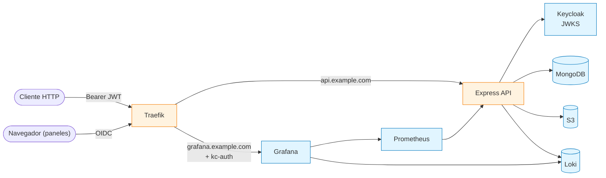

# Express Clean Backend

Backend Node.js/TypeScript con arquitectura **Hexagonal + DDD-lite**, autenticación delegada a **Keycloak**, repositorios **CQRS-lite**, **Observer** para auditoría, **AWS S3** detrás de puerto + adapter, y stack de observabilidad **Loki + Grafana + Prometheus** detrás de **Traefik 3.7** con HTTPS automático.

[](#licencia)
[](https://nodejs.org)
[](https://www.typescriptlang.org)
[](https://docs.docker.com/compose/)
[](https://www.keycloak.org)
[](https://prettier.io)

---

## Tabla de contenidos

- [Features](#features)
- [Stack](#stack)
- [Arquitectura](#arquitectura)
- [Quick start](#quick-start)
- [Comandos](#comandos)
- [API REST](#api-rest)
- [Ejemplos de uso](#ejemplos-de-uso)
- [Patrones de diseño aplicados](#patrones-de-diseño-aplicados)
- [Estructura](#estructura)
- [Documentación](#documentación)
- [Despliegue](#despliegue)
- [Troubleshooting](#troubleshooting)
- [Contribuir](#contribuir)
- [Licencia](#licencia)

---

## Features

- **Arquitectura hexagonal estricta** con cuatro capas (`domain`, `application`, `infrastructure`, `presentation`) y dependencias dirigidas hacia el centro.
- **Keycloak (OIDC)** como IdP único: la API verifica RS256 contra JWKS via `jose`; los paneles humanos (Grafana, Traefik, Prometheus) usan plugin OIDC en Traefik.
- **Repositorios CQRS-lite** que separan lectura y escritura en `user.query.repository.ts` / `user.command.repository.ts`.
- **Observer pattern** para auditoría: `LoginUseCase` publica eventos, `AuditLoginObserver` los persiste sin acoplar dominios.
- **Storage S3** detrás de `StoragePort` con `FakeStorageAdapter` para tests y guard contra path-traversal.
- **Logging estructurado** Winston → Loki con `RequestContextLoggerDecorator` (correlationId via `AsyncLocalStorage`).
- **Stack observability** opcional: Loki 3.7, Grafana 13.0, Prometheus 3.8 + dashboards provisionados.
- **Validación fail-fast** con Zod por subsistema en `src/config/env.ts`.

---

## Stack

| Capa | Tecnología |
|---|---|
| Runtime | Node ≥22, TypeScript strict, ESM nativo |
| HTTP | Express 5, `helmet`, `cors`, `express-rate-limit` |
| Auth | Keycloak 26.6 (OIDC) + `jose` (JWKS RS256) |
| Persistencia | MongoDB 8.2 + Mongoose |
| Storage | AWS S3 (LocalStack para dev) |
| Validación | Zod |
| Observabilidad | Winston + Loki + Prometheus + Grafana |
| Reverse proxy | Traefik 3.7 + plugin OIDC `sevensolutions/traefik-oidc-auth` |
| Testing | Vitest + supertest + mongodb-memory-server |
| Package manager | pnpm |

---

## Arquitectura



Detalle del layout interno y reglas de dependencia en [`docs/00-estructura-src.md`](./docs/00-estructura-src.md).

---

## Quick start

### Pre-requisitos

- Node ≥ 22, pnpm, Docker Engine + Compose v2.
- macOS / Linux (los scripts asumen `bash` + `openssl` builtin).

### Levantar el stack

```bash
# 1. Clonar e instalar deps
git clone <repo-url> express-clean-backend
cd express-clean-backend
pnpm install

# 2. Crear env local + secrets
cp .env.example .env.local
./scripts/generate-secrets.sh >> .env.local

# 3. Inicializar storage ACME (Traefik exige acme.json con chmod 600)
./scripts/init-acme.sh

# 4. Levantar la plataforma
docker compose --profile dev up -d                  # base + LocalStack
docker compose --profile dev --profile observability up -d   # + Loki/Grafana/Prom

# 5. Arrancar la API en host con hot-reload
pnpm dev
```

### Endpoints públicos

| URL | Servicio |
|---|---|
| `https://api.localhost/api/v1` | API REST |
| `https://api.localhost/api-docs` | Swagger UI |
| `https://api.localhost/health/ready` | Healthcheck |
| `https://auth.localhost` | Keycloak admin |
| `https://api.traefik.localhost` | Dashboard Traefik (login OIDC) |
| `https://api.grafana.localhost` | Grafana (login OIDC) |
| `https://api.prometheus.localhost` | Prometheus (LAN-only + OIDC) |

> En el primer acceso el navegador avisa de cert no válido (los certs de `*.localhost` no los firma una CA real). En producción, Traefik resuelve via Let's Encrypt automáticamente.

---

## Comandos

| Comando | Función |
|---|---|
| `pnpm dev` | Arranque dev con `tsx watch` (consume `.env`) |
| `pnpm dev:local` | Idem contra `.env.local` (hosts `localhost`) |
| `pnpm dev:staging` | Idem contra `.env.staging` |
| `pnpm build` | Compila TS → `dist/` |
| `pnpm start` | Arranque prod desde `dist/` |
| `pnpm start:staging` | Arranque staging |
| `pnpm test` | Vitest run (unit + integration) |
| `pnpm test:unit` | Solo unit |
| `pnpm test:integration` | Solo integration (requiere mongodb-memory-server) |
| `pnpm test:coverage` | Cobertura v8, reporte HTML en `coverage/` |
| `pnpm test:watch` | TDD interactivo |
| `pnpm lint` / `pnpm lint:fix` | ESLint |
| `pnpm format` | Prettier |

---

## API REST

| Método | Endpoint | Auth | Roles |
|---|---|---|---|
| `POST` | `/api/v1/auth/register` | público (rate-limit 3/min/IP) | — |
| `POST` | `/api/v1/auth/login` | público (rate-limit 5/min) | — |
| `POST` | `/api/v1/auth/refresh` | público | — |
| `GET` | `/api/v1/auth/me` | Bearer | cualquiera |
| `GET` | `/api/v1/users` | Bearer | `admin` |
| `GET` | `/api/v1/users/:id` | Bearer | `admin` |
| `POST` | `/api/v1/users` | Bearer | `admin` |
| `PUT` | `/api/v1/users/:id` | Bearer | `admin` |
| `DELETE` | `/api/v1/users/:id` | Bearer | `admin` |
| `GET` | `/api/v1/storage/objects` | Bearer | `admin` |
| `GET` | `/api/v1/storage/signed-url` | Bearer | `admin` |
| `GET` | `/health/live` | público | — |
| `GET` | `/health/ready` | público | — |
| `GET` | `/metrics` | LAN-only | — |

Schemas Zod, request/response shapes y error chain completo en [`docs/04-api-reference.md`](./docs/04-api-reference.md).

---

## Ejemplos de uso

### Registrar un usuario

```bash
curl -X POST https://api.localhost/api/v1/auth/register \
  -H 'Content-Type: application/json' \
  -d '{
    "email": "alice@example.com",
    "password": "<password>",
    "name": "Alice Doe"
  }' --insecure
```

Respuesta `201`:
```json
{
  "data": {
    "id": "65f...",
    "keycloak_id": "9d8...",
    "email": "alice@example.com",
    "name": "Alice Doe",
    "slug": "alice-doe",
    "is_active": true
  }
}
```

### Login y obtener tokens

```bash
curl -X POST https://api.localhost/api/v1/auth/login \
  -H 'Content-Type: application/json' \
  -d '{"email":"alice@example.com","password":"<password>"}' \
  --insecure
```

Respuesta `200`:
```json
{
  "data": {
    "access_token": "eyJhbGc...",
    "refresh_token": "eyJhbGc...",
    "expires_in": 900
  }
}
```

### Obtener perfil propio

```bash
curl https://api.localhost/api/v1/auth/me \
  -H "Authorization: Bearer <access_token>" --insecure
```

### Listar usuarios (admin)

```bash
curl 'https://api.localhost/api/v1/users?email=alice&page=1&limit=10' \
  -H "Authorization: Bearer <admin_access_token>" --insecure
```

### Generar URL firmada S3

```bash
curl 'https://api.localhost/api/v1/storage/signed-url?key=public/avatar.png&ttl=600' \
  -H "Authorization: Bearer <admin_access_token>" --insecure
```

---

## Patrones de diseño aplicados

| Categoría | Patrón | Ejemplo |
|---|---|---|
| Estructural | **Adapter** | `KeycloakAdapter`, `S3StorageAdapter`, `WinstonLoggerAdapter` |
| Estructural | **Facade** | `UserFacade`, `AuthFacade`, `StorageFacade` |
| Estructural | **Decorator** | `RequestContextLoggerDecorator` |
| Estructural | **Hexagonal (Ports & Adapters)** | `domain/<feature>/port` ← `infrastructure/<feature>/adapter` |
| Comportamiento | **Chain of Responsibility** | error-handler chain (Zod → Client → Server → Mongo → Fallback) |
| Comportamiento | **Observer** | `EventBusPort` + `AuditLoginObserver` |
| Comportamiento | **Strategy** | Format selector en `WinstonLoggerAdapter` |
| Comportamiento | **Template Method** | `ErrorHandler.handle/delegate` |
| Creacional | **Factory Method** | `CustomError.notFound/conflict/...`, `WinstonLoggerAdapter.create` |
| Creacional | **Singleton** | `MongoDatabase`, `S3Client` |
| DDD | **Use Case por archivo** | `application/<feature>/use-cases/*.use-case.ts` |
| DDD | **Repository CQRS-lite** | `UserQueryRepository` + `UserCommandRepository` |

Trade-offs y justificaciones en [`docs/02-arquitectura.md`](./docs/02-arquitectura.md).

---

## Estructura

```
.
├── src/
│   ├── main.ts                  # Composition root
│   ├── config/                  # env (Zod) + database + swagger
│   ├── domain/                  # entidades + ports + DTOs (sin deps de infra)
│   ├── application/             # use cases por feature
│   ├── infrastructure/          # adapters: keycloak, mongo, s3, winston, events
│   └── presentation/            # express routers + middlewares + bootstrap
├── test/                        # vitest unit + integration
├── docs/                        # documentación técnica (14 capítulos)
├── docker-compose.yml           # api + mongo + keycloak + traefik + obs
├── keycloak/app-realm.json      # realm con clients y roles
├── monitoring/                  # prometheus.yml + grafana provisioning
├── scripts/                     # generate-secrets, init-acme, localstack-init
└── .env.example
```

Layout completo con descripción inline en [`docs/00-estructura-src.md`](./docs/00-estructura-src.md).

---

## Documentación

La documentación técnica completa vive en [`docs/`](./docs/) — 14 capítulos:

| # | Capítulo | Tema |
|---|---|---|
| 00 | [Estructura `src/`](./docs/00-estructura-src.md) | Layout, capas, naming, path aliases |
| 01 | [Fundamentos](./docs/01-fundamentos.md) | Stack, glosario, prerequisitos |
| 02 | [Arquitectura](./docs/02-arquitectura.md) | Hexagonal, CQRS-lite, patrones |
| 03 | [Features](./docs/03-features.md) | auth, user, storage, audit |
| 04 | [API Reference](./docs/04-api-reference.md) | Endpoints, schemas, errores |
| 05 | [Infraestructura](./docs/05-infraestructura.md) | Adapters Mongo/Keycloak/S3 |
| 06 | [Plataforma + Deploy](./docs/06-plataforma-deploy.md) | Compose, Traefik, ACME |
| 07 | [Seguridad](./docs/07-seguridad.md) | Cadena auth, hardening |
| 08 | [Configuración](./docs/08-configuracion.md) | Env Zod, perfiles, secrets |
| 09 | [Observabilidad](./docs/09-observabilidad.md) | Logs, métricas, dashboards |
| 10 | [Testing](./docs/10-testing.md) | Vitest, helpers, cobertura |
| 11 | [Operación](./docs/11-operacion.md) | Quick start, healthchecks, runbook |
| 12 | [Onboarding + Contribución](./docs/12-onboarding-contribucion.md) | Code standards, PR checklist |

---

## Despliegue

### Producción

```bash
# .env.production
DOMAIN=tudominio.com
SSL_EMAIL=tu@email.com
KEYCLOAK_INTERNAL_URL=https://auth.tudominio.com
```

```bash
./scripts/init-acme.sh
docker compose --env-file .env.production up -d
```

> Si pruebas primero contra el endpoint staging de Let's Encrypt, borra `data/traefik/acme/acme.json` antes de pasar a producción para evitar mezclar certs.

Detalle de despliegue por entorno en [`docs/11-operacion.md`](./docs/11-operacion.md).

---

## Troubleshooting

**Traefik no arranca: `unable to read acme.json`**
El fichero no existe o tiene permisos incorrectos. Ejecutar `./scripts/init-acme.sh` y reintentar. Traefik exige `mode 600`.

**Traefik no genera certificados (`unable to obtain ACME certificate`)**
1. El puerto 80 no es accesible desde Internet — el HTTP-01 challenge requiere que LE llegue por `:80`. Verificar firewall/NAT.
2. El DNS aún no apunta al servidor — `dig api.tudominio.com` debe resolver a la IP pública.
3. Rate limit de LE prod (50 certs/dominio/semana). Usar `LE_CA_SERVER=https://acme-staging-v02.api.letsencrypt.org/directory` mientras se debugea.

**Plugin OIDC devuelve `issuer mismatch`**
Keycloak firma tokens con el host de `KC_HOSTNAME`. `KC_HOSTNAME=https://auth.${DOMAIN}` debe coincidir exactamente con la URL pública por la que llega el navegador. Si difieren, el `iss` del token y el `Provider.Url` del plugin no encajan.

**`auth.localhost` falla en handshake TLS**
Es normal en local: el cert auto-firmado lo rechaza el navegador. Aceptar la advertencia. La API dentro de la red Docker usa `KEYCLOAK_INTERNAL_URL=http://keycloak:8080` para no pasar por Traefik.

Más casos en [`docs/11-operacion.md#troubleshooting`](./docs/11-operacion.md).

---

## Contribuir

```bash
# 1. Hacer fork y clonar
git clone https://github.com/<tu-usuario>/express-clean-backend.git
cd express-clean-backend

# 2. Crear rama desde main
git checkout -b feat/nueva-funcionalidad

# 3. Instalar deps + arrancar stack
pnpm install
docker compose --profile dev up -d
pnpm dev

# 4. Verificar antes del commit
pnpm lint && pnpm test

# 5. Commit con Conventional Commits
git commit -m "feat(user): añadir endpoint /users/:id/roles"

# 6. Push y abrir Pull Request
git push origin feat/nueva-funcionalidad
```

**Convenciones del repo:**

- **Conventional Commits** obligatorios (`feat`, `fix`, `docs`, `refactor`, `test`, `chore`).
- **Hexagonal estricta**: `src/domain/` y `src/application/` no importan `mongoose`/`express`/`aws-sdk`/`keycloak`/`jose`/`winston`.
- **kebab-case** para archivos `.ts`, sufijos por tipo (`.use-case.ts`, `.adapter.ts`, `.repository.ts`).
- **TypeScript strict** siempre activo. Validar input HTTP con Zod, nunca confiar en `req.body`.
- **Sin comentarios inline**: solo bloques JSDoc/TSDoc.
- **Tests** obligatorios: integration para endpoints nuevos, unit para use cases con lógica condicional.

Code standards completos, code review checklist y workflow detallado en [`docs/12-onboarding-contribucion.md`](./docs/12-onboarding-contribucion.md).

---

## Licencia

[MIT](./LICENSE) © [Jesús María Rico González](https://www.jmrg.dev)

---

## Autor

**JMRG** — Senior Full Stack Developer
[Portfolio](https://www.jmrg.dev) · [GitHub](https://github.com/jmrg-link) · [LinkedIn](https://linkedin.com/in/jesus-maria-rico-gonzalez)
