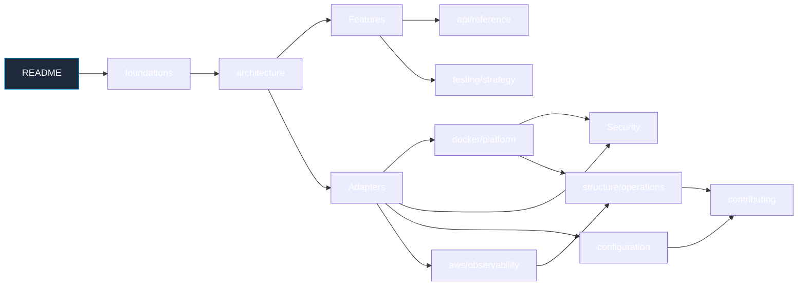

# Documentacion — Express Clean Backend

> Backend Express 5 + TypeScript con arquitectura Hexagonal + DDD-lite,
> Keycloak (jose) para IAM, CQRS-lite repos, Facade por feature,
> Observer para auditoria, S3 storage, Winston/Loki logging y plataforma
> Traefik 3.7 + observability stack.

| Meta | Valor |
|---|---|
| Idioma | Español (codigo/identificadores en ingles) |
| Diagramas | Mermaid v11 |

## Capítulos técnicos (por dominio)

| Capítulo | Carpeta | Tema |
|---|---|---|
| [Fundamentos](project/foundations.md) | project | Visión, stack, glosario, prerequisitos |
| [Estructura `src/`](project/source-structure.md) | project | Layout interno, capas, naming, path aliases |
| [Arquitectura](project/architecture.md) | project | Hexagonal, CQRS-lite, ports↔adapters, patrones GoF |
| [Features](project/features.md) | project | auth, user, storage, audit |
| [Adapters](project/adapters.md) | project | Mongo, Keycloak, S3, Winston |
| [Configuración](project/configuration.md) | project | Env Zod fail-fast, perfiles, secrets |
| [Seguridad](project/security.md) | project | Cadena auth E2E, hardening |
| [Onboarding](project/contributing.md) | project | Code standards, PR checklist |
| [Codebase summary](project/codebase-summary.md) | project | Snapshot generado por repomix |
| [Testing strategy](project/testing/strategy.md) | project/testing | Vitest, helpers, matriz de cobertura |
| [API Reference](api/reference.md) | api | Endpoints, schemas Zod, error chain |
| [Plataforma + Deploy](docker/platform.md) | docker | docker-compose, Traefik, ACME, Dockerfile |
| [Operación](structure/operations.md) | structure | Quick start, healthchecks, runbook |
| [Observabilidad](aws/observability.md) | aws | Logs Winston/Loki, métricas, dashboards |

## Carpetas de documentación (taxonomía nueva)

| Carpeta | Tema | Links |
|---|---|---|
| **project** | Workflow, code standards, testing, stack | [`README`](./project/README.md), [`workflow.md`](./project/workflow.md), [`codebase.md`](./project/codebase.md), [`testing/`](./project/testing/README.md) |
| **structure** | Topología de despliegue por entorno | [`README`](./structure/README.md), [`topology.md`](./structure/topology.md), [`local.md`](./structure/local.md), [`development.md`](./structure/development.md), [`production.md`](./structure/production.md) |
| **docker** | Orquestación Docker Compose (3 profiles) | [`README`](./docker/README.md), [`dockerfile.md`](./docker/dockerfile.md), [`local.md`](./docker/local.md), [`development.md`](./docker/development.md), [`production.md`](./docker/production.md) |
| **api** | Referencia REST + Swagger + OpenAPI | [`README`](./api/README.md), [`reference.md`](./api/reference.md) |
| **aws** | Infraestructura AWS (EC2, S3, ECS, IAM, Secrets, ECR, CloudWatch, VPC) | [`README`](./aws/README.md), [`iam.md`](./aws/iam.md), [`s3.md`](./aws/s3.md), [`ec2.md`](./aws/ec2.md), [`ecs.md`](./aws/ecs.md), [`secrets-manager.md`](./aws/secrets-manager.md), [`ecr.md`](./aws/ecr.md), [`cloudwatch.md`](./aws/cloudwatch.md), [`vpc-network.md`](./aws/vpc-network.md) |
| **gcp** | Google Cloud Platform + Firebase | [`README`](./gcp/README.md), [`services.md`](./gcp/services.md), [`auth.md`](./gcp/auth.md), [`firebase/`](./gcp/firebase/) |
| **ci-cd** | GitHub Actions + deployment + OIDC | [`README`](./ci-cd/README.md), [`workflow.md`](./ci-cd/workflow.md), [`github-actions.md`](./ci-cd/github-actions.md), [`oidc-aws.md`](./ci-cd/oidc-aws.md), [`husky.md`](./ci-cd/husky.md), [`aws.md`](./ci-cd/aws.md) |

## Resumen ejecutivo del codebase

[`project/codebase-summary.md`](project/codebase-summary.md) — Generado por repomix, estado actual del proyecto.

---

## Inicio rápido

1. Pre-requisitos y stack: [`project/foundations.md`](project/foundations.md).
2. Levantar el stack local: [`structure/operations.md`](structure/operations.md) → seccion
   "Quick start".
3. Configurar `.env`: [`project/configuration.md`](project/configuration.md).

---

## Mapa por rol

| Rol | Ruta sugerida |
|---|---|
| Backend dev nuevo | foundations → source-structure → architecture → features → reference → testing/strategy |
| DevOps / SRE | foundations → docker/platform → configuration → aws/observability → operations |
| QA | foundations → features → reference → testing/strategy |
| PM / Producto | foundations → features |
| Auditoría seguridad | foundations → security → aws/observability |

---

## Convenciones

- **Idioma docs**: español. Identificadores, paths y commits en ingles.
- **Diagramas**: Mermaid v11. Renderizan en GitHub directamente.
- **Trazabilidad**: cada afirmacion tecnica cita `file_path:line` cuando es
  verificable contra el codigo.
- **Sin valores reales de `.env`**: solo nombres, tipos y defaults Zod.
- **maxLoc**: 800 lineas por archivo `.md`. Si rebasa, subdivision en
  `docs/<cap>/.md`.

---

## Mapa visual

