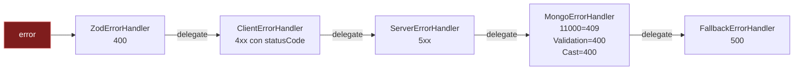

# API Reference

> Technical reference for API **v1**. Endpoints, request/response, status codes, error format, reusable schemas, and Swagger notes.

---

## Breaking changes

- **`POST /auth/register` body**: el campo `name` (string 2-100) se retira. Pasa a requerir `firstName` (2-50) y `lastName` (1-50). `CreateUserSchema`, `UpdateUserSchema` y `ListUserSchema` siguen el mismo cambio. Slug se deriva de `${firstName} ${lastName}`. Plan: [`plans/260511-2153-user-name-lastname-split`](../../plans/260511-2153-user-name-lastname-split/plan.md).
- **RBAC roles management**: nuevos endpoints `/users/:id/roles` (admin only). El registro ahora aplica `ADMIN_EMAIL_PATTERNS`: emails que cumplen patrón literal o wildcard de dominio nacen con rol `admin` en KC y Mongo. Plan: [`plans/260511-2119-roles-rbac`](../../plans/260511-2119-roles-rbac/plan.md).

---

## Bases del API

| Item | Valor | Origen |
|---|---|---|
| Prefijo | `/api/v1` | `env.server.apiPrefix` (`/api`) + `env.server.apiVersion` (`v1`) |
| Content-Type | `application/json` | `express.json({ limit: '1mb' })` (`presentation/bootstrap/app.ts:55`) |
| Auth | `Authorization: Bearer <JWT>` | unica via aceptada — `?token=` querystring NO se acepta |
| CORS | whitelist por env | `CORS_ORIGINS` lista separada por comas |
| Rate-limit | global + login dedicado | ver [`../project/security.md`](../project/security.md) |
| Swagger UI | `/api-docs` | `presentation/bootstrap/app.ts:78` (servido por `swagger-ui-express`) |

---

## Tabla maestra de endpoints

> 14 endpoints de aplicacion + 3 healthchecks + 1 docs UI = 18 rutas
> totales montadas.

| # | Feature | Metodo | Path | Auth | Rol | Validator | Use-case | Exito |
|---|---|---|---|---|---|---|---|---|
| 1 | auth | POST | `/api/v1/auth/login` | publico | — | `LoginSchema` (body) | `LoginUseCase` | 200 |
| 2 | auth | POST | `/api/v1/auth/register` | publico | — | `RegisterSchema` (body) | `RegisterUseCase` | 201 |
| 3 | auth | POST | `/api/v1/auth/refresh` | publico | — | `RefreshSchema` (body) | `RefreshUseCase` | 200 |
| 4 | auth | GET | `/api/v1/auth/me` | Bearer | cualquiera | — | `GetMeUseCase` | 200 |
| 5 | user | GET | `/api/v1/users` | Bearer | admin | `ListUserSchema` (query) | `ListUsersUseCase` | 200 |
| 6 | user | GET | `/api/v1/users/:id` | Bearer | admin | `validateObjectId` | `GetUserByIdUseCase` | 200 |
| 7 | user | POST | `/api/v1/users` | Bearer | admin | `CreateUserSchema` (body) | `CreateUserUseCase` | 201 |
| 8 | user | PUT | `/api/v1/users/:id` | Bearer | admin | `validateObjectId` + `UpdateUserSchema` | `UpdateUserUseCase` | 200 |
| 9 | user | DELETE | `/api/v1/users/:id` | Bearer | admin | `validateObjectId` | `SoftDeleteUserUseCase` | 200 |
| 9a | user-roles | GET | `/api/v1/users/:id/roles` | Bearer | admin | `validateObjectId` | `GetRolesUseCase` | 200 |
| 9b | user-roles | PUT | `/api/v1/users/:id/roles` | Bearer | admin | `validateObjectId` + `ReplaceRolesSchema` (body) | `ReplaceRolesUseCase` | 200 |
| 9c | user-roles | POST | `/api/v1/users/:id/roles/:role` | Bearer | admin | `validateObjectId` + `RoleParamSchema` | `AddRoleUseCase` | 204 |
| 9d | user-roles | DELETE | `/api/v1/users/:id/roles/:role` | Bearer | admin | `validateObjectId` + `RoleParamSchema` | `RemoveRoleUseCase` | 204 |
| 10 | storage | GET | `/api/v1/storage/objects` | Bearer | admin | `ListStorageQuerySchema` (query) | `ListStorageObjectsUseCase` | 200 |
| 11 | storage | GET | `/api/v1/storage/signed-url` | Bearer | admin | `SignedUrlParamsSchema` (query) | `GetSignedUrlUseCase` | 200 |
| 12 | health | GET | `/health/live` | publico | — | — | inline | 200 |
| 13 | health | GET | `/health/ready` | publico | — | — | inline (mongo isHealthy) | 200/503 |
| 14 | health | GET | `/health` | publico | — | — | inline | 200 |
| 15 | docs | GET | `/api-docs` | publico | — | — | swagger-ui-express | 200 |

> Storage (10, 11) **solo se montan** si `env.s3.isConfigured === true`
> (ver `src/main.ts:60-66`). Si S3 no esta configurado devuelven 404
> natural.

---

## Schemas comunes

### `SuccessResponse<T>`

```ts
interface SuccessResponse<T> {
  message: string;
  data: T;
  pagination?: PaginationMeta;   // solo en respuestas paginadas
}
```

> Codigo: `src/domain/shared/response/response.formatter.ts:11`.

### `ErrorResponse`

```ts
interface ErrorResponse {
  message: string;
  errors?: unknown[];   // detalles validacion (Zod) o lista de issues
}
```

> Codigo: `src/domain/shared/response/response.formatter.ts:18`.

### `PaginationMeta`

```ts
interface PaginationMeta {
  page: number;
  limit: number;
  count: number;            // total de filas (post-filtros)
  totalPages: number;
  nextPage: boolean;
  previousPage: boolean;
  next: number | null;      // null si no hay siguiente
  prev: number | null;      // null si no hay anterior
}
```

> Codigo: `src/domain/shared/paginator/pagination.dto.ts:22`.

### `PaginationQuery` (query params estandar)

| Param | Tipo | Default | Restricciones |
|---|---|---|---|
| `page` | int positivo | 1 | — |
| `limit` | int positivo | 20 | max 100 |
| `sort` | string | — | nombre de campo |
| `order` | enum | `desc` | `asc` o `desc` |

> Codigo: `src/domain/shared/paginator/pagination.dto.ts:7`.

### Security scheme (Swagger)

```yaml
bearerAuth:
  type: http
  scheme: bearer
  bearerFormat: "JWT (Keycloak RS256 / HS256 fallback dev)"
```

> Codigo: `src/config/swagger.ts:21-25`.

---

## Schemas Zod por feature

### auth

| DTO | Forma | Notas |
|---|---|---|
| `LoginSchema` | `{ email: email-lowercased-trimmed, password: string >=1 }` | — |
| `RegisterSchema` | `{ email, password: 8-72, firstName: 2-50, lastName: 1-50, phone? }` | password limite 72 chars. Breaking: `name` retirado, ahora `firstName` + `lastName` (ambos requeridos) |
| `RefreshSchema` | `{ refresh_token: string >=1 }` | — |

> Codigo: `src/domain/auth/auth.dto.ts`.

### user

| DTO | Forma resumida |
|---|---|
| `CreateUserSchema` | `{ keycloak_id, email, firstName, lastName, slug?, phone?, picture?, avatar_url?, provider='password', roles=['buyer'] }` con `.transform()` que deriva `slug` de `${firstName} ${lastName}` |
| `UpdateUserSchema` | todos opcionales: `firstName?, lastName?, slug?, phone?, picture?, avatar_url?, roles?, email_verified?, is_active?` con `.refine()` exigiendo al menos uno |
| `ListUserSchema` | `{ email?, firstName?, slug?, is_active? (true/false → bool), roles?, page=1, limit=20, sort?, order='desc' }` |

> Codigo: `src/domain/user/user.dto.ts`.

### storage

| DTO | Forma |
|---|---|
| `ListStorageQuerySchema` | `{ prefix?, maxKeys (default 100, max 1000), continuationToken? }` |
| `SignedUrlParamsSchema` | `{ key: string >=1, expiresIn (default 900, max 3600) }` |

> Codigo: `src/domain/shared/storage/storage.dto.ts`.

---

## Error response chain

5 eslabones (Chain of Responsibility) procesan errores en orden:



> Codigo: `src/presentation/bootstrap/error-handler/error-handler.middleware.ts:13-132`.

### Mapeo HTTP por eslabon

| Eslabon | Tipo de error | Status | Body |
|---|---|---|---|
| 1 ZodError | validacion entrada (body/query/params) | 400 | `{ message: 'Validation error', errors: [{ field, message }] }` |
| 2 ClientError | `BaseError` con `statusCode 4xx` | el de la instancia | `{ message }` o `{ message, errors: [details] }` si hay |
| 3 ServerError | `BaseError` con `statusCode 5xx` | el de la instancia | `{ message }` (sin stack al cliente) |
| 4 MongoErrorHandler `11000` | duplicate key | 409 | `{ message: "Duplicate value for '<field>'" }` |
| 4 MongoErrorHandler `ValidationError` | mongoose validation | 400 | `{ message: 'Validation error', errors: [{ field, message }] }` |
| 4 MongoErrorHandler `CastError` | tipo invalido en query | 400 | `{ message: 'Invalid <path>: <value>' }` |
| 5 Fallback | cualquier otro `Error` | 500 | `{ message: 'Internal server error' }` |

### Tabla `CustomError` factories

| Factory | Status | Mensaje default |
|---|---|---|
| `CustomError.badRequest(msg)` | 400 | el que se pase |
| `CustomError.unauthorized(msg)` | 401 | el que se pase |
| `CustomError.forbidden(msg)` | 403 | el que se pase |
| `CustomError.notFound(msg)` | 404 | el que se pase |
| `CustomError.conflict(msg)` | 409 | el que se pase |
| `CustomError.unprocessable(msg)` | 422 | el que se pase |
| `CustomError.tooManyRequests(msg)` | 429 | el que se pase |
| `CustomError.internal(msg)` | 500 | el que se pase |
| `CustomError.badGateway(msg)` | 502 | el que se pase |
| `CustomError.serviceUnavailable(msg)` | 503 | el que se pase |

> Codigo: `src/domain/shared/errors/custom.error.ts`.

---

## Ejemplos request / response

> Tokens, ids y emails son **placeholders**. NO se incluyen valores reales.

### POST `/api/v1/auth/login`

**Request**

```http
POST /api/v1/auth/login HTTP/1.1
Content-Type: application/json

{
  "email": "user@example.test",
  "password": "<PASSWORD_PLACEHOLDER>"
}
```

```bash
curl -X POST https://api.example.test/api/v1/auth/login \
  -H 'Content-Type: application/json' \
  -d '{"email":"user@example.test","password":"<PASSWORD_PLACEHOLDER>"}'
```

**Response 200**

```json
{
  "message": "Login successful",
  "data": {
    "tokens": {
      "access_token": "<JWT_PLACEHOLDER>",
      "refresh_token": "<REFRESH_TOKEN_PLACEHOLDER>",
      "expires_in": 300,
      "refresh_expires_in": 1800,
      "token_type": "Bearer"
    },
    "user": {
      "id": "<USER_OBJECT_ID>",
      "keycloak_id": "<KEYCLOAK_SUB>",
      "email": "user@example.test",
      "firstName": "User",
      "lastName": "Example",
      "slug": "user-example-ab12cd",
      "email_verified": true,
      "provider": "password",
      "roles": ["buyer"],
      "is_active": true,
      "failed_login_attempts": 0,
      "createdAt": "2026-05-09T10:30:00.000Z",
      "updatedAt": "2026-05-09T10:30:00.000Z"
    }
  }
}
```

**Response 401 (credenciales invalidas)**

```json
{ "message": "Invalid credentials" }
```

**Response 429 (rate-limit)**

```json
{ "message": "Too many login attempts" }
```

---

### POST `/api/v1/auth/register`

**Request body**

```json
{
  "email": "new@example.test",
  "password": "<PASSWORD_PLACEHOLDER>",
  "firstName": "New",
  "lastName": "User",
  "phone": "+34600000000"
}
```

**Response 201**: mismo shape que login (tokens + user).

**Response 409**: `{ "message": "Email already registered" }`.

---

### GET `/api/v1/auth/me`

**Request**

```http
GET /api/v1/auth/me HTTP/1.1
Authorization: Bearer <JWT_PLACEHOLDER>
```

**Response 200**

```json
{
  "message": "User profile",
  "data": { "id": "<USER_OBJECT_ID>", "keycloak_id": "<KEYCLOAK_SUB>", "...": "..." }
}
```

**Response 401**

```json
{ "message": "Unauthorized" }
```

---

### GET `/api/v1/users` (admin)

**Request**

```http
GET /api/v1/users?page=1&limit=20&roles=buyer&is_active=true HTTP/1.1
Authorization: Bearer <ADMIN_JWT>
```

**Response 200**

```json
{
  "message": "Users listed",
  "data": [ { "id": "...", "email": "...", "...": "..." } ],
  "pagination": {
    "page": 1, "limit": 20, "count": 142, "totalPages": 8,
    "nextPage": true, "previousPage": false,
    "next": 2, "prev": null
  }
}
```

**Response 403** (rol no admin):

```json
{ "message": "Forbidden" }
```

---

### GET `/api/v1/storage/signed-url`

**Request**

```http
GET /api/v1/storage/signed-url?key=avatars/abc123.jpg&expiresIn=900 HTTP/1.1
Authorization: Bearer <ADMIN_JWT>
```

**Response 200**

```json
{
  "message": "Signed URL generated",
  "data": {
    "url": "https://<bucket>.s3.<region>.amazonaws.com/avatars/abc123.jpg?X-Amz-...=...",
    "expiresIn": 900
  }
}
```

**Response 400** (path-traversal):

```json
{ "message": "Invalid object key" }
```

**Response 404** (S3 no configurado): el endpoint no esta montado.

---

## Healthchecks

| Endpoint | Que verifica | Status |
|---|---|---|
| `/health/live` | proceso responde | 200 siempre (uptime) |
| `/health/ready` | `MongoDatabase.isHealthy()` | 200 si Mongo conectado, 503 si no |
| `/health` | alias de `live` | 200 |

> Codigo: `src/presentation/bootstrap/app.ts:62-77`.

**Body `live` / `health`**

```json
{ "status": "ok", "uptime": 3600.42 }
```

**Body `ready`**

```json
{ "status": "ok", "mongo": "connected", "uptime": 3600.42 }
```

**Body `ready` degradado (503)**

```json
{ "status": "degraded", "mongo": "disconnected", "uptime": 12.5 }
```

---

## Notas operacionales

### Rate-limit global

- Aplica a TODAS las rutas tras `app.use(globalRateLimiter)`.
- Codigo: `src/presentation/bootstrap/middlewares/rate-limit.middleware.ts`.
- Detalle en [`../project/security.md`](../project/security.md).

### Auth ordenes en routers

- `auth/me`: `jwtMiddleware.handle()` → controller.
- `users/*`: `[validateObjectId si :id], jwtMiddleware.handle(), checkRole('admin'), [validate.body|query si aplica], controller`.
- `storage/*`: `jwtMiddleware.handle(), checkRole('admin'), validate.query, controller`.

> Codigo: `src/presentation/{auth,user,storage}/*.router.ts`.

### Swagger UI: como acceder

1. Levantar la API en local (`pnpm dev`).
2. Abrir `http://localhost:3000/api-docs`.
3. La UI lee anotaciones `@swagger` de los routers (`./src/presentation/**/*.router.ts`)
   y las renderiza en formato OpenAPI 3.0.

---

## Resumen rapido para integradores

| Necesito... | Endpoint |
|---|---|
| Loguear un usuario | POST `/api/v1/auth/login` |
| Crear cuenta | POST `/api/v1/auth/register` |
| Renovar access token | POST `/api/v1/auth/refresh` |
| Mi perfil | GET `/api/v1/auth/me` con Bearer |
| Listar usuarios (admin) | GET `/api/v1/users` con Bearer admin |
| Listar objetos S3 (admin) | GET `/api/v1/storage/objects` con Bearer admin |
| URL temporal de descarga | GET `/api/v1/storage/signed-url?key=...` |
| Health (k8s liveness) | GET `/health/live` |
| Health (k8s readiness) | GET `/health/ready` |
| Documentacion interactiva | GET `/api-docs` |
| Listar roles de un usuario | GET `/api/v1/users/:id/roles` con Bearer admin |
| Reemplazar set de roles    | PUT `/api/v1/users/:id/roles` con Bearer admin |
| Anyadir rol concreto       | POST `/api/v1/users/:id/roles/:role` con Bearer admin |
| Retirar rol concreto       | DELETE `/api/v1/users/:id/roles/:role` con Bearer admin |

---

## User Roles Management

CRUD admin-only para mutar el set de roles de un usuario. Sincroniza KC (realm role-mapping) + Mongo en cada operacion y emite `user.role_changed` con `before`/`after`/`actorId`.

**Roles validos** (catalogo cerrado en `USER_ROLES`): `buyer`, `seller`, `operator`, `admin`.

**Self-demotion guard**: el actor NO puede dejarse sin `admin` (bloquea PUT que excluya admin sobre su propio user, y DELETE de su propio `admin`). Respuesta 400 `Cannot self-demote admin`.

### GET `/users/:id/roles`

```bash
curl -H "Authorization: Bearer $TOKEN" \
  https://api.example.com/api/v1/users/$USER_ID/roles
```

Response 200:
```json
{ "message": "Roles retrieved", "data": { "roles": ["buyer"] } }
```

### PUT `/users/:id/roles`

Idempotente. Calcula diff contra Mongo, llama `iam.assignRoles(toAdd)` + `iam.removeRoles(toRemove)` y persiste el set final.

```bash
curl -X PUT -H "Authorization: Bearer $TOKEN" -H "Content-Type: application/json" \
  -d '{"roles":["seller","operator"]}' \
  https://api.example.com/api/v1/users/$USER_ID/roles
```

Response 200:
```json
{ "message": "Roles replaced", "data": { "roles": ["seller","operator"] } }
```

Errores: 400 (body vacio o self-demotion), 401, 403, 404, 502 (KC failure).

### POST `/users/:id/roles/:role`

Anyade un rol. No-op si el usuario ya lo tiene.

```bash
curl -X POST -H "Authorization: Bearer $TOKEN" \
  https://api.example.com/api/v1/users/$USER_ID/roles/seller
```

Response 204 (sin body). Errores: 400 (rol invalido), 401, 403, 404, 502.

### DELETE `/users/:id/roles/:role`

Retira un rol. No-op si no lo tiene. Bloquea self-demotion del propio `admin`.

```bash
curl -X DELETE -H "Authorization: Bearer $TOKEN" \
  https://api.example.com/api/v1/users/$USER_ID/roles/seller
```

Response 204. Errores: 400 (rol invalido o self-demotion), 401, 403, 404, 502.

---

## Siguiente capitulo

- [`../project/adapters.md`](../project/adapters.md): detalle de cada
  adapter (Mongo, Keycloak, S3, Winston).
- [`../project/security.md`](../project/security.md): cadena auth E2E + 8 items
  CRITICAL/IMPORTANT.
