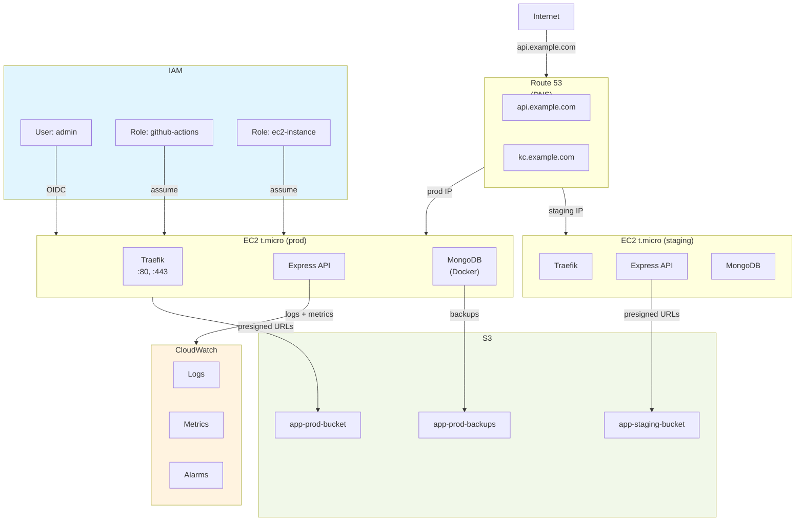

# AWS

## Qué?

Infraestructura AWS para express-clean-backend: IAM (usuarios, roles), S3 (storage), EC2 (compute), ECS (futuro).

## Por qué?

We host on AWS because it handles the heavy lifting—no need to manage servers ourselves. Amazon maintains the infrastructure and takes care of hardware failures.

## Para qué?

- Hostear API en EC2
- Almacenar archivos en S3
- Logs + métricas en CloudWatch
- Secretos en Secrets Manager
- DNS en Route 53

## Lo que obtenemos

- **Escalabilidad:** auto-scale servicios bajo carga
- **Confiabilidad:** 99.9% SLA, multi-AZ (futuro)
- **Seguridad:** IAM granular, encryption at-rest
- **Visibilidad:** CloudWatch logs y auditoría CloudTrail

## Qué hace?

- Sets IAM policies by role
- Configures S3 buckets with CORS and lifecycle rules
- Documents EC2 setup for MongoDB and API
- Manages secrets in Secrets Manager

## Estructura

| Archivo | Tema |
|---|---|
| [`iam.md`](./iam.md) | IAM users, roles, service accounts, MFA, policies |
| [`s3.md`](./s3.md) | S3 buckets, presigned URLs, CORS, lifecycle, encryption |
| [`ec2.md`](./ec2.md) | EC2 instances, MongoDB containerizado, EBS snapshots, monitoring |
| [`ecs.md`](./ecs.md) | ECS Fargate, task definitions, auto-scaling, deployments |
| [`ecr.md`](./ecr.md) | ECR repositories, image scanning, lifecycle policies, CI/CD |
| [`secrets-manager.md`](./secrets-manager.md) | Secrets Manager, rotación automática, inyección en ECS/EC2 |
| [`cloudwatch.md`](./cloudwatch.md) | CloudWatch logs, métricas, alarms, dashboards, Logs Insights |
| [`vpc-network.md`](./vpc-network.md) | VPC, subnets, NAT Gateway, security groups, VPC endpoints |

## Arquitectura AWS



## Servicios usados

| Servicio | Propósito | Costo |
|---|---|---|
| **EC2** | Compute (API, MongoDB) | ~$0/mes (free tier) |
| **S3** | Object storage | ~$1/mes (< 1GB) |
| **Secrets Manager** | Secrets storage | ~$0.4/mes |
| **CloudWatch** | Logs + metrics | ~$1/mes |
| **Route 53** | DNS | ~$0.5/mes |
| **IAM** | Access control | Free |
| **ECS** (futuro) | Container orchestration | ~$50-100/mes |

**Total actual:** ~$3-5/mes (free tier)

## Acceso a AWS

### AWS Management Console

```bash
# Via browser
open https://console.aws.amazon.com

# Login: admin@example.com / MFA required
```

### AWS CLI

```bash
# Configure local credentials
aws configure

# Test
aws ec2 describe-instances --region us-east-1
```

### Keys & Permissions

- **Admin user:** root-account@example.com (MFA)
- **Programmatic users:** github-actions (GitHub OIDC federation)
- **Service roles:** ec2-instance (for EC2 to access S3, Secrets Manager)

## Seguridad AWS

### IAM Best Practices

- ✓ MFA on root account + admin user
- ✓ Programmatic access via temporary credentials (OIDC, STS)
- ✓ Least privilege: roles con permisos mínimos
- ✓ No hardcoded AWS keys en código
- ✓ Audit trail: CloudTrail logging

### EC2 Security

- ✓ Security Groups (firewall)
- ✓ SSH key-based (no passwords)
- ✓ Private subnets (futuro)
- ✓ Snapshots + backups

### S3 Security

- ✓ Bucket policies (deny public access)
- ✓ Presigned URLs (time-limited access)
- ✓ Encryption at-rest (SSE-S3)
- ✓ Versioning (restore deleted objects)

### Secrets Manager

- ✓ Encryption (KMS)
- ✓ Rotation (90-day policy)
- ✓ Audit trail
- ✓ IAM resource-based policies

## Guía de costos

### Dentro de free tier (gratis)

```
EC2 t2.micro:     750 hours/month
S3 storage:       5 GB free
Data transfer:    1 GB/month free
Secrets Manager:  first 20 free per month
CloudWatch:       logs ingestion free tier
```

### Fuera de free tier

```
EC2 t2.micro:     ~$8.50/month
S3 storage:       ~$0.023 per GB/month
Data transfer:    ~$0.09 per GB
```

**Recomendación:** usar t2.micro mientras sea posible; si escalamos, considerar t3a.small o contenedores en ECS.

## Roadmap AWS

1. ✓ Single EC2 (actual)
2. [ ] RDS PostgreSQL (en lugar de Mongo containerizado)
3. [ ] ECS Fargate (orquestación container managed)
4. [ ] ALB (Application Load Balancer)
5. [ ] Auto Scaling Group
6. [ ] Multi-AZ (high availability)
7. [ ] ElastiCache Redis (caching)
8. [ ] CloudFront (CDN)

## Links relacionados

- [`docs/structure/development.md`](../structure/development.md)
- [`docs/structure/production.md`](../structure/production.md)
- AWS Console: https://console.aws.amazon.com
- AWS CLI: https://aws.amazon.com/cli/
