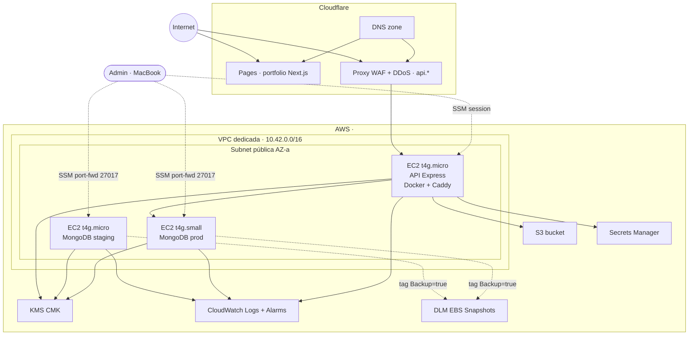

# AWS

Infraestructura AWS para express-clean-backend: 2 instancias MongoDB self-hosted (staging + production), 1 instancia API (futuro), S3, Secrets Manager, CloudWatch, KMS. DNS gestionado por Cloudflare (no Route 53).

## Qué hospedamos

- 2× EC2 MongoDB (staging y production), ARM Graviton, self-hosted nativo.
- 1× EC2 API Express (Docker + Caddy reverse proxy), arquitectura futura, fuera del scope actual.
- S3 para storage (migración desde OVH Object Storage).
- KMS CMK para cifrado en reposo.
- Secrets Manager para credenciales.
- CloudWatch para logs, métricas, alarmas.

## Estructura

| Path | Tema |
|---|---|
| [`mongodb/`](./mongodb/) | MongoDB en EC2 self-hosted: overview, setup, operations |
| [`keycloak/`](./keycloak/) | Keycloak 26 en EC2 con H2 embedded detrás de Cloudflare proxied. Sin Traefik, sin Let's Encrypt |
| [`iam.md`](./iam.md) | IAM users, roles, service accounts, MFA, policies |
| [`s3.md`](./s3.md) | S3 buckets, presigned URLs, lifecycle, encryption |
| [`ec2.md`](./ec2.md) | EC2 instances generales: AMI, sizing, IMDSv2 |
| [`secrets-manager.md`](./secrets-manager.md) | Secrets Manager, rotación, inyección |
| [`cloudwatch.md`](./cloudwatch.md) | CloudWatch logs, métricas, alarmas, billing alerts |
| [`vpc-network.md`](./vpc-network.md) | VPC, subnets, IGW, security groups |
| [`observability.md`](./observability.md) | Observabilidad cross-service |
| [`ecr.md`](./ecr.md) | ECR (no usado actualmente — imágenes Docker van a GHCR) |
| ~~`ecs.md`~~ | ECS Fargate (descartado — usamos EC2 self-hosted por budget) |

## Arquitectura objetivo



## Servicios y costes estimados (régimen estable, post-migración OVH)

Pricing real `eu-south-2` mayo 2026. Cifras IVA incluido (×1.21).

| Servicio | Item | €/mes IVA |
|---|---|---|
| **EC2 Mongo staging** | `t4g.micro` 24/7 + EBS 10 GB | ~9 |
| **EC2 Mongo prod** | `t4g.small` 24/7 + EBS 20 GB | ~17 |
| **EC2 API** (futuro) | `t4g.micro` 24/7 + EBS 8 GB | ~8 |
| **S3 Standard** | 50 GB asumido | ~1 |
| **KMS CMK** | 1 key + requests | ~1 |
| **Secrets Manager** | 9 secrets + API calls | ~3 |
| **CloudWatch** | logs + metrics + flow logs sample | ~3 |
| **EBS snapshots** | DLM delta retention 7d | ~1 |
| **Egress data** | reserva 5 GB | ~0 |
| **Total AWS** | | **~43 €/mes IVA** |

Crédito promocional 100 € cubre primeros ~2-3 meses sin facturar.

## Acceso

### Consola

`https://console.aws.amazon.com` — login con admin user + MFA obligatorio.

### CLI

```bash
aws configure --profile <aws-admin-profile>
aws sts get-caller-identity --profile <aws-admin-profile>
```

### CloudShell

Hereda credenciales de la sesión consola. Útil para `terraform apply` sin gestionar keys locales.

### SSM Session Manager (no SSH)

```bash
aws ssm start-session --region <aws-region> --target <instance-id>
```

Requiere `session-manager-plugin` instalado (`brew install --cask session-manager-plugin`).

## Seguridad — baseline

| Área | Decisión |
|---|---|
| IAM root | MFA obligatorio, no usar para operación diaria |
| Admin user | MFA obligatorio, AdministratorAccess |
| Programmatic access | GitHub Actions vía OIDC federation, sin keys persistentes |
| EC2 acceso shell | SSM Session Manager (sin SSH, sin port 22) |
| EBS | Encrypted con KMS CMK (no aws/managed) |
| S3 | Public access block en 4 niveles + bucket policy deny insecure transport |
| Secrets | KMS CMK encryption + IAM resource-based policies |
| VPC | Flow Logs a CloudWatch, sin NAT (instancias en subnet pública con SG estricto) |
| Network | Security Groups restrictivos por referencia (`sg-api` → `sg-mongo:27017`) |

## Descartado por presupuesto

| Servicio | Por qué no se usa |
|---|---|
| ECS Fargate | Coste ~50-100 €/mes; EC2 self-hosted con Docker es suficiente |
| RDS PostgreSQL | App usa Mongo, no SQL |
| ElastiCache | Sin caché distribuido por ahora; caché in-memory si hace falta |
| NAT Gateway | ~32 €/mes solo por existir; instancias van en subnet pública con SG |
| CloudFront | Cloudflare ya hace CDN gratis |
| AWS Client VPN | ~80 €/mes; SSM Session Manager cubre el caso de uso admin |
| Route 53 hosted zone | Cloudflare DNS ya existe y es gratis |

## Roadmap

1. ✅ Setup Terraform backend (S3 state + DynamoDB lock + KMS) — phase 01
2. ✅ VPC + Security Groups + KMS workloads + Flow Logs — phase 02
3. ✅ MongoDB staging + prod desplegados (EC2 self-hosted, SCRAM auth) — phase 03
4. ✅ Keycloak 26 + DLM backups (EC2 ARM, H2 embedded, CF proxied) — phase kc
5. ⏳ API Express ECS Fargate ARM + ALB compartido + GitHub Actions OIDC — phase 04
6. ⏳ S3 + migración OVH → AWS — phase 05
7. ⏳ Cloudflare Pages para portfolio Next.js — phase 06
8. ⏳ Observability stack (Loki + Prometheus + Thanos + Grafana en EC2) — phase 07a/b
9. ⏳ Secrets API + DLM extendido + CW alarms + billing alert — phase 07c
10. ⏳ Cutover OVH → AWS — phase 08

## Estado actual del entorno

| Componente | Estado | Notas |
|---|---|---|
| Terraform backend remoto | ✅ | S3 + DynamoDB + KMS CMK propia |
| VPC dedicada (2 AZs) | ✅ | Subnets pública + privada (privada reservada), sin NAT Gateway |
| Security Groups | ✅ | `sg-admin`, `sg-mongo`, `sg-api` con SG-to-SG reference |
| VPC Flow Logs | ✅ | CloudWatch group cifrado con KMS |
| MongoDB staging | ✅ | EC2 `t4g.micro`, EBS 10 GB, SCRAM auth, sin TLS |
| MongoDB production | ✅ | EC2 `t4g.small`, EBS 20 GB, SCRAM auth, sin TLS |
| Keycloak | ✅ | EC2 `t4g.small` compartida staging+prod, H2 embedded, CF proxied termina TLS, SG limitado a CIDRs CF |
| DLM backups | ✅ | Policy daily 03:00 UTC, 7 snapshots, cubre todos los EBS con tag `Backup true` (Mongo + Keycloak) |
| Secrets Manager | ✅ | `mongo/staging/admin`, `mongo/prod/admin` (random_password 32 chars) |
| CloudWatch Log Groups | ✅ | `/mongo/staging`, `/mongo/prod`, `/aws/vpc/main/flow-logs` |
| IAM user CLI admin | ✅ | `<cli-user>` con policy mínima para SSM port-forward + read secrets |
| Scripts locales SSM | ✅ (no commiteados) | `scripts/ssm-mongo-{staging,prod}.sh` excluidos vía `.git/info/exclude` |

## Archivos locales (no commiteados)

Por privacidad e higiene operativa, **estos archivos viven solo en el laptop del admin**, excluidos via `.git/info/exclude`:

| Path | Contenido | Cómo recrearlo |
|---|---|---|
| `infra/` | Módulos Terraform completos + state local del bootstrap | Plantilla en plan `260510-2322-aws-migration-mongo-api-s3/` |
| `scripts/ssm-mongo-staging.sh` | Wrapper SSM port-forward staging | Plantilla en [`mongodb/operations.md`](./mongodb/operations.md#scripts-locales-no-se-commitean) |
| `scripts/ssm-mongo-prod.sh` | Wrapper SSM port-forward prod | Plantilla en [`mongodb/operations.md`](./mongodb/operations.md#scripts-locales-no-se-commitean) |
| `~/.aws/credentials` `[<cli-profile>]` | Access keys del IAM user CLI | `aws configure --profile <cli-profile>` con keys nuevas de IAM |

**Razón:** los archivos contienen instance IDs, ARNs reales y referencias a la cuenta AWS. Aunque AWS-resource IDs no son secretos por sí mismos, exponerlos en un repo público facilita reconocimiento. El plan de fase y la doc operativa describen la estructura con placeholders para que cualquiera pueda recrear el setup en otra cuenta.

## IAM users en uso

| User | Origen | Permisos | MFA | Uso |
|---|---|---|---|---|
| Root account | AWS | Total | Sí | Solo emergencias |
| Admin user (consola) | Manual | `AdministratorAccess` | Sí | Operaciones grandes desde consola web o CloudShell (herencia) |
| MCP read-only | Manual | `ReadOnlyAccess` | No | Llamadas read desde herramientas locales |
| CLI admin Mongo (`<cli-user>`) | Manual | Policy mínima (ver `mongodb/operations.md`) | No | SSM port-forward + read secrets desde laptop |

`<cli-user>` no tiene MFA porque su scope es mínimo (SSM tunnel a 1 instancia + leer secrets `mongo/*`). Si se compromete, lo peor posible es túneles SSM autenticados a Mongo + lectura de credenciales Mongo, que se rotan rápido.

## Lecturas relacionadas

- [`../structure/development.md`](../structure/development.md) — topología por entorno
- [`../structure/production.md`](../structure/production.md) — topología prod
- AWS Console: `https://console.aws.amazon.com`
