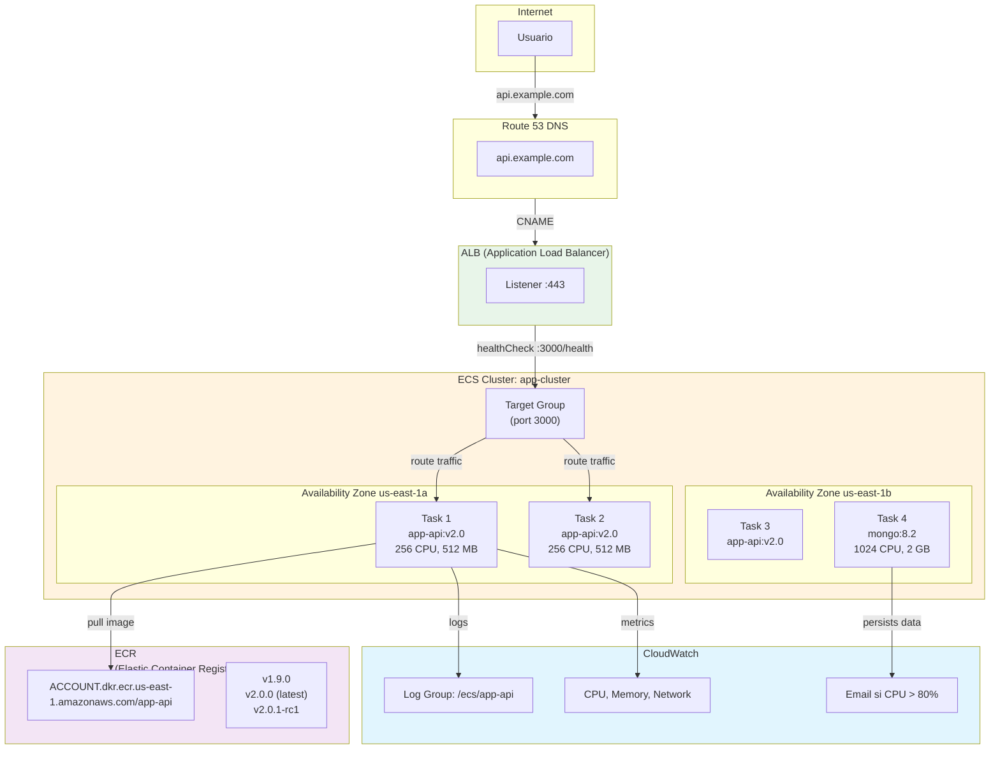

# ECS — Container Orchestration

Run containers on Fargate—AWS handles the infrastructure.

## Qué?

ECS runs Docker containers. Fargate means AWS manages the servers.

## Por qué ECS?

Today we run MongoDB and the API on a single EC2 instance manually. That means patching, reboots, maintenance.

With ECS Fargate, we define a container and tell AWS to run it. Servers are invisible.

## Para qué?

- Scaling automático bajo carga (tasks se crean/destruyen)
- Despliegues rolling (sin downtime)
- Logs centralizados en CloudWatch
- Health checks automáticos + reintentos

## Arquitectura



## Task Definition (Fargate)

Define qué imagen correr, recursos, variables, secretos, logs.

```json
{
  "family": "app-api",
  "networkMode": "awsvpc",
  "requiresCompatibilities": ["FARGATE"],
  "cpu": "256",
  "memory": "512",
  "executionRoleArn": "arn:aws:iam::ACCOUNT:role/ecsTaskExecutionRole",
  "taskRoleArn": "arn:aws:iam::ACCOUNT:role/ecsTaskRole",
  "containerDefinitions": [
    {
      "name": "api",
      "image": "ACCOUNT.dkr.ecr.us-east-1.amazonaws.com/app-api:v2.0.0",
      "essential": true,
      "portMappings": [
        {
          "containerPort": 3000,
          "hostPort": 3000,
          "protocol": "tcp"
        }
      ],
      "environment": [
        {
          "name": "NODE_ENV",
          "value": "production"
        },
        {
          "name": "LOG_LEVEL",
          "value": "info"
        }
      ],
      "secrets": [
        {
          "name": "MONGODB_URI",
          "valueFrom": "arn:aws:secretsmanager:us-east-1:ACCOUNT:secret:/app/prod/env:MONGODB_URI::"
        },
        {
          "name": "JWT_SECRET",
          "valueFrom": "arn:aws:secretsmanager:us-east-1:ACCOUNT:secret:/app/prod/env:JWT_SECRET::"
        },
        {
          "name": "AWS_ACCESS_KEY_ID",
          "valueFrom": "arn:aws:secretsmanager:us-east-1:ACCOUNT:secret:/app/prod/env:AWS_ACCESS_KEY_ID::"
        },
        {
          "name": "AWS_SECRET_ACCESS_KEY",
          "valueFrom": "arn:aws:secretsmanager:us-east-1:ACCOUNT:secret:/app/prod/env:AWS_SECRET_ACCESS_KEY::"
        }
      ],
      "logConfiguration": {
        "logDriver": "awslogs",
        "options": {
          "awslogs-group": "/ecs/app-api",
          "awslogs-region": "us-east-1",
          "awslogs-stream-prefix": "ecs"
        }
      },
      "healthCheck": {
        "command": [
          "CMD-SHELL",
          "curl -f http://localhost:3000/health || exit 1"
        ],
        "interval": 30,
        "timeout": 5,
        "retries": 3,
        "startPeriod": 60
      }
    }
  ]
}
```

**Roles IAM explicados:**
- `ecsTaskExecutionRole`: permite pull imagen desde ECR, acceso a Secrets Manager (otorgada por AWS)
- `ecsTaskRole`: permisos que el container necesita (S3 read/write, DynamoDB, etc.)

### Crear y registrar task definition

```bash
# Guardar JSON arriba en task-definition.json

aws ecs register-task-definition \
  --cli-input-json file://task-definition.json

# Ver versiones registradas
aws ecs list-task-definitions --family-prefix app-api
```

## ECS Service

Especifica cuántas tasks correr, load balancing, actualización.

```bash
aws ecs create-service \
  --cluster app-cluster \
  --service-name app-api \
  --task-definition app-api:1 \
  --desired-count 2 \
  --launch-type FARGATE \
  --network-configuration "awsvpcConfiguration={
    subnets=[subnet-12345,subnet-67890],
    securityGroups=[sg-api-task],
    assignPublicIp=DISABLED
  }" \
  --load-balancers "targetGroupArn=arn:aws:elasticloadbalancing:us-east-1:ACCOUNT:targetgroup/app-api/...,containerName=api,containerPort=3000" \
  --deployment-configuration "maximumPercent=200,minimumHealthyPercent=100" \
  --scheduling-strategy REPLICA \
  --tags key=Name,value=app-api key=Environment,value=prod
```

**Parámetros clave:**
- `desired-count: 2` — corre 2 tasks (1 por AZ para HA)
- `launch-type FARGATE` — sin EC2 subyacente
- `maximumPercent=200` — rolling update: puede tener 2×desired (4 tasks) durante deploy
- `minimumHealthyPercent=100` — al menos 2 sanos durante deploy

## Auto-Scaling

Tasks escalan automáticamente según CPU/memoria.

### Registrar target scalable

```bash
aws application-autoscaling register-scalable-target \
  --service-namespace ecs \
  --resource-id service/app-cluster/app-api \
  --scalable-dimension ecs:service:DesiredCount \
  --min-capacity 2 \
  --max-capacity 10
```

### Crear política de scaling

```bash
aws application-autoscaling put-scaling-policy \
  --policy-name app-api-cpu \
  --service-namespace ecs \
  --resource-id service/app-cluster/app-api \
  --scalable-dimension ecs:service:DesiredCount \
  --policy-type TargetTrackingScaling \
  --target-tracking-scaling-policy-configuration '{
    "TargetValue": 70.0,
    "PredefinedMetricSpecification": {
      "PredefinedMetricType": "ECSServiceAverageCPUUtilization"
    },
    "ScaleOutCooldown": 60,
    "ScaleInCooldown": 300
  }'
```

Si CPU promedio > 70%, AWS crea task. Si < 70%, destruye (con cooldown).

## Deployment Strategies

### Rolling (recomendado)

Tasks nuevas se crean, viejas se destruyen gradualmente. Sin downtime.

Ejemplo: 2 tasks corriendo v1.0.0
1. Crear 1 task con v2.0.0 (total 3 tasks)
2. Health check en v2.0.0
3. Destruir 1 task v1.0.0 (total 2 tasks)
4. Repetir hasta 2× v2.0.0

**Configuración:**
```bash
--deployment-configuration "maximumPercent=150,minimumHealthyPercent=100"
```

### Blue-Green

Crear servicio paralelo (Green), validar, switchear tráfico. Rollback instantáneo.

Más costoso (2× tasks durante deploy) pero 0% risk.

```bash
# 1. Crear servicio green (v2.0.0)
aws ecs create-service --service-name app-api-green ...

# 2. Validar smoke tests
curl https://app.example.com/health

# 3. Update ALB target group
aws elbv2 modify-target-group-attributes \
  --target-group-arn arn:... \
  --attributes Key=deregistration_delay.timeout_seconds,Value=30

# 4. Switchear tráfico blue → green
aws elbv2 modify-rule \
  --rule-arn arn:... \
  --actions Type=forward,TargetGroupArn=arn:...tg/app-api-green/...

# 5. Si algo anda mal, switchear atrás
```

## Deployment via CLI

```bash
# 1. Build imagen local
docker build -t app-api:v2.0.0 .

# 2. Tag con ECR registry
docker tag app-api:v2.0.0 ACCOUNT.dkr.ecr.us-east-1.amazonaws.com/app-api:v2.0.0

# 3. Login a ECR
aws ecr get-login-password --region us-east-1 | \
  docker login --username AWS --password-stdin ACCOUNT.dkr.ecr.us-east-1.amazonaws.com

# 4. Push imagen
docker push ACCOUNT.dkr.ecr.us-east-1.amazonaws.com/app-api:v2.0.0

# 5. Registrar nueva task definition
aws ecs register-task-definition --cli-input-json file://task-definition.json

# 6. Update servicio (triggers rolling deploy)
aws ecs update-service \
  --cluster app-cluster \
  --service app-api \
  --task-definition app-api:2 \
  --force-new-deployment
```

## Monitoreo

### Logs en CloudWatch

```bash
# Ver logs en tiempo real
aws logs tail /ecs/app-api --follow

# Ver últimas 100 líneas
aws logs tail /ecs/app-api --max-items 100
```

### Métricas

CloudWatch recolecta automáticamente:
- CPU utilization
- Memory utilization
- Network in/out
- Task count

```bash
# Ver métrica CPU
aws cloudwatch get-metric-statistics \
  --namespace AWS/ECS \
  --metric-name CPUUtilization \
  --dimensions Name=ServiceName,Value=app-api Name=ClusterName,Value=app-cluster \
  --start-time 2026-05-09T00:00:00Z \
  --end-time 2026-05-10T00:00:00Z \
  --period 300 \
  --statistics Average
```

## Comparativa: ECS vs EC2

| Aspecto | ECS Fargate | EC2 Manual |
|---|---|---|
| **Manejo SO** | AWS | Vos |
| **Scaling** | Automático | Manual |
| **Patching** | AWS | Vos |
| **Monitoreo** | Nativo CloudWatch | Tercero (DataDog, etc.) |
| **Costo fijo** | $0 (sin instancia) | ~$8.50/mes t2.micro |
| **Min despliegue** | 2 tasks ($30-40/mes) | 1 instancia |
| **Rollback** | 1 click | Manual |

## Costos estimados

| Componente | Tarifa | Mensual |
|---|---|---|
| Fargate (256 CPU, 512 MB) | $0.0445/hour | $32/mes (2 tasks) |
| ALB | $16/mes | $16/mes |
| CloudWatch Logs | gratis (5GB free) | $0 |
| ECR storage | $0.10/GB | ~$2/mes |
| Data transfer | $0.09/GB | ~$1/mes |
| **Total** | | ~$51/mes |

**vs EC2 t2.micro:** +$42/mes, pero sin ops burden.

## Troubleshooting

### Task no inicia

```bash
# Revisar logs
aws logs get-log-events --log-group-name /ecs/app-api --log-stream-name ecs/api/abc123

# Ver status task
aws ecs describe-tasks --cluster app-cluster --tasks arn:aws:ecs:...
```

### Image pull error

```bash
# Verificar credenciales ECR
aws ecr describe-repositories --repository-names app-api

# Verificar permisos en execution role
aws iam get-role-policy --role-name ecsTaskExecutionRole --policy-name push-ecr
```

## Enlaces relacionados

- [ECR — Container Registry](./ecr.md)
- [Secrets Manager — Secretos](./secrets-manager.md)
- [VPC Network — Networking](./vpc-network.md)
- [README AWS](./README.md)
- ECS docs: https://docs.aws.amazon.com/ecs/
- Fargate pricing: https://aws.amazon.com/fargate/pricing/
