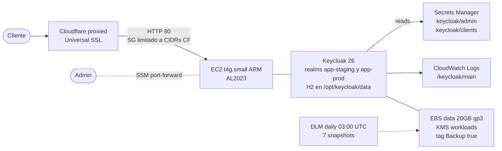

# Keycloak en AWS

Despliegue de Keycloak 26 en EC2 `t4g.small` ARM con H2 embedded DB, detrás de
Cloudflare proxied (Universal SSL). Una instancia compartida sirve los realms
`app-staging` y `app-prod` por path.

## Topología

## Por qué este diseño

| Decisión | Razón |
|---|---|
| **Sin Traefik en origen** | Cloudflare proxied termina TLS y aporta WAF + Bot Fight Mode + DDoS L3/L4 gratis. Traefik añadiría un container más sin valor real para 1 backend. |
| **Sin Let's Encrypt** | Cloudflare Universal SSL firma el cert público. Sin lifecycle de certs en el origen. |
| **Sin ALB dedicado** | 1 EC2 single-instance, ALB sería ~22 €/mes adicionales sin ventaja real aquí. |
| **Sin puerto 443 al mundo** | El SG ingress en 80 está restringido a CIDRs Cloudflare (data source `cloudflare_ip_ranges`). |
| **H2 embedded** | Sin requisito HA. Backup via DLM snapshot + `kc.sh export` ad-hoc del realm a JSON. Recreación en <5 min desde JSON si corrupción del fichero. |
| **Realms separados** | `app-staging.json` y `app-prod.json` importados al primer boot via `--import-realm`. Cambios en runtime no se sobrescriben (`KC_DB_IMPORT_STRATEGY=IGNORE_EXISTING`). |
| **SSL/TLS mode Flexible solo en `kc.*`** | Page Rule específica para los subdominios de Keycloak. Resto de la zona sigue en `Full` para no romper el portfolio y otros servicios. |

## Cobertura DLM

Una sola policy `daily-7d` cubre todos los EBS con tag `Backup=true`. Hoy:

- `keycloak-data` (EBS data del EC2 Keycloak)
- `mongo-staging-data` (de phase-03)
- `mongo-prod-data` (de phase-03)

Snapshot diario 03:00 UTC, retención 7 rolling, KMS workloads. Coste residual
~1-2 €/mes en total para los 3 volumes.

## Archivos

| Sección | Detalle |
|---|---|
| [setup.md](./setup.md) | Procedimiento de despliegue desde cero (Terraform + ajustes Cloudflare) |
| [operations.md](./operations.md) | Login admin, regeneración de client secrets, export/restore de realms, rotación de credenciales, troubleshooting |

## Referencias

- Módulo Terraform: `infra/aws/modules/keycloak-traefik-ec2/` (nombre legacy, ya sin Traefik)
- Wiring: `infra/aws/envs/main/keycloak.tf`
- Realms JSON: `infra/aws/modules/keycloak-traefik-ec2/files/realm-{staging,prod}.json`
- Adapter del proyecto: `src/infrastructure/keycloak/keycloak.adapter.ts`
- Modelo de issuers: [`docs/project/security.md`](../../project/security.md)
