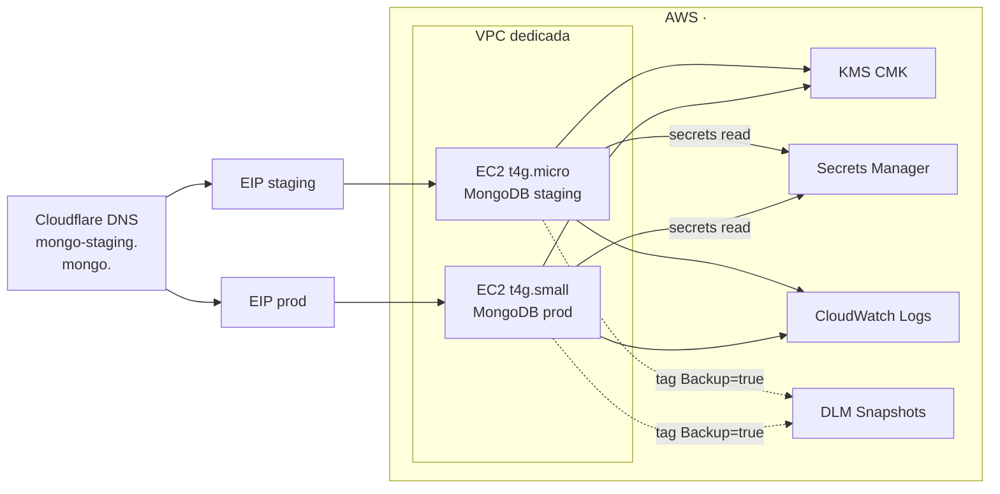

# MongoDB en AWS EC2

MongoDB self-hosted en dos instancias EC2 (staging + production), una por entorno, standalone (sin replica set por presupuesto).

## Qué

- 2 instancias EC2 ARM64 (Graviton) con MongoDB 8.x instalado nativamente (no Docker).
- TLS obligatorio (cert Let's Encrypt vía DNS-01 challenge contra Cloudflare).
- Autenticación SCRAM-SHA-256 obligatoria.
- Subnet pública, EIP fija, sin exposición pública del puerto 27017 (Security Group restrictivo).

## Por qué EC2 self-hosted y no DocumentDB / Atlas

| Opción | Coste/mes IVA aprox | Pros | Contras |
|---|---|---|---|
| **EC2 self-hosted** ✅ | ~25 € (2 instancias) | Control total, barato, MongoDB upstream real | Operación manual (patches, scaling) |
| DocumentDB | 200+ € | Managed, backups automáticos | Caro, compatibilidad parcial Mongo API |
| Atlas M10 | ~50 €/cluster × 2 = 100 € | Mejor managed Mongo | Caro, fuera de AWS native |
| Atlas M0 (free) | 0 € | Gratis | 512 MB max, sin uso productivo serio |

Decisión: **self-hosted EC2** dado el budget y volumen de datos bajo.

## Arquitectura

## Sizing por entorno

| Item | Staging | Production |
|---|---|---|
| Instance type | `t4g.micro` | `t4g.small` |
| vCPU / RAM | 2 / 1 GB | 2 / 2 GB |
| WiredTiger cache | 256 MB (mín) | ~768 MB |
| EBS data volume | 10 GB gp3 | 20 GB gp3 |
| EBS root | 8 GB gp3 | 8 GB gp3 |
| Coste/mes IVA | ~9 € | ~17 € |
| DNS | `mongo-staging.<your-domain.tld>` | `mongo.<your-domain.tld>` |
| Cloudflare proxy | OFF (TCP no proxiable) | OFF |
| Backup tag DLM | `Backup=true` | `Backup=true` |
| Snapshot retention | 3 días | 7 días |

## Decisiones de seguridad

| Tema | Decisión |
|---|---|
| Acceso shell admin | SSM Session Manager (sin SSH, sin port 22) |
| Acceso Compass (admin desde laptop) | SSM port-forward → `mongodb://localhost:27017` |
| Acceso desde API EC2 | Security Group `sg-api` → `sg-mongo:27017` |
| Cifrado en reposo | EBS encrypted con KMS CMK (no aws/managed) |
| Cifrado en tránsito | TLS obligatorio (`requireTLS`), cert LE renovado por cron |
| Auth | SCRAM-SHA-256, sin usuarios anónimos |
| IMDSv2 | `http_tokens=required` |
| Secrets | Mongo admin pwd en Secrets Manager (`mongo/<env>/admin`) |
| Backup | DLM snapshot diario tag `Backup=true` |
| Network egress | Sin NAT Gateway; instancia accede a Internet desde subnet pública con SG egress all |

## Lecturas relacionadas

- [`setup.md`](./setup.md) — Bootstrap completo (UserData cloud-init, mongod.conf, certbot).
- [`operations.md`](./operations.md) — Conexión Compass, backup/restore, runbook.
- [`../ec2.md`](../ec2.md) — EC2 general (instances + AMI).
- [`../secrets-manager.md`](../secrets-manager.md) — Secrets layout.
- [`../cloudwatch.md`](../cloudwatch.md) — Alarmas y logs.
- [`../vpc-network.md`](../vpc-network.md) — VPC + Security Groups.
