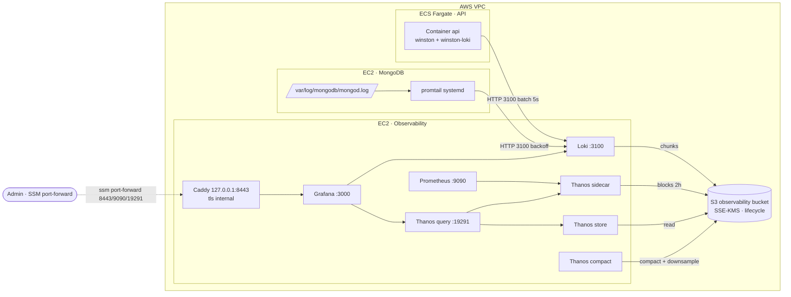
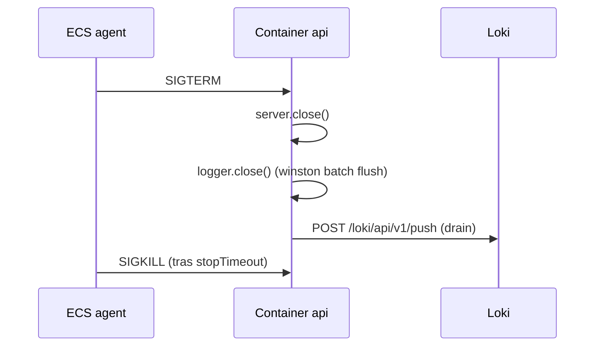

# Observabilidad

> Stack centralizado para logs y métricas: Loki + Prometheus + Thanos + Grafana servidos desde una EC2 dedicada, con un bucket S3 propio como backend de retención larga. Acceso administrativo vía SSM port-forward, sin DNS público.

---

## Índice

1. [Contexto](#contexto)
2. [Arquitectura](#arquitectura)
3. [Componentes](#componentes)
4. [Pipelines](#pipelines)
5. [Acceso administrativo](#acceso-administrativo)
6. [Configuración Loki / Thanos / Prometheus](#configuración-loki--thanos--prometheus)
7. [Convenciones LogQL](#convenciones-logql)
8. [Coste](#coste)
9. [Gaps](#gaps)

---

## Contexto

El backend Express produce logs estructurados (Winston). Mongo escribe a `/var/log/mongodb/mongod.log`. Ambos viajan por la red interna de la VPC hasta una sola EC2 que aloja todo el plano de observabilidad. Los chunks de Loki y los bloques 2 h de Prometheus persisten en un bucket S3 con SSE-KMS, lifecycle a IA y Glacier-IR y `Deny aws:SecureTransport=false`.

Decisiones que fijan el resto del documento:

- Una sola EC2 ARM64 (`t4g.small`) en subnet pública AZ-a, sin EIP. IP efímera vía IGW.
- Sin VPC interface endpoints SSM ni NAT Gateway. El SG bloquea todo ingress salvo Loki `3100/tcp` desde los SG de API y Mongo. Mismo patrón que el resto de hosts del VPC.
- Caddy con `tls internal` en `127.0.0.1:8443` delante de Grafana. La UI nunca habla HTTP plano, ni siquiera en localhost.
- Acceso humano por SSM port-forward. No hay registro DNS público, no hay ALB, no hay Cloudflare Tunnel.

---

## Arquitectura



Shutdown limpio de la task API (relevante para no perder el último batch de Winston al desplegar):



---

## Componentes

| Componente | Versión | Rol | Datos |
|---|---|---|---|
| Loki | `3.7.x` | ingest + query de logs, tiered storage S3 | `/var/lib/observability/loki/` (WAL local) + S3 chunks/index |
| Prometheus | `v3.5.x` | scrape métricas, bloques TSDB 2 h | `/var/lib/observability/prom-data/` (15 d retención local) |
| Thanos sidecar | `v0.41.x` | sube bloques Prom a S3 cuando se sellan | conecta a Prom localhost |
| Thanos store | `v0.41.x` | sirve bloques históricos desde S3 | sin estado local relevante |
| Thanos compact | `v0.41.x` | compacta y downsamplea bloques históricos | `/var/lib/observability/thanos-compact/` |
| Thanos query | `v0.41.x` | query unificada sidecar + store | endpoint datasource Grafana |
| Grafana | `13.0.x` | UI, datasources Loki + Thanos, provisioning | `/var/lib/observability/grafana/` |
| Caddy | `2.8.x` | TLS internal frente a Grafana, sin auth propia | cert self-signed |
| CloudWatch Agent | system pkg | logs userdata + métricas básicas EC2 | log group `/observability/main` |

Imágenes Docker pineadas en el `docker-compose.yml`. Las versiones se promueven con un PR puntual, sin actualización automática.

---

## Pipelines

### Logs de la API (Express + Winston → Loki)

`winston-loki` se activa solo cuando `NODE_ENV` ∈ {`staging`, `production`} y `LOKI_HOST` apunta a una URL HTTP completa (`http://<observability-ip>:3100`). Si falta alguno, la app sigue escribiendo a stdout y se omite el push.

| Aspecto | Valor |
|---|---|
| Labels Loki | `app`, `env`, `service`, `level` |
| Batching | sí, intervalo `5 s` |
| Formato | JSON puro (transport con `format: winston.format.json()` propio) |
| Timeout request | `30 s` |
| `onConnectionError` | escribe a `stderr` con throttle interno (máx 1 línea/minuto) |
| Health checks | filtrados antes de llegar al adapter (Express access middleware) |

Sobre labels: nada de `requestId`, `userId`, `path`, `ip`, `statusCode` como label estático. Esos viven en el body JSON. La cardinalidad alta rompe el TSDB de Loki.

Los campos top-level del JSON que la app emite consistentemente:

| Campo | Origen | Disponibilidad |
|---|---|---|
| `level` | Winston | siempre |
| `message` | Winston | siempre |
| `timestamp` | Winston | siempre |
| `app`, `env`, `service` | labels Loki | siempre (label) |
| `requestId`, `method`, `path` | `RequestContextLoggerDecorator` | en todo log emitido vía `req.logger.*` |
| `statusCode` | `ErrorLogger` (todas las ramas del Chain) | en todo log de la cadena de errores (4xx y 5xx) |
| `fields[]` | `ErrorLogger.validation` | en errores Zod |
| `kind`, `stack` | `ErrorLogger` | en errores Mongo / unhandled |

### Logs de MongoDB (mongod.log → Promtail → Loki)

Promtail systemd corre en cada EC2 Mongo bajo usuario propio (`promtail`, sin shell ni home), con ACL `setfacl u:promtail:r` sobre `mongod.log` y `messages`. El hook `postrotate` reaplica la ACL tras `logrotate`.

| Aspecto | Valor |
|---|---|
| Jobs | `mongo` (`/var/log/mongodb/mongod.log`), `syslog` (`/var/log/messages`) |
| Labels | `job`, `host`, `env`, `service`, `component` |
| Positions | `/var/lib/promtail/positions.yaml` (sobrevive a restart) |
| Backoff push | `500 ms` → `5 m`, `10` retries |
| Batch | `1 s` / `1 MiB` |

La versión instalada es la última estable que se publicó como binario standalone. Versiones más recientes del repo de Loki dejaron de empaquetar promtail como artifact; el sucesor oficial es Grafana Alloy y queda anotado como evolución futura.

### Métricas (Prometheus + Thanos sidecar → S3)

Prometheus corre con `--storage.tsdb.min-block-duration=2h --storage.tsdb.max-block-duration=2h`. Esa simetría hay que mantenerla: Thanos sidecar exige bloques inmutables del mismo tamaño. Si no coinciden, los uploads quedan corruptos.

Scrape jobs declarados:

- `prometheus` (self-scrape)
- `api-staging`, `api-prod` — endpoint `/metrics`
- `mongo-staging`, `mongo-prod` — endpoint `:9216` (mongodb_exporter)
- `node-observability` — `:9100` (node_exporter en la propia EC2)

Hoy buena parte de esos targets aparecen `DOWN` hasta que se desplieguen los exporters. La infraestructura de scrape ya está. Ver [Gaps](#gaps).

---

## Acceso administrativo

Sin DNS público. Todo va por SSM Session Manager. El admin necesita perfil AWS con `ssm:StartSession`, `ssmmessages:Create/Open Control/DataChannel` y `secretsmanager:GetSecretValue` para leer la contraseña inicial de Grafana.

```bash
OBSERVABILITY_INSTANCE_ID=<observability-ec2-id> \
  ./scripts/ssm-observability.sh -p <your-cli-profile>
```

Tres túneles paralelos:

| Local | Remoto | Servicio |
|---|---|---|
| `https://127.0.0.1:8443` | `127.0.0.1:8443` | Grafana (vía Caddy, cert self-signed) |
| `http://127.0.0.1:9090` | `127.0.0.1:9090` | Prometheus UI |
| `http://127.0.0.1:19291` | `127.0.0.1:19291` | Thanos query UI |

Aviso sobre el certificado: Caddy lo emite para `127.0.0.1` y `localhost`. Conectar con `localhost:8443` o `127.0.0.1:8443` funciona. Cualquier otro hostname (IP remota, alias en `/etc/hosts`) da `ERR_SSL_PROTOCOL_ERROR`.

Recuperar la contraseña de admin:

```bash
aws secretsmanager get-secret-value \
  --region <aws-region> --profile <your-cli-profile> \
  --secret-id observability/grafana-admin \
  --query SecretString --output text
```

Rotar la password: `openssl rand -hex 16` sobre la EC2, sobreescribir `/etc/grafana/admin-password`, `docker compose restart grafana`, sincronizar al secret.

---

## Configuración Loki / Thanos / Prometheus

Las configs viven en `infra/observability/config/` y se renderizan con `envsubst` sustituyendo `<AWS_REGION>`, `<BUCKET_ID>` y `<KMS_ARN>` antes de enviarlas a `/etc/{loki,prometheus,thanos}/` de la EC2.

### Loki — schema y storage

Schema `v13` + `tsdb` + `period: 24h` son los valores que necesita el compactor para poder borrar por retención. Si falta cualquiera, el GC no toca los chunks viejos. Configuración relevante:

```yaml
schema_config:
  configs:
    - from: <fecha-de-arranque>
      store: tsdb
      object_store: s3
      schema: v13
      index: { prefix: loki/index/, period: 24h }
      chunks: { prefix: loki/chunks/ }

storage_config:
  aws:
    s3: s3://<aws-region>/<observability-bucket>
    region: <aws-region>
    sse: { type: SSE-KMS, kms_key_id: <kms-workloads-arn> }
    s3forcepathstyle: false

compactor:
  working_directory: /loki/compactor
  retention_enabled: true
  retention_delete_delay: 2h
  delete_request_store: s3

limits_config:
  retention_period: 2160h    # 90 d
  ingestion_rate_mb: 4
  ingestion_burst_size_mb: 6
```

Las credenciales para S3 vienen del instance profile (`aws_sdk_auth: true` en Thanos, sin keys hard-coded en Loki).

### Thanos sidecar / store

```yaml
type: S3
config:
  bucket: <observability-bucket>
  endpoint: s3.<aws-region>.amazonaws.com
  region: <aws-region>
  aws_sdk_auth: true
  sse_config: { type: SSE-KMS, kms_key_id: <kms-workloads-arn> }
prefix: thanos
```

Retención por resolución (compact):

| Resolución | Retención |
|---|---|
| raw | 180 d |
| 5m | 365 d |
| 1h | 2 años |

### Prometheus

Pin de bloques 2 h, lifecycle + admin API expuestos en localhost para el sidecar:

```
--storage.tsdb.retention.time=15d
--storage.tsdb.min-block-duration=2h
--storage.tsdb.max-block-duration=2h
--web.enable-lifecycle
--web.enable-admin-api
```

Granularidad scrape `15 s` (override por job no permitido salvo justificación).

---

## Dashboards

Grafana arranca con provisioning de filesystem. Los JSON viven en `/etc/grafana/dashboards/` y los recoge un provider con `disableDeletion: true` y `allowUiUpdates: false`. Los cambios desde la UI no persisten: el flujo es JSON en repo, sync al EC2, restart Grafana.

El stack no tiene exporters de Prometheus todavía (la API no expone `/metrics`, no hay `node_exporter` ni `mongodb_exporter`). Los dashboards se apoyan en Loki, que cubre la mayor parte del valor diagnóstico mientras tanto.

El transport `winston-loki` recibe `format: winston.format.json()` propio, así que cada entry llega a Loki como JSON puro top-level. Las queries de panel usan `| json` directo, sin `| regexp`. Los templates `line_format` referencian campos como `{{.path}}`, `{{.statusCode}}`, `{{.requestId}}` que Loki extrae automáticamente.

La cadena de errores (`error-handler.middleware.ts`) implementa Chain of Responsibility: BodyParse, Zod, Client, Server, Mongo, Fallback. Cada eslabón emite `statusCode` como meta separada del `message`. Eso permite filtros LogQL nativos sobre el campo (`| statusCode =~ "4.."`, `| statusCode != ""`).

### `API · Logs (Loki)`

Variable `env` (dropdown). Paneles:

| Panel | Tipo | Query |
|---|---|---|
| Logs totales 5m | stat | `sum(count_over_time({app="express-clean-backend", env="$env"}[5m]))` |
| Errores 5m | stat (background rojo si ≥ 1) | filtro `level="error"` |
| Warnings 5m | stat | filtro `level="warn"` |
| Validation 4xx 5m | stat | `\|~ "\\[VALIDATION 4"` |
| Logs por nivel | timeseries stacked 1m bins | `sum by (level) (count_over_time(...[1m]))` |
| Logs en vivo | logs panel | `{app, env}` |
| Solo warn/error | logs panel | filtro `level=~"warn\|error"` |

### `MongoDB · Logs (Loki)`

Variables `env` y `host` (cascading; `host` se filtra por el `env` actual). Paneles:

| Panel | Tipo | Query |
|---|---|---|
| Eventos 5m | stat | `count_over_time({job="mongo", env="$env", host="$host"}[5m])` |
| Slow operations 15m | stat | `\|~ "(?i)slow operation"` |
| Eventos NETWORK 5m | stat | filtro `component="NETWORK"` |
| Restarts 1h | stat | `\|~ "MongoDB starting"` |
| Eventos por component | timeseries stacked | `sum by (component) (count_over_time(...[1m]))` |
| Logs en vivo | logs panel | `{job=mongo, env, host}` |
| Slow ops detectadas | logs panel | `\|~ "(?i)slow operation"` |

Los dashboards renderizan en Grafana sin alertas asociadas. Las alertas entran en una fase posterior junto a Alertmanager y las reglas de Prometheus.

---

## Convenciones LogQL

Queries que conviene tener a mano:

```logql
# Todos los logs de la API en producción
{app="express-clean-backend", env="production"}

# Filtrar por requestId concreto (campo extraído por | json)
{app="express-clean-backend"} | json | requestId="<uuid>"

# Solo warnings/errores
{app="express-clean-backend", env="staging"} | json | level=~"warn|error"

# Todos los 4xx (filtra por statusCode numérico — el meta emitido por ErrorLogger)
{app="express-clean-backend", env="production"} | json | statusCode =~ "4.."

# Top 10 paths con más tráfico en 15 m
topk(10, sum by (path) (count_over_time({app="express-clean-backend", env="production"} | json | path != "" [15m])))

# Logs Mongo: checkpoints WiredTiger último cuarto de hora
{job="mongo", env="production", component="WTCHKPT"} [15m]

# Slow queries Mongo (heurística por substring)
{job="mongo"} |~ "slow operation"

# Login fallidos correlacionados con request
{app="express-clean-backend"} | json | event="user.login_failed"
```

Lo que conviene evitar:

- Añadir `requestId`, `userId`, `path`, `ip` o `statusCode` como label estático del push.
- Mezclar `route` y `path` como nombres para el mismo dato. El adapter usa `path` desde el `RequestContextLoggerDecorator` y desde el Chain de errores.
- Crear datasources en la UI de Grafana fuera del provisioning. Genera drift entre filesystem y UI.
- Usar `{job=~".*"}` o regex amplios sobre `job` en dashboards compartidos. Explota la cardinality del query frontend.

---

## Coste

Régimen estable medido en Cost Explorer (tag `Module=observability`):

| Componente | €/mes IVA |
|---|---|
| EC2 `t4g.small` 24/7 | ~14.8 |
| EBS gp3 70 GiB (root 20 + data 50) | ~6.3 |
| S3 storage mixto (STD → IA → Glacier IR) | ~3.2 |
| S3 requests (puts + gets típicos) | ~1.1 |
| KMS requests (reuse CMK workloads) | ~0.5 |
| CloudWatch logs userdata + sidecar | ~0.8 |
| DLM snapshots EBS data | ~1.5 |
| **Total** | **~28** |

Sin NAT GW, sin VPC interface endpoints y sin ALB delante de Grafana. El egress sale por IGW al precio estándar, y el tráfico a S3 dentro de la región es gratis.

---

## Gaps

Lo que el stack todavía no cubre:

- Alertmanager + reglas Prometheus para `HighErrorRate`, `LokiIngestRateHigh`, `MongoDown`. Notificaciones a email, Slack o PagerDuty.
- Exporters de métricas: `prom-client` middleware en la API (HTTP histogram + counters), `mongodb_exporter` en cada Mongo EC2, `node_exporter` en los hosts EC2. Hoy Prometheus tiene los scrape jobs declarados pero la mayoría salen `DOWN`.
- Trazas distribuidas con OpenTelemetry SDK en la API y Tempo en el stack. Hoy el `requestId` cubre solo la correlación intra-API.
- OIDC en Grafana con Keycloak (`app-prod`) sustituyendo al admin local.
- Migración de Promtail a Grafana Alloy. El proyecto Promtail dejó de publicar binarios standalone y Alloy es su sucesor soportado.
- Multi-AZ. El stack vive en AZ-a. Si el volumen de logs y métricas crece por encima de 20 GB/día, conviene split más replicación cruzada.
- FireLens sidecar fluent-bit en ECS como alternativa a winston-loki para Fargate. Reenvía logs por driver `awsfirelens` y aguanta mejor un crash de la app.

---

## Referencias cruzadas

- [`docs/project/architecture.md`](../project/architecture.md) — patrón Hexagonal + DDD-lite, capa logging via `LoggerPort`.
- [`docs/project/adapters.md`](../project/adapters.md) — adapter `WinstonLoggerAdapter` y decorator `RequestContextLoggerDecorator`.
- [`docs/structure/operations.md`](../structure/operations.md) — runbook arranque/parada del stack.
- [`docs/aws/vpc-network.md`](./vpc-network.md) — subnets, route tables, SGs referenciados.
- [`docs/aws/s3.md`](./s3.md) — patrón de bucket con SSE-KMS + lifecycle + TLS-deny.
