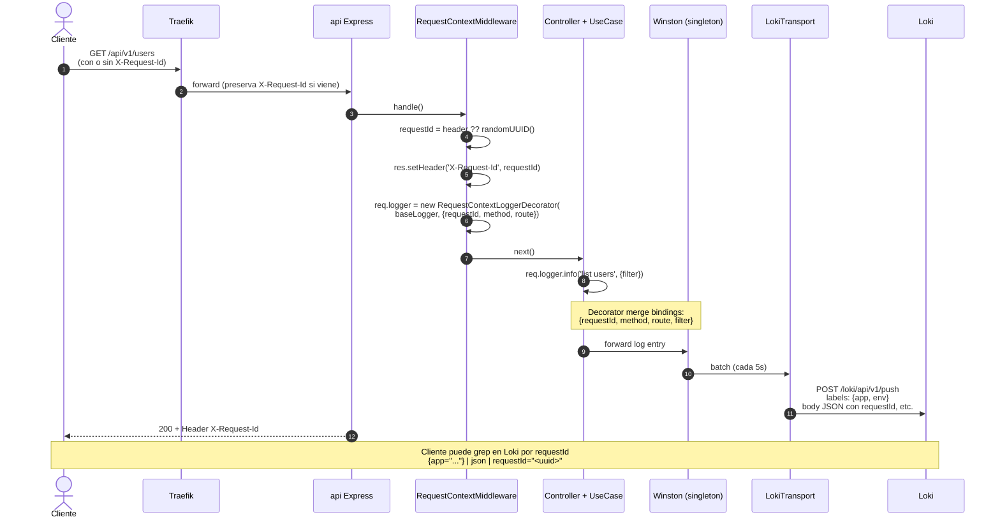

# Observabilidad

> Stack observability operacional: logs (Winston + Loki),
> métricas (Prometheus), dashboards (Grafana).

---

## Indice

1. [Resumen ejecutivo](#resumen-ejecutivo)
2. [Logs (Winston + Loki)](#logs-winston--loki)
3. [Trazabilidad request-id E2E](#trazabilidad-request-id-e2e)
4. [Auditoria de login](#auditoria-de-login)
5. [Metricas](#metricas)
6. [Dashboards](#dashboards)
7. [Alertas](#alertas)
8. [Traces](#traces)

---

## Resumen ejecutivo

| Pilar | Estado | Evidencia |
|---|---|---|
| **Logs aplicativos** | OK — Winston + winston-loki + decorator request-context | `src/infrastructure/logger/winston.adapter.ts:25-69` |
| **Logs Traefik** | OK — JSON access log + traefik.log | `docker-compose.yml:111-116` |
| **Trazabilidad E2E** | OK — `X-Request-Id` UUID v4 propagado | `src/presentation/bootstrap/middlewares/request-context.middleware.ts:28-40` |
| **Audit log** | OK — coleccion separada con TTL 90d | `src/infrastructure/mongodb/schemas/login-audit-log.schema.ts:42-43` |
| **Metricas Traefik** | OK — `:8082/metrics` con labels router/service | `docker-compose.yml:119-122` |
| **Metricas API** | OK — `prom-client` + `/metrics` + job Prometheus activo | `src/presentation/bootstrap/middlewares/metrics.middleware.ts`, `monitoring/prometheus.yml` |
| **Dashboards Grafana** | OK — provisioning + dashboard `api-overview` | `monitoring/grafana/{provisioning,dashboards}/` |
| **Alertas** | AUSENTE — sin Alertmanager ni reglas Prometheus | — |
| **Traces** | AUSENTE — sin OpenTelemetry SDK | — |
| **Loki retention** | IMPORTANT — sin compactor explicito (default infinita) | `docker-compose.yml:379-394` |


> sub-secciones.

---

## Logs (Winston + Loki)

### Configuracion adapter

`src/infrastructure/logger/winston.adapter.ts:25-69` — factory `async create()`
con dos Strategies (formato y transports):

| Aspecto | dev / local / test | staging / production |
|---|---|---|
| Formato | `colorize + timestamp HH:mm:ss + errors{stack:true} + printf custom` | `timestamp ISO + errors{stack:true} + json()` |
| `level` | `debug` (development), `info` (resto) | `info` |
| Transport Console | siempre activo | siempre activo |
| Transport Loki | NO | si `LOKI_HOST` esta seteado |
| `exitOnError` | `false` | `false` |

### Pipeline a Loki

`src/infrastructure/logger/winston.adapter.ts:43-58`:

```ts
if ((env.server.isProduction || env.server.isStaging) && env.loki.host) {
  transports.push(new LokiTransport({
    host: env.loki.host,
    labels: { app: 'express-clean-backend', env: nodeEnv },
    json: true,
    batching: true,
    interval: 5,
  }));
}
```

| Aspecto | Valor |
|---|---|
| Labels Loki | `app`, `env` (estaticos — low cardinality) |
| Batching | true |
| Interval | 5 segundos |
| Formato | JSON (parseable con `| json` en LogQL) |

**Reglas Loki low-cardinality**: NO meter `requestId`, `userId`,
`route` como labels. Cardinality alta rompe Loki. Estos campos van en
el body JSON y se filtran via `| json | <campo>="<valor>"` en LogQL.

### Ejemplos LogQL

```logql
# Todos los logs de la app
{app="express-clean-backend"}

# Filtrar por requestId concreto
{app="express-clean-backend"} | json | requestId="123e4567-e89b-12d3-a456-426614174000"

# Errores en staging
{app="express-clean-backend", env="staging"} |= "error"

# Logs de un usuario
{app="express-clean-backend"} | json | userId="<USER_ID>"

# Login fallidos
{app="express-clean-backend"} | json | event="user.login_failed"
```

### Niveles y uso

| Nivel | Uso |
|---|---|
| `error` | Excepciones inesperadas, fallos de adapters externos. |
| `warn` | Recuperaciones, fallbacks (e.g. HS256 cuando RS256 falla). |
| `info` | Eventos de negocio (login OK, user creado). |
| `debug` | Detalle de flow (solo development). |

### Loki retention

---

## Trazabilidad request-id E2E

### `RequestContextMiddleware`

`src/presentation/bootstrap/middlewares/request-context.middleware.ts:28-40`:

```ts
public handle(): RequestHandler {
  return (req: Request, res: Response, next: NextFunction) => {
    const requestId = req.header('X-Request-Id') ?? randomUUID();
    req.requestId = requestId;
    res.setHeader('X-Request-Id', requestId);
    req.logger = new RequestContextLoggerDecorator(this.baseLogger, {
      requestId,
      method: req.method,
      route: req.path,
    });
    next();
  };
}
```

- Si el cliente envia `X-Request-Id`, se reutiliza (correlacion
  externa).
- Si no, se genera un UUID v4 fresco (`randomUUID` de `node:crypto`).
- Se expone en `res.setHeader('X-Request-Id', ...)` para que el
  cliente lo reciba.
- `req.logger` queda colgado del request — los handlers lo usan via
  `req.logger?.info(...)` y cada linea lleva `requestId`, `method`,
  `route` automaticamente.

### Decorator stacking

`RequestContextLoggerDecorator`
(`src/infrastructure/logger/request-context.decorator.ts:22-51`)
implementa `LoggerPort` y delega al inner. `child(bindings)` crea otro
decorator con bindings acumulados — permite stacking:

```ts
const userLogger = req.logger?.child({ userId: req.user.id });
userLogger?.info('user updated profile', { changedFields });
// → log final tiene: requestId, method, route, userId, changedFields
```

### Diagrama: trace E2E



### Donde se usa

- Controllers: `req.logger?.info(...)`.
- Use-cases: reciben `LoggerPort` por DI (no leen del request directamente).
- Adapters: aceptan `LoggerPort` opcional en constructor.

---

## Auditoria de login

### Coleccion `login_audit_logs`

Separada de `users`. Mongo doc por intento (success o failed).
Schema: `src/infrastructure/mongodb/schemas/login-audit-log.schema.ts`.

### TTL 90 dias

```ts
// login-audit-log.schema.ts:42
loginAuditLogSchema.index({ occurred_at: 1 }, { expireAfterSeconds: 60 * 60 * 24 * 90 });
```

Mongo elimina automaticamente docs cuyo `occurred_at` sea `> 90 dias`
atras. Politica **hardcoded**.


### Indice compuesto

`{email:1, success:1, occurred_at:-1}`
(`login-audit-log.schema.ts:43`) — soporta query "ultimos N intentos
por email", filtrable por exito/fallo.

### Observer wiring

`AuditLoginObserver`
(`src/application/audit/use-cases/audit-login.observer.ts:32-37,40-66`)
suscribe a `'user.logged_in'` y `'user.login_failed'` desde
`src/main.ts`. Emite la audit log via `LoginAuditLogRepository.create`.

`onLoginFailed` solo crea audit log; NO incrementa
`failed_login_attempts`.

---

## Metricas

### Hoy: solo Traefik

`docker-compose.yml:119-122`:

```
--metrics.prometheus=true
--metrics.prometheus.entrypoint=metrics
--metrics.prometheus.addrouterslabels=true
--metrics.prometheus.addserviceslabels=true
```

Prometheus scrapea `traefik:8082/metrics` (`monitoring/prometheus.yml:17-22`)
con granularidad por router/servicio.

### Endpoint `/metrics`

`GET /metrics` expone métricas Prometheus vía `PrometheusMetrics`
(`src/presentation/bootstrap/middlewares/metrics.middleware.ts`):

- `http_requests_total` (Counter, labels `method` / `route` / `status_code`)
- `http_request_duration_seconds` (Histogram, buckets 5 ms → 10 s)
- Métricas del proceso (node_*, process_*)

El job Prometheus en `monitoring/prometheus.yml` escruta `api:3000/metrics`
con label `service=api`.

---

## Dashboards

Provisioning Grafana con estructura en `monitoring/grafana/`:

```
monitoring/grafana/
├── provisioning/
│   ├── datasources/datasources.yml   # Prometheus (default) + Loki
│   └── dashboards/dashboards.yml     # Provider de dashboards
└── dashboards/
    └── api-overview.json             # Dashboard inicial
```

El servicio Grafana monta los directorios de configuración en `docker-compose.yml`.
El dashboard `api-overview` muestra:

- Request rate (req/s) por método
- Latencia p50/p95/p99 basada en histogramas
> - Ratio 5xx y 4xx (5 m) como stats con thresholds.
> - Memoria Node (RSS + heap usado).
> - Event-loop lag p99.
> - Panel Loki con `{app="express-clean-backend"}`.
>
> Futuras mejoras:
- Dashboard Traefik (router/service rate, retries, certificados ACME)
- Dashboard Audit con LogQL sobre `event=login.*`

---

## Alertas

**Estado: AUSENTE**.

- Sin Alertmanager en compose.
- Sin reglas Prometheus (`monitoring/rules/*.yml` no existe).
- Sin notificaciones (Slack, email, PagerDuty).


---

## Traces

**Estado: AUSENTE**.

- Sin OpenTelemetry SDK en `package.json`.
- Sin Tempo / Jaeger en compose.
- Sin instrumentacion de spans.

Hoy `requestId` en logs sustituye correlacion intra-API. Para tracing
distribuido (mobile → API → KC → Mongo) hay que añadir OTel.

Plan futuro: integración con OpenTelemetry (SDK + Tempo en Grafana stack).

---

## Tabla resumen: cobertura observability

| Area | Implementado |
|---|---|
| Logs aplicativos | Console + Loki (staging/prod) |
| Logs HTTP | Traefik access.log + winston JSON |
| Logs auth audit | LoginAuditLog en Mongo (TTL 90d) |
| Métricas proxy | Traefik Prometheus export |
| Métricas API | `/metrics` endpoint + prom-client |
| Dashboards Grafana | Provisioning + api-overview |
| Trazabilidad | X-Request-Id E2E |

---

## Referencias cruzadas

- Cap 05 (Infraestructura): adapter Winston + decorator detalle, schema
  audit log con TTL.
- Cap 06 (Plataforma): Loki/Grafana/Prometheus en compose profile
  `observability`, Traefik metrics endpoint.
- Cap 07 (Seguridad): hardening (rate-limit, JWT verify, error chain).
  recordLoginFailure huerfano.
- Cap 08 (Configuracion): `LOKI_HOST` activacion transport.
- Cap 11 (Operacion): healthchecks live/ready, runbook incidentes.

  (Loki retention), traces para tracking.
