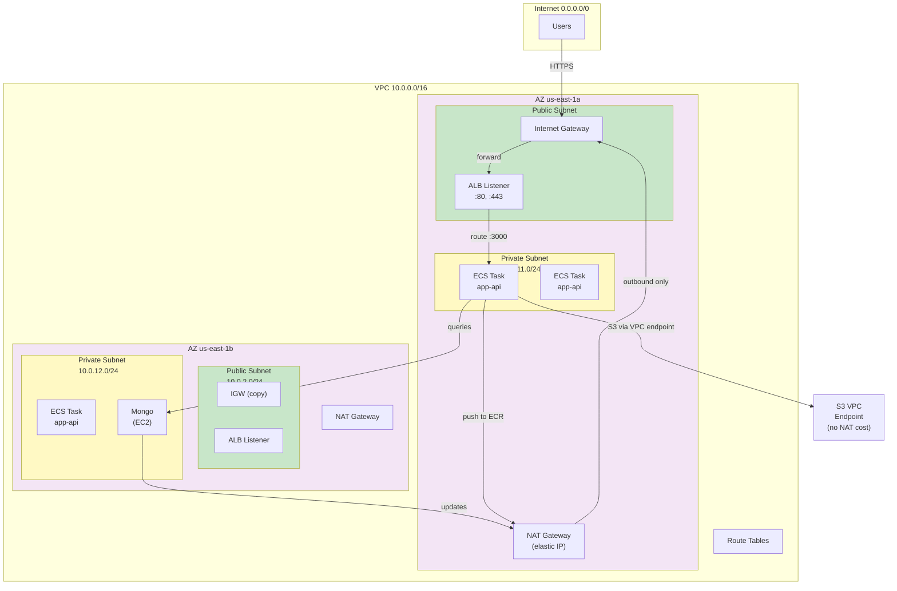

# VPC Network — Networking

Set up a VPC with public and private subnets, NAT Gateways, and security groups.

## Qué?

A VPC isolates your infrastructure. You control who talks to whom.

## Por qué?

Production needs isolation. Some things (load balancers) face the internet. Others (databases) don't. Security groups enforce those boundaries.

## Para qué?

- Separar tráfico por tier (public/private)
- High availability: 2 availability zones
- Reducir costos: NAT Gateway en lugar de IP elástica por instancia

## Arquitectura VPC recomendada



## Create VPC

```bash
# Crear VPC
aws ec2 create-vpc --cidr-block 10.0.0.0/16 \
  --tag-specifications 'ResourceType=vpc,Tags=[{Key=Name,Value=app-vpc}]'

# Output: VpcId=vpc-abc123
VPC_ID="vpc-abc123"

# Habilitar DNS
aws ec2 modify-vpc-attribute --vpc-id $VPC_ID --enable-dns-hostnames
aws ec2 modify-vpc-attribute --vpc-id $VPC_ID --enable-dns-support
```

## Internet Gateway

Permite traffic Internet ↔ VPC.

```bash
# Crear IGW
IGW_ID=$(aws ec2 create-internet-gateway \
  --tag-specifications 'ResourceType=internet-gateway,Tags=[{Key=Name,Value=app-igw}]' \
  --query 'InternetGateway.InternetGatewayId' \
  --output text)

# Adjuntar a VPC
aws ec2 attach-internet-gateway --internet-gateway-id $IGW_ID --vpc-id $VPC_ID
```

## Subnets

2 AZs × 2 subnets (public + private) = 4 subnets.

### Public Subnets (ALB, bastion)

```bash
# us-east-1a
PUBLIC_SUBNET_1=$(aws ec2 create-subnet \
  --vpc-id $VPC_ID \
  --cidr-block 10.0.1.0/24 \
  --availability-zone us-east-1a \
  --tag-specifications 'ResourceType=subnet,Tags=[{Key=Name,Value=public-1a}]' \
  --query 'Subnet.SubnetId' \
  --output text)

# us-east-1b
PUBLIC_SUBNET_2=$(aws ec2 create-subnet \
  --vpc-id $VPC_ID \
  --cidr-block 10.0.2.0/24 \
  --availability-zone us-east-1b \
  --tag-specifications 'ResourceType=subnet,Tags=[{Key=Name,Value=public-1b}]' \
  --query 'Subnet.SubnetId' \
  --output text)

# Enable auto-assign public IP en public subnets
aws ec2 modify-subnet-attribute --subnet-id $PUBLIC_SUBNET_1 --map-public-ip-on-launch
aws ec2 modify-subnet-attribute --subnet-id $PUBLIC_SUBNET_2 --map-public-ip-on-launch
```

### Private Subnets (ECS tasks, MongoDB)

```bash
# us-east-1a
PRIVATE_SUBNET_1=$(aws ec2 create-subnet \
  --vpc-id $VPC_ID \
  --cidr-block 10.0.11.0/24 \
  --availability-zone us-east-1a \
  --tag-specifications 'ResourceType=subnet,Tags=[{Key=Name,Value=private-1a}]' \
  --query 'Subnet.SubnetId' \
  --output text)

# us-east-1b
PRIVATE_SUBNET_2=$(aws ec2 create-subnet \
  --vpc-id $VPC_ID \
  --cidr-block 10.0.12.0/24 \
  --availability-zone us-east-1b \
  --tag-specifications 'ResourceType=subnet,Tags=[{Key=Name,Value=private-1b}]' \
  --query 'Subnet.SubnetId' \
  --output text)
```

## NAT Gateway

Permite instancias privadas salir a Internet (sin ser alcanzadas desde afuera).

```bash
# Asignar Elastic IP para NAT (us-east-1a)
EIP_1=$(aws ec2 allocate-address \
  --domain vpc \
  --query 'AllocationId' \
  --output text)

# Crear NAT Gateway en public subnet de 1a
NAT_GW_1=$(aws ec2 create-nat-gateway \
  --subnet-id $PUBLIC_SUBNET_1 \
  --allocation-id $EIP_1 \
  --tag-specifications 'ResourceType=nat-gateway,Tags=[{Key=Name,Value=nat-1a}]' \
  --query 'NatGateway.NatGatewayId' \
  --output text)

# Esperar a que esté "available"
aws ec2 wait nat-gateway-available --nat-gateway-ids $NAT_GW_1

# Repetir para AZ 1b
EIP_2=$(aws ec2 allocate-address --domain vpc --query 'AllocationId' --output text)
NAT_GW_2=$(aws ec2 create-nat-gateway \
  --subnet-id $PUBLIC_SUBNET_2 \
  --allocation-id $EIP_2 \
  --query 'NatGateway.NatGatewayId' \
  --output text)
aws ec2 wait nat-gateway-available --nat-gateway-ids $NAT_GW_2
```

**Costo:** $32/mes per NAT Gateway = $64/mes para 2 (HA). VPC endpoint S3 es gratis.

## Route Tables

Definen cómo fluye el tráfico.

### Public Route Table

Tráfico hacia Internet via IGW.

```bash
# Crear public route table
PUBLIC_RT=$(aws ec2 create-route-table \
  --vpc-id $VPC_ID \
  --tag-specifications 'ResourceType=route-table,Tags=[{Key=Name,Value=public-rt}]' \
  --query 'RouteTable.RouteTableId' \
  --output text)

# Agregar ruta default (0.0.0.0/0 → IGW)
aws ec2 create-route \
  --route-table-id $PUBLIC_RT \
  --destination-cidr-block 0.0.0.0/0 \
  --gateway-id $IGW_ID

# Asociar subnets públicas
aws ec2 associate-route-table --route-table-id $PUBLIC_RT --subnet-id $PUBLIC_SUBNET_1
aws ec2 associate-route-table --route-table-id $PUBLIC_RT --subnet-id $PUBLIC_SUBNET_2
```

### Private Route Table (us-east-1a)

Tráfico hacia Internet via NAT Gateway (misma AZ).

```bash
# Crear private route table para 1a
PRIVATE_RT_1A=$(aws ec2 create-route-table \
  --vpc-id $VPC_ID \
  --tag-specifications 'ResourceType=route-table,Tags=[{Key=Name,Value=private-rt-1a}]' \
  --query 'RouteTable.RouteTableId' \
  --output text)

# Agregar ruta default via NAT de misma AZ
aws ec2 create-route \
  --route-table-id $PRIVATE_RT_1A \
  --destination-cidr-block 0.0.0.0/0 \
  --nat-gateway-id $NAT_GW_1

# Asociar private subnet 1a
aws ec2 associate-route-table --route-table-id $PRIVATE_RT_1A --subnet-id $PRIVATE_SUBNET_1
```

### Private Route Table (us-east-1b)

```bash
# Crear private route table para 1b
PRIVATE_RT_1B=$(aws ec2 create-route-table \
  --vpc-id $VPC_ID \
  --tag-specifications 'ResourceType=route-table,Tags=[{Key=Name,Value=private-rt-1b}]' \
  --query 'RouteTable.RouteTableId' \
  --output text)

# Agregar ruta default via NAT de misma AZ
aws ec2 create-route \
  --route-table-id $PRIVATE_RT_1B \
  --destination-cidr-block 0.0.0.0/0 \
  --nat-gateway-id $NAT_GW_2

# Asociar private subnet 1b
aws ec2 associate-route-table --route-table-id $PRIVATE_RT_1B --subnet-id $PRIVATE_SUBNET_2
```

## Security Groups

Firewall a nivel de instancia/task.

### ALB Security Group

```bash
# Crear SG para ALB
ALB_SG=$(aws ec2 create-security-group \
  --group-name alb-sg \
  --description "ALB: allow HTTP/HTTPS from Internet" \
  --vpc-id $VPC_ID \
  --query 'GroupId' \
  --output text)

# Allow HTTP
aws ec2 authorize-security-group-ingress \
  --group-id $ALB_SG \
  --protocol tcp \
  --port 80 \
  --cidr 0.0.0.0/0

# Allow HTTPS
aws ec2 authorize-security-group-ingress \
  --group-id $ALB_SG \
  --protocol tcp \
  --port 443 \
  --cidr 0.0.0.0/0
```

### ECS Tasks Security Group

```bash
# Crear SG para ECS tasks
TASK_SG=$(aws ec2 create-security-group \
  --group-name app-api-sg \
  --description "ECS tasks: allow from ALB only" \
  --vpc-id $VPC_ID \
  --query 'GroupId' \
  --output text)

# Allow port 3000 solo desde ALB
aws ec2 authorize-security-group-ingress \
  --group-id $TASK_SG \
  --protocol tcp \
  --port 3000 \
  --source-group $ALB_SG

# Allow egress a MongoDB (intra-VPC)
aws ec2 authorize-security-group-egress \
  --group-id $TASK_SG \
  --protocol tcp \
  --port 27017 \
  --source-group $MONGO_SG
```

### MongoDB Security Group

```bash
# Crear SG para MongoDB
MONGO_SG=$(aws ec2 create-security-group \
  --group-name mongo-sg \
  --description "MongoDB: allow from ECS tasks only" \
  --vpc-id $VPC_ID \
  --query 'GroupId' \
  --output text)

# Allow port 27017 solo desde ECS tasks
aws ec2 authorize-security-group-ingress \
  --group-id $MONGO_SG \
  --protocol tcp \
  --port 27017 \
  --source-group $TASK_SG
```

## VPC Endpoints (S3, ECR, Secrets Manager)

Evitar NAT Gateway para AWS services (gratis, más rápido).

### S3 Gateway Endpoint

```bash
# Crear endpoint S3
S3_ENDPOINT=$(aws ec2 create-vpc-endpoint \
  --vpc-id $VPC_ID \
  --service-name com.amazonaws.us-east-1.s3 \
  --route-table-ids $PRIVATE_RT_1A $PRIVATE_RT_1B \
  --query 'VpcEndpoint.VpcEndpointId' \
  --output text)

# Adjuntar policy: permitir tasks pull images
aws ec2 modify-vpc-endpoint \
  --vpc-endpoint-id $S3_ENDPOINT \
  --policy-file policy-s3-endpoint.json
```

policy-s3-endpoint.json:
```json
{
  "Version": "2012-10-17",
  "Statement": [
    {
      "Effect": "Allow",
      "Principal": "*",
      "Action": "s3:GetObject",
      "Resource": "arn:aws:s3:::app-prod-bucket/*"
    }
  ]
}
```

### ECR Interface Endpoint

```bash
# Crear interface endpoint para ECR
ECR_ENDPOINT=$(aws ec2 create-vpc-endpoint \
  --vpc-id $VPC_ID \
  --vpc-endpoint-type Interface \
  --service-name com.amazonaws.us-east-1.ecr.dkr \
  --subnet-ids $PRIVATE_SUBNET_1 $PRIVATE_SUBNET_2 \
  --security-group-ids $TASK_SG \
  --query 'VpcEndpoint.VpcEndpointId' \
  --output text)

# Permitir tasks pull desde ECR
aws ec2 authorize-security-group-ingress \
  --group-id $TASK_SG \
  --protocol tcp \
  --port 443 \
  --source-group $TASK_SG
```

## Network ACLs (Opcional, avanzado)

Firewall a nivel de subnet (menos usado que security groups).

```bash
# Ver NACL predeterminado
aws ec2 describe-network-acls --filters Name=vpc-id,Values=$VPC_ID

# Crear NACL para private subnets (deny SSH)
aws ec2 create-network-acl \
  --vpc-id $VPC_ID \
  --tag-specifications 'ResourceType=network-acl,Tags=[{Key=Name,Value=private-nacl}]'
```

Generalmente no necesario; security groups son suficientes.

## Costos

| Recurso | Costo |
|---|---|
| VPC | Free |
| Subnets | Free |
| Internet Gateway | Free |
| Route Table | Free |
| Security Group | Free |
| **NAT Gateway** | **$32/mes por gateway** |
| Elastic IP (unused) | $0.005/hour |
| VPC Endpoint Gateway (S3) | Free |
| VPC Endpoint Interface | $7.20/mes + $0.01/hour |

**Estimado HA setup:** 2× NAT Gateway = $64/mes.

**Para ahorrar:** usar VPC endpoint Gateway para S3 (gratis), no interface endpoint.

## Troubleshooting

### ECS tasks no pueden alcanzar Internet

```bash
# Verificar route table tiene ruta a NAT
aws ec2 describe-route-tables --route-table-ids $PRIVATE_RT_1A

# Verificar NAT Gateway está "available"
aws ec2 describe-nat-gateways --nat-gateway-ids $NAT_GW_1 | jq '.NatGateways[0].State'

# Verificar security group permite egress
aws ec2 describe-security-groups --group-ids $TASK_SG | jq '.SecurityGroups[0].IpPermissionsEgress'
```

### Tasks no pueden conectar a MongoDB

```bash
# Verificar MongoDB SG permite ingress desde tasks SG
aws ec2 describe-security-groups --group-ids $MONGO_SG | jq '.SecurityGroups[0].IpPermissions'

# Verificar tasks SG permite egress a MongoDB
aws ec2 describe-security-groups --group-ids $TASK_SG | jq '.SecurityGroups[0].IpPermissionsEgress'
```

### ALB tráfico no llega a tasks

```bash
# Verificar ALB SG permite egress a tasks port 3000
aws ec2 describe-security-groups --group-ids $ALB_SG | jq '.SecurityGroups[0].IpPermissionsEgress'

# Verificar tasks SG permite ingress desde ALB
aws ec2 describe-security-groups --group-ids $TASK_SG | jq '.SecurityGroups[0].IpPermissions'
```

## Enlaces relacionados

- [ECS — Container Orchestration](./ecs.md)
- [EC2 — Compute Instances](./ec2.md)
- [S3 — Object Storage](./s3.md)
- [README AWS](./README.md)
- AWS VPC docs: https://docs.aws.amazon.com/vpc/
- VPC best practices: https://docs.aws.amazon.com/vpc/latest/userguide/VPC_Subnets.html
