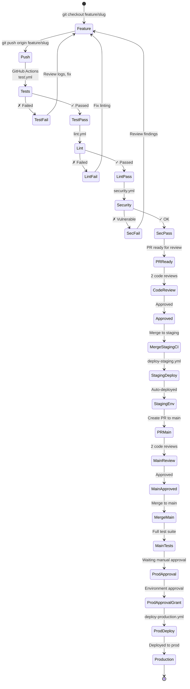

# CI/CD

Test, lint, build, and deploy automatically via GitHub Actions.

## Qué?

GitHub Actions runs tests, lint checks, and deploys code automatically.

## Por qué?

Without CI/CD, broken code gets merged. With it, every commit runs through tests first.

## Para qué?

- Block PRs if tests fail
- Auto-deploy staging when merging
- Require manual approval for production
- Audit who deployed what

## Lo que logramos

- Tests pass before code merges
- Staging deploys instantly
- Production needs sign-off
- Clear audit trail

## Qué hace?

- Define workflows para staging + production
- Especifica checks obligatorios (test, lint, security)
- Configura deployments a EC2 via SSH
- Maneja secrets via GitHub Secrets + OIDC

## Estructura

| Archivo | Tema |
|---|---|
| [`workflow.md`](./workflow.md) | Pipeline stages: feature → staging → main → prod |
| [`husky.md`](./husky.md) | Pre-commit/pre-push hooks |
| [`aws.md`](./aws.md) | GitHub Actions → AWS OIDC → ECS/EC2 deploy |

## Workflows en .github/workflows/

```
├── test.yml              # Unit + integration tests (PR)
├── lint.yml              # ESLint + Prettier checks
├── security.yml          # SAST (trivy), dependency audit
├── deploy-staging.yml    # Auto-deploy to staging
├── deploy-production.yml # Manual approval → deploy prod
└── release.yml           # Create release tag (futuro)
```

## Flujo visual



## Triggers

| Evento | Workflow | Action |
|---|---|---|
| `push` a feature/* | test.yml, lint.yml, security.yml | Check PR |
| `push` a staging | deploy-staging.yml | Auto-deploy |
| `push` a main | test.yml (full suite) | Check before prod |
| Manual trigger | deploy-production.yml | Manual deploy prod |

## Secrets en GitHub

**Ubicación:** Settings → Secrets and variables → Actions

```
STAGING_EC2_HOST         # staging.api.example.com IP
STAGING_EC2_KEY          # SSH private key para EC2
PROD_EC2_HOST            # api.example.com IP
PROD_EC2_KEY             # SSH private key para EC2
AWS_ROLE_TO_ASSUME       # ARN de role OIDC
AWS_GITHUB_ACTIONS_ROLE  # github-actions-role ARN
```

## Ejemplo: test.yml

```yaml
name: Tests

on:
  pull_request:
    branches: [staging, main]
  push:
    branches: [staging, main]

jobs:
  test:
    runs-on: ubuntu-latest
    steps:
      - uses: actions/checkout@v3
      
      - name: Setup Node
        uses: actions/setup-node@v3
        with:
          node-version: 22
          cache: npm
      
      - name: Install deps
        run: npm ci
      
      - name: Run tests
        run: npm run test:coverage
      
      - name: Check coverage threshold
        run: |
          COVERAGE=$(grep -oP '(?<=Statements\s*:\s)[0-9.]+' coverage/coverage-summary.json)
          if (( $(echo "$COVERAGE < 75" | bc -l) )); then
            echo "Coverage too low: $COVERAGE%"
            exit 1
          fi
```

## Estado en PR

Cada workflow muestra estado:
- ✓ Passed
- ✗ Failed
- ⏳ In Progress

Merge bloqueado si alguno falla (branch protection rule).

## Despliegue

### Staging (automático)

```yaml
# Triggered on: push to staging
# Steps:
# 1. Checkout code
# 2. Build Docker image
# 3. SSH to EC2
# 4. docker-compose down
# 5. docker-compose up -d
# 6. Smoke tests
```

### Production (manual)

```yaml
# Triggered on: manual (GitHub UI)
# Steps:
# 1. All staging checks rerun
# 2. Security scan (trivy)
# 3. AWS OIDC authentication
# 4. SSH to EC2
# 5. Fetch secrets from AWS Secrets Manager
# 6. Deploy with manual approval gate
# 7. Health checks
```

## Links relacionados

- [`docs/project/workflow.md`](../project/workflow.md)
- `.github/workflows/`
- AWS OIDC: [`docs/aws/iam.md`](../aws/iam.md)
