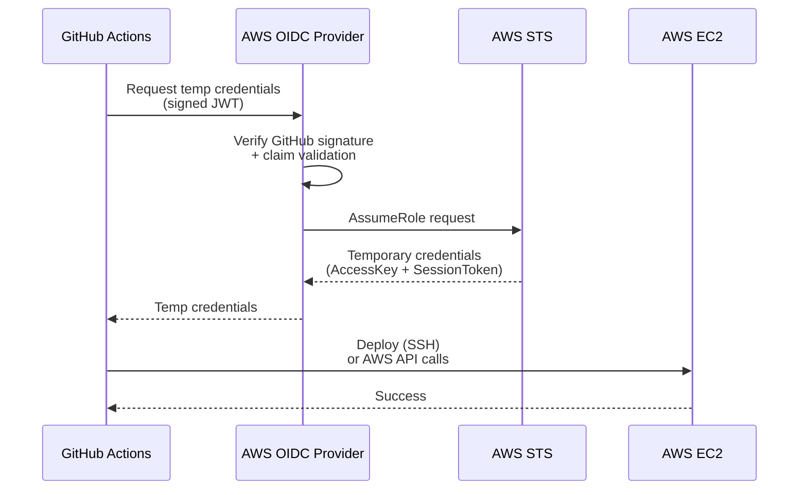

# AWS OIDC — GitHub to AWS

GitHub Actions assumes an AWS role without ever storing API keys.

## Por qué OIDC?

**Alternativas:**
- Static IAM user + access keys (❌ insecuro, rotación manual)
- GitHub Secrets con keys (❌ risk de exfiltración)

**OIDC:**
- ✓ Temporary credentials (1 hora)
- ✓ No keys en GitHub
- ✓ Audit trail en CloudTrail
- ✓ Role-based access (least privilege)

## Arquitectura



## Setup (one-time)

### 1. Create OIDC Provider en AWS

```bash
aws iam create-open-id-connect-provider \
  --url https://token.actions.githubusercontent.com \
  --client-id-list sts.amazonaws.com \
  --thumbprint-list 6938fd4d98bab03faadb97b34396831e3780aea1
```

**Resultado:** `arn:aws:iam::ACCOUNT:oidc-provider/token.actions.githubusercontent.com`

### 2. Create IAM Role (github-actions-role)

**Trust policy:**
```json
{
  "Version": "2012-10-17",
  "Statement": [
    {
      "Effect": "Allow",
      "Principal": {
        "Federated": "arn:aws:iam::ACCOUNT:oidc-provider/token.actions.githubusercontent.com"
      },
      "Action": "sts:AssumeRoleWithWebIdentity",
      "Condition": {
        "StringEquals": {
          "token.actions.githubusercontent.com:aud": "sts.amazonaws.com"
        },
        "StringLike": {
          "token.actions.githubusercontent.com:sub": "repo:jmrg/express-clean-backend:ref:refs/heads/*"
        }
      }
    }
  ]
}
```

```bash
aws iam create-role \
  --role-name github-actions-role \
  --assume-role-policy-document file://trust-policy.json
```

### 3. Attach Permissions Policy

```json
{
  "Version": "2012-10-17",
  "Statement": [
    {
      "Effect": "Allow",
      "Action": [
        "ec2:DescribeInstances",
        "ec2:DescribeTags",
        "ec2:DescribeImages"
      ],
      "Resource": "*"
    },
    {
      "Effect": "Allow",
      "Action": [
        "ssm:SendCommand",
        "ssm:GetCommandInvocation"
      ],
      "Resource": "*"
    },
    {
      "Effect": "Allow",
      "Action": [
        "secretsmanager:GetSecretValue"
      ],
      "Resource": "arn:aws:secretsmanager:us-east-1:ACCOUNT:secret:/app/*"
    },
    {
      "Effect": "Allow",
      "Action": [
        "s3:GetObject",
        "s3:PutObject"
      ],
      "Resource": "arn:aws:s3:::app-*/*"
    }
  ]
}
```

```bash
aws iam put-role-policy \
  --role-name github-actions-role \
  --policy-name GitHubActionsPolicy \
  --policy-document file://permissions-policy.json
```

### 4. Store Role ARN en GitHub

Settings → Secrets and variables → Actions → New secret

```
AWS_ROLE_TO_ASSUME = arn:aws:iam::ACCOUNT:oidc-provider/...
```

## GitHub Actions Workflow

**`.github/workflows/deploy-production.yml`:**

```yaml
name: Deploy to Production

on:
  workflow_dispatch:  # Manual trigger

jobs:
  deploy:
    runs-on: ubuntu-latest
    permissions:
      id-token: write  # CRITICAL: allow OIDC token request
      contents: read
    environment: production
    
    steps:
      - uses: actions/checkout@v3
      
      - name: Assume AWS Role
        uses: aws-actions/configure-aws-credentials@v2
        with:
          role-to-assume: ${{ secrets.AWS_ROLE_TO_ASSUME }}
          aws-region: us-east-1
      
      - name: Fetch secrets from Secrets Manager
        run: |
          aws secretsmanager get-secret-value \
            --secret-id /app/prod/env \
            --query SecretString \
            --output text | jq -r 'to_entries | .[] | "\(.key)=\(.value)"' > .env.production
      
      - name: Deploy to EC2
        run: |
          SSH_KEY=$(mktemp)
          echo "${{ secrets.PROD_EC2_KEY }}" > $SSH_KEY
          chmod 600 $SSH_KEY
          
          ssh -i $SSH_KEY -o StrictHostKeyChecking=no ec2-user@${{ secrets.PROD_EC2_HOST }} << 'EOF'
            cd express-clean-backend
            git pull origin main
            docker-compose --profile production down
            docker-compose --profile production up -d
          EOF
          
          rm -f $SSH_KEY
      
      - name: Health check
        run: |
          for i in {1..10}; do
            if curl -f https://api.example.com/health; then
              echo "Health check passed"
              exit 0
            fi
            sleep 5
          done
          exit 1
```

**Key points:**
- `permissions: { id-token: write }` — permite generar OIDC token
- `aws-actions/configure-aws-credentials@v2` — intercambia GitHub token por AWS creds
- `role-to-assume` — ARN del role
- Temporary credentials válidas solo por duración del job (~1 hora)

## Secrets en GitHub

**Settings → Secrets → Actions:**

```
AWS_ROLE_TO_ASSUME        # arn:aws:iam::...
PROD_EC2_KEY              # SSH private key (PEM format)
PROD_EC2_HOST             # IP o hostname
STAGING_EC2_KEY           # SSH private key
STAGING_EC2_HOST          # IP o hostname
```

## Auditing

### CloudTrail logs

```bash
# Ver quién asumió rol
aws cloudtrail lookup-events \
  --lookup-attributes AttributeKey=EventName,AttributeValue=AssumeRole \
  --max-results 10

# Ejemplo output:
# Principal: github-actions-role
# Timestamp: 2026-05-10T15:30:00Z
# Action: sts:AssumeRoleWithWebIdentity
```

### GitHub Actions logs

```
GitHub UI → Actions → workflow run → job logs
```

## Troubleshooting

### "OIDC token request failed"

```bash
# Verificar que el workflow tiene permiso
permissions:
  id-token: write  # ← THIS IS CRITICAL
```

### "AssumeRole failed"

```bash
# Check trust policy
aws iam get-role --role-name github-actions-role
# Verify 'AssumeRolePolicyDocument' includes GitHub principal
```

### "Access denied to EC2"

```bash
# Verify role has EC2 permissions
aws iam list-attached-role-policies --role-name github-actions-role

# Test assume role manually
aws sts assume-role-with-web-identity \
  --role-arn arn:aws:iam::ACCOUNT:role/github-actions-role \
  --role-session-name test \
  --web-identity-token $GITHUB_TOKEN
```

## References

- AWS OIDC setup: https://docs.github.io/en/actions/deployment/security-hardening-your-deployments/about-security-hardening-with-openid-connect
- `configure-aws-credentials` action: https://github.com/aws-actions/configure-aws-credentials
- [`docs/aws/iam.md`](../aws/iam.md)
