# GitHub Actions — Workflows

Run lint, tests, and builds on every push. Auto-deploy staging, manual-approve production.

## Qué?

GitHub Actions executes YAML workflows on Git events: pushes, pull requests, manual triggers.

## Por qué?

Manual deployments fail. Automated ones don't.

Workflows prevent broken code from merging, deploy staging instantly, and require sign-off before production.

## Para qué?

- Catch bugs before merge
- Deploy staging automatically
- Require approval for production
- Keep an audit trail

## Estructura de workflows

```
.github/workflows/
├── ci.yml                    # PR checks (test, lint, build)
├── deploy-staging.yml        # Auto-deploy to staging
├── deploy-production.yml     # Manual approval → prod
└── security.yml              # SAST, dependency audit
```

## Branch convention

| Branch | Purpose | Deploy | Approval |
|--------|---------|--------|----------|
| `feature/<slug>` | Feature development | No | N/A |
| `fix/<slug>` | Bug fixes | No | N/A |
| `staging` o `dev` | Integration branch | Yes (auto) | None |
| `main` | Production-ready | Yes (manual) | Lead/DevOps |

## State machine: Git → GitHub Actions → AWS

```mermaid
stateDiagram-v2
    [*] --> FeatureBranch: git checkout feature/slug
    
    FeatureBranch --> Push: git push origin feature/slug
    
    Push --> CI_Trigger: GitHub Actions<br/>on: push, pull_request
    
    CI_Trigger --> Install: pnpm install
    Install --> Lint: pnpm lint
    Lint --> Test: pnpm test:unit
    Test --> Build: pnpm build
    
    Build --> TestPass: ✓ All checks passed
    Build --> TestFail: ✗ Failed
    
    TestFail --> FeatureBranch: Fix code, retry push
    
    TestPass --> PR: Create PR staging/main
    PR --> CodeReview: Assign reviewers
    CodeReview --> Approved: Approved
    
    Approved --> MergeStaging: Merge to staging
    MergeStaging --> DeployStagingTrigger: on: push to staging
    DeployStagingTrigger --> StagingChecks: Assume OIDC role
    StagingChecks --> BuildImage: docker build
    BuildImage --> PushECR: Push to ECR
    PushECR --> UpdateECS: ECS task update
    UpdateECS --> StagingLive: Live in staging.api.example.com
    
    StagingLive --> PRMain: Create PR staging→main
    PRMain --> MainReview: 2 code reviews
    MainReview --> MainApproved: Approved
    
    MainApproved --> MergeMain: Merge to main
    MergeMain --> ManualApproval: Manual approval gate
    ManualApproval --> ProdTrigger: Click "Deploy" in Actions
    
    ProdTrigger --> ProdChecks: Full test suite
    ProdChecks --> AssumeRole: AWS OIDC
    AssumeRole --> BuildImageProd: docker build
    BuildImageProd --> PushECRProd: Push to ECR
    PushECRProd --> UpdateECSProd: ECS task update
    UpdateECSProd --> HealthCheck: curl /health
    HealthCheck --> ProdLive: Live in api.example.com
    
    ProdLive --> [*]
```



## 1. CI Workflow (PR checks)

**Archivo:** `.github/workflows/ci.yml`

**Triggered on:**
- `pull_request` a `staging` o `main`
- `push` a `feature/*` o `fix/*`

```yaml
name: CI — Tests, Lint, Build

on:
  pull_request:
    branches: [staging, main]
  push:
    branches:
      - 'feature/**'
      - 'fix/**'
      - staging
      - main

jobs:
  quality:
    runs-on: ubuntu-latest
    strategy:
      matrix:
        node-version: [22]
    
    steps:
      - name: Checkout code
        uses: actions/checkout@v4

      - name: Setup pnpm
        uses: pnpm/action-setup@v3
        with:
          version: 9

      - name: Setup Node.js
        uses: actions/setup-node@v4
        with:
          node-version: ${{ matrix.node-version }}
          cache: pnpm

      - name: Install dependencies
        run: pnpm install --frozen-lockfile

      - name: Lint
        run: pnpm lint

      - name: Format check
        run: pnpm format --check || (echo "Run: pnpm format" && exit 1)

      - name: TypeScript check
        run: tsc --noEmit

      - name: Unit tests
        run: pnpm test:unit

      - name: Build
        run: pnpm build

      - name: Check coverage threshold
        run: |
          COVERAGE=$(grep -oP '"lines":\s*{"pct":\s*\K[0-9.]+' coverage/coverage-summary.json || echo "0")
          if (( $(echo "$COVERAGE < 75" | bc -l) )); then
            echo "Coverage too low: $COVERAGE% (threshold: 75%)"
            exit 1
          fi
          echo "Coverage: $COVERAGE% ✓"

      - name: Report job status
        if: always()
        run: |
          if [ "${{ job.status }}" = "failure" ]; then
            echo "CI failed. Fix errors and retry."
            exit 1
          fi
```

**Key points:**
- Matrix con Node v22
- Cache pnpm entre runs (más rápido)
- Lint, format, TypeScript, tests, build — todo bloqueante
- Coverage threshold 75% (ajusta según proyecto)
- Si algo falla → PR bloqueada

## 2. Deploy Staging (auto-deploy)

**Archivo:** `.github/workflows/deploy-staging.yml`

**Triggered on:** `push` a `staging`

```yaml
name: Deploy to Staging

on:
  push:
    branches: [staging]

jobs:
  deploy:
    runs-on: ubuntu-latest
    permissions:
      id-token: write
      contents: read
    environment: staging

    steps:
      - name: Checkout code
        uses: actions/checkout@v4

      - name: Setup pnpm
        uses: pnpm/action-setup@v3
        with:
          version: 9

      - name: Setup Node.js
        uses: actions/setup-node@v4
        with:
          node-version: 22
          cache: pnpm

      - name: Install dependencies
        run: pnpm install --frozen-lockfile

      - name: Lint
        run: pnpm lint

      - name: Unit tests
        run: pnpm test:unit

      - name: Build
        run: pnpm build

      - name: Configure AWS credentials
        uses: aws-actions/configure-aws-credentials@v4
        with:
          role-to-assume: ${{ secrets.AWS_ROLE_TO_ASSUME }}
          aws-region: us-east-1
          role-session-name: github-actions-staging

      - name: Login to Amazon ECR
        id: login-ecr
        uses: aws-actions/amazon-ecr-login@v2

      - name: Build Docker image
        id: docker-build
        env:
          ECR_REGISTRY: ${{ steps.login-ecr.outputs.registry }}
          ECR_REPOSITORY: express-clean-backend
          IMAGE_TAG: staging-${{ github.sha }}
        run: |
          docker build -t $ECR_REGISTRY/$ECR_REPOSITORY:$IMAGE_TAG \
                       -t $ECR_REGISTRY/$ECR_REPOSITORY:staging-latest \
                       .
          echo "image=$ECR_REGISTRY/$ECR_REPOSITORY:$IMAGE_TAG" >> $GITHUB_OUTPUT

      - name: Push image to ECR
        env:
          ECR_REGISTRY: ${{ steps.login-ecr.outputs.registry }}
          ECR_REPOSITORY: express-clean-backend
          IMAGE_TAG: staging-${{ github.sha }}
        run: |
          docker push $ECR_REGISTRY/$ECR_REPOSITORY:$IMAGE_TAG
          docker push $ECR_REGISTRY/$ECR_REPOSITORY:staging-latest

      - name: Update ECS task definition
        id: task-def
        uses: aws-actions/amazon-ecs-render-task-definition@v1
        with:
          task-definition: staging-task-definition.json
          container-name: api
          image: ${{ steps.docker-build.outputs.image }}

      - name: Deploy to ECS
        uses: aws-actions/amazon-ecs-deploy-task-definition@v1
        with:
          task-definition: ${{ steps.task-def.outputs.task-definition }}
          service: express-clean-backend-staging
          cluster: staging-cluster
          wait-for-service-stability: true

      - name: Health check
        run: |
          for i in {1..15}; do
            STATUS=$(curl -s -o /dev/null -w "%{http_code}" https://staging.api.example.com/health)
            if [ "$STATUS" = "200" ]; then
              echo "✓ Health check passed"
              exit 0
            fi
            echo "Attempt $i: HTTP $STATUS, retrying in 10s..."
            sleep 10
          done
          echo "✗ Health check failed after 2.5 minutes"
          exit 1

      - name: Notify deployment
        if: success()
        run: |
          echo "✓ Deployed to staging.api.example.com"
          echo "Commit: ${{ github.sha }}"
          echo "Branch: ${{ github.ref }}"
```

**Key points:**
- OIDC role assumption (AWS_ROLE_TO_ASSUME)
- Docker build + push to ECR
- ECS task definition update (seamless deploy)
- Health check (retry 15 veces, 10s entre intentos)
- Auto-trigger en push a staging

## 3. Deploy Production (manual approval)

**Archivo:** `.github/workflows/deploy-production.yml`

**Triggered on:** Manual via GitHub Actions UI

```yaml
name: Deploy to Production

on:
  workflow_dispatch:

jobs:
  deploy:
    runs-on: ubuntu-latest
    permissions:
      id-token: write
      contents: read
    environment: production

    steps:
      - name: Checkout code
        uses: actions/checkout@v4

      - name: Setup pnpm
        uses: pnpm/action-setup@v3
        with:
          version: 9

      - name: Setup Node.js
        uses: actions/setup-node@v4
        with:
          node-version: 22
          cache: pnpm

      - name: Install dependencies
        run: pnpm install --frozen-lockfile

      - name: Full test suite
        run: pnpm test:coverage

      - name: Security scan
        run: |
          npm audit --production || true
          # Optional: trivy scan
          # docker run --rm -v /var/run/docker.sock:/var/run/docker.sock \
          #   aquasec/trivy image --exit-code 0 --severity CRITICAL \
          #   ${{ secrets.ECR_REGISTRY }}/express-clean-backend:${{ github.sha }}

      - name: Configure AWS credentials
        uses: aws-actions/configure-aws-credentials@v4
        with:
          role-to-assume: ${{ secrets.AWS_ROLE_TO_ASSUME }}
          aws-region: us-east-1
          role-session-name: github-actions-production

      - name: Login to Amazon ECR
        id: login-ecr
        uses: aws-actions/amazon-ecr-login@v2

      - name: Build Docker image
        id: docker-build
        env:
          ECR_REGISTRY: ${{ steps.login-ecr.outputs.registry }}
          ECR_REPOSITORY: express-clean-backend
          IMAGE_TAG: prod-${{ github.sha }}
        run: |
          docker build --build-arg NODE_ENV=production \
                       -t $ECR_REGISTRY/$ECR_REPOSITORY:$IMAGE_TAG \
                       -t $ECR_REGISTRY/$ECR_REPOSITORY:prod-latest \
                       .
          echo "image=$ECR_REGISTRY/$ECR_REPOSITORY:$IMAGE_TAG" >> $GITHUB_OUTPUT

      - name: Push image to ECR
        env:
          ECR_REGISTRY: ${{ steps.login-ecr.outputs.registry }}
          ECR_REPOSITORY: express-clean-backend
          IMAGE_TAG: prod-${{ github.sha }}
        run: |
          docker push $ECR_REGISTRY/$ECR_REPOSITORY:$IMAGE_TAG
          docker push $ECR_REGISTRY/$ECR_REPOSITORY:prod-latest

      - name: Update ECS task definition
        id: task-def
        uses: aws-actions/amazon-ecs-render-task-definition@v1
        with:
          task-definition: production-task-definition.json
          container-name: api
          image: ${{ steps.docker-build.outputs.image }}

      - name: Deploy to ECS (with canary)
        uses: aws-actions/amazon-ecs-deploy-task-definition@v1
        with:
          task-definition: ${{ steps.task-def.outputs.task-definition }}
          service: express-clean-backend-production
          cluster: production-cluster
          wait-for-service-stability: true

      - name: Health check (comprehensive)
        run: |
          DOMAIN="api.example.com"
          ENDPOINTS=("/health" "/api/v1/users" "/api/v1/auth/status")
          
          for endpoint in "${ENDPOINTS[@]}"; do
            echo "Testing: https://$DOMAIN$endpoint"
            for i in {1..20}; do
              STATUS=$(curl -s -o /dev/null -w "%{http_code}" https://$DOMAIN$endpoint)
              if [ "$STATUS" = "200" ] || [ "$STATUS" = "401" ]; then
                echo "  ✓ $endpoint — HTTP $STATUS"
                break
              fi
              if [ $i -eq 20 ]; then
                echo "  ✗ $endpoint — Failed after 20 attempts"
                exit 1
              fi
              sleep 10
            done
          done

      - name: Slack notification (success)
        if: success()
        uses: slackapi/slack-github-action@v1
        with:
          webhook-url: ${{ secrets.SLACK_WEBHOOK_PROD }}
          payload: |
            {
              "text": "✓ Production deployment successful",
              "blocks": [
                {
                  "type": "section",
                  "text": {
                    "type": "mrkdwn",
                    "text": "*✓ Production Deployment Successful*\n*Commit:* <${{ github.server_url }}/${{ github.repository }}/commit/${{ github.sha }}|${{ github.sha }}>\n*Branch:* ${{ github.ref }}\n*Deployed by:* ${{ github.actor }}"
                  }
                }
              ]
            }

      - name: Slack notification (failure)
        if: failure()
        uses: slackapi/slack-github-action@v1
        with:
          webhook-url: ${{ secrets.SLACK_WEBHOOK_PROD }}
          payload: |
            {
              "text": "✗ Production deployment FAILED",
              "blocks": [
                {
                  "type": "section",
                  "text": {
                    "type": "mrkdwn",
                    "text": "*✗ Production Deployment FAILED*\n*Commit:* <${{ github.server_url }}/${{ github.repository }}/commit/${{ github.sha }}|${{ github.sha }}>\n*Logs:* <${{ github.server_url }}/${{ github.repository }}/actions/runs/${{ github.run_id }}|View Logs>"
                  }
                }
              ]
            }
```

**Key points:**
- Manual trigger (`workflow_dispatch`) — no auto-deploy
- Full test suite + security scan antes de deploy
- OIDC role assumption
- Health check exhaustivo (20 intentos)
- Slack notifications (success + failure)
- Audit trail en CloudTrail

## Secrets vs Variables

### Variables (públicas)

Usa para valores NO sensibles:

```yaml
env:
  DOMAIN: api.example.com
  NODE_ENV: production
  REGISTRY: ${{ secrets.AWS_ACCOUNT }}.dkr.ecr.us-east-1.amazonaws.com
```

Configura en: Settings → Secrets and variables → Variables

```
DOMAIN = api.example.com
NODE_ENV = production
AWS_ACCOUNT = 123456789012
```

### Secrets (privados)

Usa para credentials:

```yaml
with:
  role-to-assume: ${{ secrets.AWS_ROLE_TO_ASSUME }}
  webhook-url: ${{ secrets.SLACK_WEBHOOK_PROD }}
```

Configura en: Settings → Secrets and variables → Actions

```
AWS_ROLE_TO_ASSUME = arn:aws:iam::123456789012:role/github-actions-role
SLACK_WEBHOOK_PROD = https://hooks.slack.com/services/T.../B.../X...
ECR_REGISTRY = 123456789012.dkr.ecr.us-east-1.amazonaws.com
```

### Scoped secrets

Para staging vs production:

```
# Settings → Environments → staging
SLACK_WEBHOOK = https://hooks.slack.com/services/...staging...

# Settings → Environments → production
SLACK_WEBHOOK = https://hooks.slack.com/services/...prod...
```

Luego en workflow:

```yaml
jobs:
  deploy:
    environment: staging  # o production
    steps:
      - uses: slackapi/slack-github-action@v1
        with:
          webhook-url: ${{ secrets.SLACK_WEBHOOK }}  # Scoped al environment
```

## Dockerfile (para CI/CD)

```dockerfile
# Multi-stage build
FROM node:22-alpine AS builder

WORKDIR /app

COPY package.json pnpm-lock.yaml ./
RUN corepack enable pnpm && pnpm install --frozen-lockfile --prod=false

COPY . .
RUN pnpm build

# Production image
FROM node:22-alpine

WORKDIR /app

RUN addgroup -g 1001 -S nodejs && adduser -S nodejs -u 1001

COPY package.json pnpm-lock.yaml ./
RUN corepack enable pnpm && pnpm install --frozen-lockfile --prod=true

COPY --from=builder --chown=nodejs:nodejs /app/dist ./dist

USER nodejs

EXPOSE 3000

CMD ["node", "dist/main.js"]
```

## Task definitions (ECS)

### staging-task-definition.json

```json
{
  "family": "express-clean-backend-staging",
  "containerDefinitions": [
    {
      "name": "api",
      "image": "IMAGE",
      "essential": true,
      "portMappings": [
        {
          "containerPort": 3000,
          "protocol": "tcp"
        }
      ],
      "environment": [
        {
          "name": "NODE_ENV",
          "value": "staging"
        }
      ],
      "secrets": [
        {
          "name": "MONGODB_URI",
          "valueFrom": "arn:aws:secretsmanager:us-east-1:ACCOUNT:secret:/app/staging/mongodb-uri"
        },
        {
          "name": "KC_API_SECRET",
          "valueFrom": "arn:aws:secretsmanager:us-east-1:ACCOUNT:secret:/app/staging/kc-secret"
        }
      ],
      "logConfiguration": {
        "logDriver": "awslogs",
        "options": {
          "awslogs-group": "/ecs/express-clean-backend-staging",
          "awslogs-region": "us-east-1",
          "awslogs-stream-prefix": "ecs"
        }
      }
    }
  ]
}
```

### production-task-definition.json

```json
{
  "family": "express-clean-backend-production",
  "containerDefinitions": [
    {
      "name": "api",
      "image": "IMAGE",
      "essential": true,
      "portMappings": [
        {
          "containerPort": 3000,
          "protocol": "tcp"
        }
      ],
      "environment": [
        {
          "name": "NODE_ENV",
          "value": "production"
        }
      ],
      "secrets": [
        {
          "name": "MONGODB_URI",
          "valueFrom": "arn:aws:secretsmanager:us-east-1:ACCOUNT:secret:/app/production/mongodb-uri"
        },
        {
          "name": "KC_API_SECRET",
          "valueFrom": "arn:aws:secretsmanager:us-east-1:ACCOUNT:secret:/app/production/kc-secret"
        }
      ],
      "logConfiguration": {
        "logDriver": "awslogs",
        "options": {
          "awslogs-group": "/ecs/express-clean-backend-production",
          "awslogs-region": "us-east-1",
          "awslogs-stream-prefix": "ecs"
        }
      }
    }
  ]
}
```

## Status checks en GitHub

Cada workflow reporta su status a la PR. Merge bloqueado si alguno falla.

**En Settings → Branches → main:**

```
Require status checks to pass before merging:
  ✓ CI — Tests, Lint, Build
  ✓ Deploy to Staging (solo para PRs a staging)
  ✓ security (si aplica)
```

## Troubleshooting

### Workflow no se ejecuta

```bash
# 1. Verificar syntax YAML
# Copy-paste en: https://yamllint.com

# 2. Verificar trigger en workflow on:
name: CI
on:
  pull_request:
    branches: [main]

# 3. Verificar que archivo está en .github/workflows/
ls -la .github/workflows/
```

### "Job cancelled" sin error

```bash
# Timeout default 360 min. Si es más largo:
jobs:
  deploy:
    timeout-minutes: 600  # Aumenta límite
```

### OIDC token request failed

Ver [`docs/ci-cd/oidc-aws.md`](./oidc-aws.md) — troubleshooting sección.

### "Health check failed" en deploy

```bash
# SSH a EC2/ECS task
ssh -i key.pem ec2-user@staging.api.example.com
docker ps
docker logs <container-id>

# Verificar que app está escuchando en puerto correcto
curl http://localhost:3000/health
```

## Cross-references

- [`docs/ci-cd/husky.md`](./husky.md) — hooks locales
- [`docs/ci-cd/oidc-aws.md`](./oidc-aws.md) — AWS authentication
- [`docs/aws/ecs.md`](../aws/ecs.md) — ECS deployment
- [`docs/aws/ecr.md`](../aws/ecr.md) — ECR registry
- [`docs/project/contributing.md`](../project/contributing.md) — workflow para contribuidores
