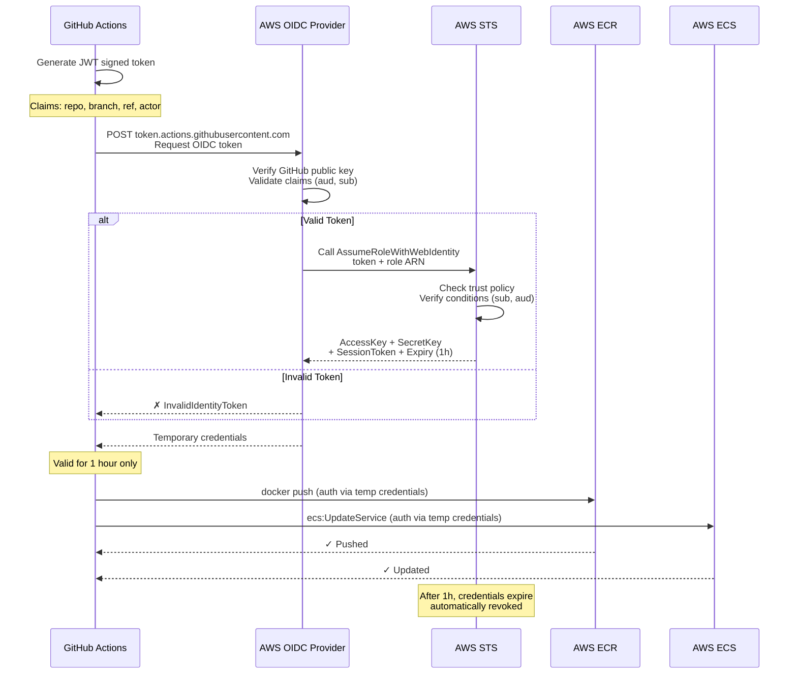

# OIDC — GitHub to AWS

GitHub Actions authenticates to AWS without storing API keys. Uses federated identity.

## Qué?

GitHub generates a JWT token and sends it to AWS. AWS verifies the signature and returns temporary credentials (1 hour max).

Without OIDC: API keys live in GitHub Secrets permanently (bad).
With OIDC: GitHub sends a throwaway JWT (better).

## Por qué?

| Aspecto | Static Keys | OIDC |
|--------|------------|------|
| Credenciales | Permanente | Temporal (1h) |
| Rotación | Manual | Automática |
| Dónde vive | GitHub Secrets | En el JWT |
| Auditoría | Débil | CloudTrail |
| Si lo comprometen | Lento de revocar | Instant |
| Riesgo | Alto | Bajo |

## Para qué?

- Zero static credentials en GitHub
- Auditoría automática en CloudTrail
- Cumplimiento de seguridad (HIPAA, SOC2, ISO27001)
- Rápida revocación si repo comprometido

## Flujo OIDC (sequence diagram)



## Setup paso a paso (one-time)

### Fase 1: Crear OIDC Provider en AWS

1. Abre AWS Console → IAM → Identity providers
2. Click "Create provider"
3. Selecciona "OpenID Connect"
4. **Provider URL:** `https://token.actions.githubusercontent.com`
5. **Audience:** `sts.amazonaws.com`
6. Click "Create provider"

O via CLI:

```bash
aws iam create-open-id-connect-provider \
  --url https://token.actions.githubusercontent.com \
  --client-id-list sts.amazonaws.com \
  --thumbprint-list 6938fd4d98bab03faadb97b34396831e3780aea1
```

**Output:**
```
{
  "OpenIDConnectProviderArn": "arn:aws:iam::123456789012:oidc-provider/token.actions.githubusercontent.com"
}
```

Guarda ese ARN — lo usarás en trust policy.

### Fase 2: Crear IAM Role (github-actions-role)

**Trust policy:** Define quién puede asumir este rol. En este caso, GitHub Actions del repo.

Crea archivo `trust-policy.json`:

```json
{
  "Version": "2012-10-17",
  "Statement": [
    {
      "Effect": "Allow",
      "Principal": {
        "Federated": "arn:aws:iam::123456789012:oidc-provider/token.actions.githubusercontent.com"
      },
      "Action": "sts:AssumeRoleWithWebIdentity",
      "Condition": {
        "StringEquals": {
          "token.actions.githubusercontent.com:aud": "sts.amazonaws.com"
        },
        "StringLike": {
          "token.actions.githubusercontent.com:sub": "repo:jmrg-link/express-clean-backend:ref:refs/heads/*"
        }
      }
    }
  ]
}
```

**Condiciones explicadas:**

| Condición | Significa |
|-----------|-----------|
| `aud: sts.amazonaws.com` | Solo GitHub Actions (no otros OIDC issuers) |
| `sub: repo:jmrg-link/express-clean-backend:*` | Solo workflows del repo |
| `:ref:refs/heads/*` | Solo branches (no pull requests) |

**Alternativas para sub:**
- `:ref:refs/heads/main` — solo branch `main`
- `:ref:refs/heads/staging` — solo branch `staging`
- `:environment:production` — solo workflows con environment `production`
- `:actor:jmrg` — solo workflow triggered por usuario `jmrg`

Crea el role:

```bash
aws iam create-role \
  --role-name github-actions-role \
  --assume-role-policy-document file://trust-policy.json \
  --description "GitHub Actions OIDC role"
```

**Output:**
```json
{
  "Role": {
    "Arn": "arn:aws:iam::123456789012:role/github-actions-role",
    "RoleName": "github-actions-role"
  }
}
```

### Fase 3: Permisos (IAM Policy)

Crea archivo `permissions-policy.json` con permisos mínimos:

```json
{
  "Version": "2012-10-17",
  "Statement": [
    {
      "Sid": "ECRAccess",
      "Effect": "Allow",
      "Action": [
        "ecr:GetAuthorizationToken",
        "ecr:BatchGetImage",
        "ecr:GetDownloadUrlForLayer",
        "ecr:PutImage",
        "ecr:InitiateLayerUpload",
        "ecr:UploadLayerPart",
        "ecr:CompleteLayerUpload",
        "ecr:DescribeRepositories"
      ],
      "Resource": "arn:aws:ecr:us-east-1:123456789012:repository/express-clean-backend"
    },
    {
      "Sid": "ECSDeployAccess",
      "Effect": "Allow",
      "Action": [
        "ecs:DescribeServices",
        "ecs:DescribeTaskDefinition",
        "ecs:DescribeTasks",
        "ecs:ListTasks",
        "ecs:RegisterTaskDefinition",
        "ecs:UpdateService"
      ],
      "Resource": [
        "arn:aws:ecs:us-east-1:123456789012:service/staging-cluster/express-clean-backend-staging",
        "arn:aws:ecs:us-east-1:123456789012:service/production-cluster/express-clean-backend-production",
        "arn:aws:ecs:us-east-1:123456789012:task-definition/express-clean-backend-staging:*",
        "arn:aws:ecs:us-east-1:123456789012:task-definition/express-clean-backend-production:*"
      ]
    },
    {
      "Sid": "SecretsManagerAccess",
      "Effect": "Allow",
      "Action": [
        "secretsmanager:GetSecretValue"
      ],
      "Resource": "arn:aws:secretsmanager:us-east-1:123456789012:secret:/app/*"
    },
    {
      "Sid": "S3Access",
      "Effect": "Allow",
      "Action": [
        "s3:GetObject",
        "s3:PutObject"
      ],
      "Resource": "arn:aws:s3:::express-clean-backend-*/*"
    },
    {
      "Sid": "IAMPassRole",
      "Effect": "Allow",
      "Action": [
        "iam:PassRole"
      ],
      "Resource": [
        "arn:aws:iam::123456789012:role/ecsTaskExecutionRole",
        "arn:aws:iam::123456789012:role/ecsTaskRole"
      ]
    }
  ]
}
```

Adjunta policy al role:

```bash
aws iam put-role-policy \
  --role-name github-actions-role \
  --policy-name GitHubActionsPolicy \
  --policy-document file://permissions-policy.json
```

O si prefieres managed policies:

```bash
aws iam attach-role-policy \
  --role-name github-actions-role \
  --policy-arn arn:aws:iam::aws:policy/AmazonEC2ContainerRegistryPowerUser
```

### Fase 4: Guardar Role ARN en GitHub Secrets

1. Copia el role ARN: `arn:aws:iam::123456789012:role/github-actions-role`
2. Ve a GitHub repo → Settings → Secrets and variables → Actions
3. New secret:
   - Name: `AWS_ROLE_TO_ASSUME`
   - Value: `arn:aws:iam::123456789012:role/github-actions-role`
4. Save

## GitHub Actions Workflow (uso)

En `.github/workflows/deploy-staging.yml`:

```yaml
name: Deploy to Staging

on:
  push:
    branches: [staging]

jobs:
  deploy:
    runs-on: ubuntu-latest
    permissions:
      id-token: write    # CRITICAL: permite solicitar OIDC token
      contents: read
    environment: staging

    steps:
      - uses: actions/checkout@v4

      # STEP CRÍTICO: Intercambiar GitHub token por AWS credentials
      - name: Configure AWS credentials
        uses: aws-actions/configure-aws-credentials@v4
        with:
          role-to-assume: ${{ secrets.AWS_ROLE_TO_ASSUME }}
          aws-region: us-east-1
          role-session-name: github-actions-staging

      # Ahora tenemos credenciales temporales en $AWS_ACCESS_KEY_ID, etc.
      - name: Verify AWS access
        run: |
          aws sts get-caller-identity
          # Output: arn:aws:iam::123456789012:role/github-actions-role

      - name: Push to ECR
        run: |
          aws ecr get-login-password --region us-east-1 | \
            docker login --username AWS --password-stdin ${{ secrets.ECR_REGISTRY }}
          docker push ${{ secrets.ECR_REGISTRY }}/express-clean-backend:staging-latest
```

**Key points:**
- `permissions: { id-token: write }` — OBLIGATORIO para OIDC
- `aws-actions/configure-aws-credentials@v4` — intercambia token
- `role-to-assume` — role ARN de Secrets
- Credenciales auto-expire después del job

## Condiciones avanzadas (sub claim)

El claim `sub` identifica uniquely la solicitud. Puedes usar:

### 1. Permitir solo main branch

```json
"token.actions.githubusercontent.com:sub": "repo:jmrg-link/express-clean-backend:ref:refs/heads/main"
```

### 2. Permitir solo production environment

```json
"token.actions.githubusercontent.com:sub": "repo:jmrg-link/express-clean-backend:environment:production"
```

### 3. Permitir múltiples branches

```json
"token.actions.githubusercontent.com:sub": [
  "repo:jmrg-link/express-clean-backend:ref:refs/heads/main",
  "repo:jmrg-link/express-clean-backend:ref:refs/heads/staging"
]
```

### 4. Permitir solo workflow específico

```json
"token.actions.githubusercontent.com:sub": "repo:jmrg-link/express-clean-backend:workflow:Deploy to Production"
```

## Auditoría: CloudTrail logs

AWS registra automáticamente cada AssumeRole en CloudTrail.

```bash
aws cloudtrail lookup-events \
  --lookup-attributes AttributeKey=EventName,AttributeValue=AssumeRoleWithWebIdentity \
  --max-results 10 \
  --region us-east-1
```

**Output:**
```json
{
  "Events": [
    {
      "EventName": "AssumeRoleWithWebIdentity",
      "EventTime": "2026-05-10T15:30:45Z",
      "Username": "github-actions-role",
      "Resources": [
        {
          "ARN": "arn:aws:iam::123456789012:role/github-actions-role",
          "AccountId": "123456789012",
          "Type": "AWS::IAM::Role"
        }
      ],
      "CloudTrailEvent": "{...\"sourceIPAddress\": \"140.82.112.0\"...}"
    }
  ]
}
```

**Información disponible:**
- `EventTime` — cuándo
- `UserAgent` — qué action/repo
- `sourceIPAddress` — GitHub's IP
- `requestParameters` — qué role, duración

Crea CloudTrail alert:

```bash
aws cloudtrail put-event-selectors \
  --trail-name GitHubActionsTrail \
  --event-selectors '[{
    "ReadWriteType": "WriteOnly",
    "IncludeManagementEvents": true,
    "DataResources": []
  }]'
```

## Troubleshooting

### "InvalidIdentityToken"

**Síntoma:** Workflow falla en `configure-aws-credentials`.

**Causa:** GitHub token inválido o trust policy no acepta el claim.

**Solución:**

1. Verifica permisos en workflow:
```yaml
permissions:
  id-token: write  # ← MUST exist
  contents: read
```

2. Verifica trust policy:
```bash
aws iam get-role --role-name github-actions-role

# Mira "AssumeRolePolicyDocument"
# Debe tener:
# "token.actions.githubusercontent.com:aud": "sts.amazonaws.com"
```

3. Verifica formato del `sub`:
```bash
# Repo debe ser: owner/repo
# No: github.com/owner/repo

# Branch debe ser: refs/heads/main
# No: main

# Workflow execution
aws sts assume-role-with-web-identity \
  --role-arn arn:aws:iam::123456789012:role/github-actions-role \
  --role-session-name test \
  --web-identity-token $GITHUB_TOKEN
```

### "AccessDenied" (role ok, pero permisos insuficientes)

**Síntoma:** Token válido, pero `docker push` o `aws ecs` falla con 403.

**Causa:** Policy no tiene permisos necesarios.

**Solución:**

```bash
# Verifica policy adjunta
aws iam list-role-policies --role-name github-actions-role
aws iam get-role-policy --role-name github-actions-role --policy-name GitHubActionsPolicy

# Añade permisos que falten
aws iam put-role-policy \
  --role-name github-actions-role \
  --policy-name GitHubActionsPolicy \
  --policy-document file://updated-permissions-policy.json
```

### "Token request timeout"

**Síntoma:** GitHub Actions tarda >30s en `configure-aws-credentials`.

**Causa:** Red lenta o throttling de AWS.

**Solución:**

```yaml
- name: Configure AWS credentials
  uses: aws-actions/configure-aws-credentials@v4
  with:
    role-to-assume: ${{ secrets.AWS_ROLE_TO_ASSUME }}
    aws-region: us-east-1
    role-session-name: github-actions
    role-duration-seconds: 1800  # 30 min (default 3600)
```

### "Credentials NOT working locally"

**Síntoma:** Workflow usa `configure-aws-credentials`, dev quiere replicar.

**Nota:** OIDC solo funciona en GitHub Actions. Localmente, usa AWS CLI credentials:

```bash
# Local development
aws configure
# Enter access key, secret key

# Luego:
aws sts get-caller-identity  # ✓ Works

# Para CI/CD
# GitHub Actions → OIDC → STS → Temp credentials
```

## Comparativa: OIDC vs Static Keys

| Aspecto | Static Keys | OIDC |
|---------|-------------|------|
| **Setup** | 5 min | 20 min (one-time) |
| **Credentials** | IAM User + Access Key | Role + Trust Policy |
| **Storage** | GitHub Secrets (risky) | Trust Policy (safe) |
| **Lifetime** | Permanent | 1 hour |
| **Rotation** | Manual (error-prone) | Automatic (secure) |
| **Revocation** | Manual (slow) | Instant (update policy) |
| **Audit** | Weak | CloudTrail (detailed) |
| **Cost** | Same | Same |

**Recomendación:** OIDC siempre que sea posible (GitHub Actions + AWS).

## Referencias

- [GitHub OIDC in AWS](https://docs.github.com/en/actions/deployment/security-hardening-your-deployments/about-security-hardening-with-openid-connect)
- [AWS OIDC provider setup](https://docs.aws.amazon.com/IAM/latest/UserGuide/id_roles_providers_create_oidc.html)
- [`configure-aws-credentials` action](https://github.com/aws-actions/configure-aws-credentials)
- [`docs/aws/iam.md`](../aws/iam.md) — IAM reference
- [`docs/ci-cd/github-actions.md`](./github-actions.md) — Workflows completos
