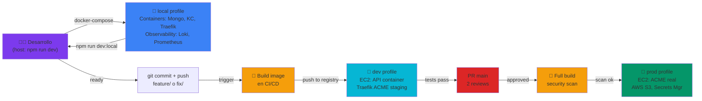
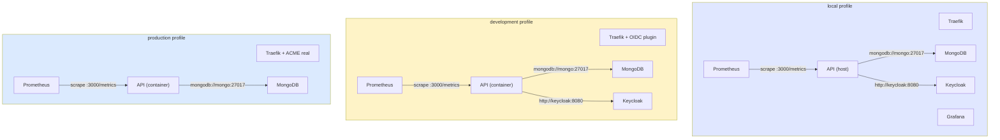

# Docker

> Docker Compose v2 with three profiles: `local` (hot-reload on host), `development` (containerized on EC2), `production` (EC2 with real ACME).

## Qué

Docker Compose orquesta los servicios API, MongoDB, Keycloak, Traefik y observabilidad en tres perfiles: desarrollo local, staging y producción.

## Por qué

Los servicios corren idénticamente en laptop, staging y producción usando versiones fijas. El Dockerfile y la configuración de compose son la única fuente de verdad. No hay sorpresas de "funciona en mi máquina".

## Configuración

Tres perfiles manejan diferentes modelos de despliegue:
- `local`: servicios en contenedores, API con hot-reload en host
- `development`: todo containerizado en EC2, certs ACME staging
- `production`: EC2 con certs Let's Encrypt real y AWS Secrets Manager

## Cómo ayuda

- **Consistencia:** Misma imagen y configuración en todos lados
- **Aislamiento:** Tres redes internas (proxy, backend, monitoring) sin conflictos de puertos
- **DNS:** Los servicios se encuentran entre sí por hostname
- **Estado:** Los volúmenes con nombre persisten datos entre reinicios
- **Visibilidad:** Prometheus, Grafana y Loki incluidos en todos los perfiles

## Componentes

- 3 perfiles con diferentes estrategias de redes y secretos
- Servicios: API, MongoDB, Keycloak, Traefik, stack observabilidad opcional
- 3 redes aisladas: proxy, backend, monitoring
- Volúmenes nombrados persistentes con políticas de backup
- HEALTHCHECK en todos los servicios con condiciones de dependencia
- Traefik 3.7 con plugin OIDC y ACME (staging o producción)

## Estructura

| Archivo | Tema |
|---|---|
| [`local.md`](./local.md) | Profile `local`: servicios en containers, API en host con hot-reload |
| [`development.md`](./development.md) | Profile `development`: todo en EC2 containerizado, Traefik ACME staging |
| [`production.md`](./production.md) | Profile `production`: EC2 + ACME Let's Encrypt real, secretos AWS |
| [`dockerfile.md`](./dockerfile.md) | Multi-stage build: deps → build → runtime; no-root user, distroless, caching |

## Diagrama: Ciclo de vida (profiles)



## Diagrama: Redes por perfil



## Tres profiles

### Profile: local

API en **host** (hot-reload con `tsx watch`), servicios en containers.

```bash
docker-compose --profile local up -d
npm run dev:local
```

**Stack:**
- Traefik 3.7 (reverse proxy, no ACME en local)
- MongoDB 8.2
- Keycloak 26.6.1 (puerto 127.0.0.1:8080)
- LocalStack 4.14.0 (S3 fake, puerto 127.0.0.1:4566)
- Prometheus 3.8.1
- Grafana 13.0.1
- Loki 3.7.1

**Env vars:** `.env.local` (copia con `KEYCLOAK_URL=http://localhost:8080`, `AWS_S3_ENDPOINT=http://localhost:4566`)

**Red:** `proxy`, `backend`, `monitoring`. API se conecta a containers por hostname: `mongodb://mongo:27017`, `http://keycloak:8080`.

**Volúmenes:** mongo_data, keycloak_data, localstack_data, prometheus_data, grafana_data, loki_data.

**API base:** http://localhost:3000 (host) o http://api.localhost:3000 (Traefik)

**Swagger:** http://localhost:3000/api/v1/docs

### Profile: development

Todo en **containers** en EC2. Traefik ACME staging (certs auto-firmados).

```bash
# En EC2 (dev/staging)
docker-compose --profile development up -d
```

**Stack:**
- Traefik 3.7 con OIDC plugin + ACME staging
- Express API (containerizado)
- MongoDB 8.2
- Keycloak 26.6.1
- Prometheus 3.8.1
- Grafana 13.0.1
- Loki 3.7.1

**Env vars:** `.env.staging` (copia con `KEYCLOAK_URL=http://keycloak:8080`, `AWS_S3_ENDPOINT=http://localstack:4566` SI localstack presente)

**Red:** API, Mongo, Keycloak en red `backend`. Traefik, Prometheus, Grafana en redes `proxy` y `monitoring`.

**API base:** https://api.staging.example.com (vía Traefik)

**Healthchecks:** API espera a MongoDB `service_healthy`, Keycloak `service_started`.

### Profile: production

EC2 con ACME **real** (Let's Encrypt). Integración AWS Secrets Manager.

```bash
# En EC2 (production)
docker-compose --profile production up -d
```

**Stack:**
- Traefik 3.7 con ACME real (Let's Encrypt)
- Express API (containerizado)
- MongoDB 8.2 (con backup scripts)
- Prometheus 3.8.1
- Loki 3.7.1
- Sin LocalStack: usa AWS S3 real

**Env vars:** `.env.production` (fetched de AWS Secrets Manager)

```bash
# Populate .env.production
aws secretsmanager get-secret-value \
  --secret-id /app/prod/env \
  --query SecretString --output text | jq -r 'to_entries | .[] | "\(.key)=\(.value)"' > .env.production
```

**ACME:** LE_CA_SERVER=https://acme-v02.api.letsencrypt.org/directory. Certs se renuevan 30 días antes de expirar.

**Monitoreo:** CloudWatch + SNS para alertas (error rate, response time p95, disk space).

## Organización del compose.yml

**Ubicación:** `docker-compose.yml` (root, 469 líneas)

**Estructura:**
1. Networks (proxy, backend, monitoring)
2. Servicios con perfiles
3. Volúmenes nombrados
4. Middlewares Traefik (en labels)

**Servicios principales:**

| Servicio | Image | Profiles | Ports | Network |
|---|---|---|---|---|
| **traefik** | traefik:v3.7.0-ea.1 | local, dev, prod | 80, 443, 8082 | proxy |
| **mongodb** | mongo:8.2 | all | 127.0.0.1:27017 | backend |
| **keycloak** | quay.io/keycloak/keycloak:26.6.1 | all | 127.0.0.1:8080 | proxy, backend |
| **api** | ./Dockerfile (build) | dev, prod (no local) | 3000 | proxy, backend, monitoring |
| **localstack** | localstack/localstack:4.14.0 | dev | 127.0.0.1:4566 | backend |
| **prometheus** | prom/prometheus:v3.8.1 | dev, prod | 9090 | monitoring |
| **grafana** | grafana/grafana:13.0.1 | dev, prod | 3001 | monitoring, proxy |
| **loki** | grafana/loki:3.7.1 | dev, prod | 3100 | monitoring |

**Perfiles (profiles):**
- **local:** Todos los servicios EXCEPTO API (en host)
- **development:** Todos incluyendo API (EC2 staging)
- **production:** API, MongoDB, Prometheus, Loki, Traefik (EC2 prod)

**Env vars (3 archivos):**
- `.env.local` — desarrollo con hot-reload
- `.env.staging` — EC2 staging (desarrollo profile)
- `.env.production` — EC2 prod (fetched de AWS Secrets Manager)

## Comando compose recomendado

```bash
# Local development (profile local)
docker-compose --profile local up -d

# Staging EC2 (profile development)
docker-compose --profile development up -d

# Production EC2 (profile production)
docker-compose --profile production up -d
```

**Nota:** `docker-compose` (Compose v2) es alias de `docker compose`. No usar `docker-compose` legacy (Python).

## Flujos de trabajo comunes

### Desarrollo local (con hot-reload)

```bash
# Terminal 1: servicios Docker
docker-compose --profile local up -d

# Terminal 2: API en host
npm run dev:local

# Swagger: http://localhost:3000/api/v1/docs
# Grafana: http://localhost:3001 (admin/admin)
# Prometheus: http://localhost:9090
```

### Staging en EC2

```bash
# 1. En EC2
ssh ubuntu@staging.example.com
cd /app && git pull origin main

# 2. Prepare env
aws secretsmanager get-secret-value --secret-id /app/staging/env \
  --query SecretString --output text > .env.staging

# 3. Start
docker-compose --profile development up -d

# 4. Verify
curl https://api.staging.example.com/health/live
```

### Producción en EC2

```bash
# 1. En EC2
ssh ubuntu@prod.example.com
cd /app && git pull origin main

# 2. Env + ACME
aws secretsmanager get-secret-value --secret-id /app/prod/env \
  --query SecretString --output text > .env.production

# 3. Start
docker-compose --profile production up -d

# 4. Monitor
docker-compose logs -f api
curl https://api.example.com/health/ready
```

## Resolución de problemas

| Problema | Solución |
|---|---|
| **"Cannot connect to Docker daemon"** | `sudo systemctl start docker` (Linux) o abrir Docker Desktop |
| **"Port already in use"** | `lsof -i :3000` para encontrar proceso. O cambiar puerto en compose |
| **"Service exited with code 1"** | `docker-compose logs service_name` para ver error específico |
| **"Connection refused between containers"** | Usar `mongodb://mongo:27017` (DNS Docker), no `localhost` |
| **"API can't reach Keycloak"** | En local: `KEYCLOAK_URL=http://localhost:8080`. En EC2: `http://keycloak:8080` |
| **"ACME certificate not renewing"** | Ver `docker logs traefik \| grep acme`. Verificar `LE_CA_SERVER` en `.env` |
| **"Healthcheck failing"** | `docker-compose logs <service>`. Comprobar `healthcheck` condition en compose |

## Rendimiento y optimización

**Dockerfile (multi-stage):**
- 3 stages: deps, build, runtime
- Node 22-alpine base (corepack pnpm)
- Non-root user `node`
- HEALTHCHECK integrado
- `.dockerignore` exluye node_modules, .git, .env*

**Compose:**
- Healthchecks con `depends_on.condition: service_healthy`
- Volúmenes nombrados (no bind mounts)
- Networks aisladas (proxy, backend, monitoring)
- Restart policy `unless-stopped`
- Log rotation via driver

**Sizes (actual):**
- API image: ~400MB (node:22-alpine + deps)
- Traefik: ~100MB
- MongoDB: ~800MB

## Seguridad

**Secretos:**
- NO hardcodear en Dockerfile
- Production: AWS Secrets Manager
- Staging/local: archivos .env (gitignore)

**ACME:**
- Staging: self-signed (teste certs)
- Production: Let's Encrypt real (HTTPS válido)

**Traefik:**
- Plugin OIDC para paneles (admin/operator roles)
- Middleware `security-headers` (HSTS, CSP, etc.)
- Rate limit 100 req/min en `/api/v1`

**Redes:**
- `proxy`: solo Traefik, Keycloak, API, paneles
- `backend`: API, MongoDB, Keycloak (interno)
- `monitoring`: Prometheus, Grafana, Loki

## Roadmap futuro

- [ ] Compose override files (compose.prod.yml) para menos repetición
- [ ] Secrets nativos de Compose en prod (vs AWS Secrets Manager)
- [ ] K8s migration: compose → Helm charts (futuro escalado)
- [ ] Docker layer caching improvement (BuildKit)
- [ ] Image scanning + registry scanning (Trivy)

## Referencias

- [docker-compose.yml](../../docker-compose.yml) — configuración completa
- [Dockerfile](../../Dockerfile) — multi-stage build
- [local.md](./local.md) — profile local detallado
- [development.md](./development.md) — profile staging EC2
- [production.md](./production.md) — profile prod EC2
- [dockerfile.md](./dockerfile.md) — explicación línea a línea
- Docker official: https://docs.docker.com/compose/, https://docs.docker.com/develop/
- Traefik: https://doc.traefik.io/ (v3.7)
