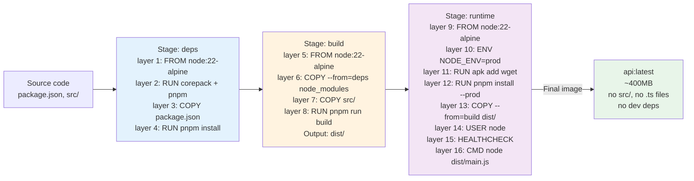

# Dockerfile

> Multi-stage build: deps (install dependencies), build (compile TypeScript), runtime (production image with non-root user).

## What

The Dockerfile defines how to build the Express API container image using a three-stage process.

## Why

A well-designed image is reproducible, fast to rebuild, secure, and small.
- Same binary every time
- Cached layers speed up rebuilds
- Non-root user limits damage if compromised
- Multi-stage keeps prod image lean (no build tools)

## Setup

Build the image for CI/CD and deployments to staging or production. Guarantees the API runs identically on laptops, EC2, or Kubernetes.

## How it helps

- **Consistency:** Same Dockerfile for local and CI builds
- **Performance:** Layer caching reuses stages between builds
- **Security:** Non-root user, production dependencies only
- **Size:** ~400MB (alpine) instead of 1.2GB (ubuntu)

---

## Estructura línea a línea

### Stage 1: deps

```dockerfile
# syntax=docker/dockerfile:1.7
#
# Habilita características modernas (BuildKit syntax).
# https://docs.docker.com/build/dockerfile/frontend/
```

```dockerfile
FROM node:22-alpine AS deps
#
# Base: Node.js 22.x sobre Alpine Linux 3.x.
# Alpine es tiny (~5MB) vs ubuntu (~80MB).
# node:22-alpine ya incluye corepack (pnpm, yarn via package managers).
#
# Why node:22?
# - Express 5.2.1 requiere Node >=18. Node 22 es LTS estable (Oct 2024 → Oct 2026).
# - Mejor performance, mejor soporte de TypeScript.
#
# Why Alpine?
# - Reducida: 45MB imagen base vs 900MB ubuntu
# - Suficiente: glibc, OpenSSL, musl C library, wget incluidos
#
# Alias 'deps': nombramos este stage para referenciar después.
```

```dockerfile
WORKDIR /app
#
# Establece directorio de trabajo.
# Todos los comandos subsecuentes corren aquí.
```

```dockerfile
RUN corepack enable && corepack prepare pnpm@10.33.0 --activate
#
# Habilita corepack (gestor de package managers).
# Prepara pnpm 10.33.0 y lo activa globalmente.
#
# Why pnpm?
# - Más rápido que npm (symbolic links, monorepo-friendly)
# - Determinístico: pnpm-lock.yaml exacto
# - Usado en package.json > "engines": {"npm": "pnpm"}
#
# Why RUN en stage deps?
# - Corepack + pnpm se cachean. Si package.json no cambia, reutiliza layer.
```

```dockerfile
COPY package.json pnpm-lock.yaml tsconfig.json ./
#
# Copia SOLO lo que define dependencias (no src/).
# Razón: Docker cachea por archivo. Si src/ cambia, no invalida deps layer.
#
# Files:
# - package.json: versiones exactas + scripts
# - pnpm-lock.yaml: hash de todas las dependencias (reproducibilidad)
# - tsconfig.json: necesario para verificar build (tipos)
```

```dockerfile
RUN pnpm install --frozen-lockfile
#
# Instala deps EXACTAS del pnpm-lock.yaml.
# --frozen-lockfile: falla si lock no matches, previene surpresas.
#
# Output: node_modules/ (~500MB con alpine)
# Guardado en layer, reutilizable si package.json no cambia.
```

### Stage 2: build

```dockerfile
FROM node:22-alpine AS build
#
# Nuevo stage: construir (transpile TypeScript → JavaScript).
# Heredada las layers previas? No. Empezamos limpio.
# Luego copiaremos node_modules DEL stage 'deps'.
```

```dockerfile
WORKDIR /app
RUN corepack enable && corepack prepare pnpm@10.33.0 --activate
COPY --from=deps /app/node_modules ./node_modules
#
# Copia node_modules DEL stage anterior (deps).
# Ahorra reinstalar. BuildKit deduplica storage.
```

```dockerfile
COPY package.json pnpm-lock.yaml tsconfig.json ./
COPY src ./src
#
# Ahora copia código fuente.
# Orden: metadata primero (package.json) luego src.
# Razón: si solo src/ cambia, reutiliza layers anteriores.
```

```dockerfile
RUN pnpm run build
#
# Ejecuta tsc (TypeScript compiler).
# package.json:
#   "build": "tsc"
#
# Output: dist/ (transpiled JavaScript).
# Guardado en layer 'build', NO se copia al runtime (beneficio multi-stage).
```

### Stage 3: runtime

```dockerfile
FROM node:22-alpine AS runtime
#
# Final stage: ejecutar.
# NO incluye node_modules de dev, tsconfig.json, src/ → imagen pequeña.
```

```dockerfile
ENV NODE_ENV=production
#
# Seteea NODE_ENV=production en tiempo de RUNTIME.
# Express, Winston, etc., usan esta variable para optimizar (less logging, etc.).
#
# Note: diferente a ARG (build-time only). ENV persiste en container.
```

```dockerfile
WORKDIR /app
RUN corepack enable && corepack prepare pnpm@10.33.0 --activate \
    && apk add --no-cache wget
#
# Activa pnpm (necesario para pnpm install en prod).
# Instala wget (usado por HEALTHCHECK más abajo).
# apk add --no-cache: descarga + instala en un RUN solo, NO crea layer extra.
# --no-cache: no guarda cache apk, reduciendo imagen (~2MB).
```

```dockerfile
COPY package.json pnpm-lock.yaml ./
#
# Copia solo metadata (necesario para pnpm install).
# NO copia node_modules ni src ni tsconfig.
```

```dockerfile
RUN pnpm install --frozen-lockfile --prod && pnpm store prune
#
# Instala SOLO dependencias production (no devDependencies).
# --prod: omite @vitest/coverage, tsx, @types/*, eslint, prettier, typescript
#   reduciendo tamaño ~200MB.
# pnpm store prune: borra caché local de pnpm (~50MB).
#
# Output: node_modules/ lean (~200MB) vs ~500MB con dev deps.
```

```dockerfile
COPY --from=build /app/dist ./dist
#
# Copia distribución compilada DEL stage 'build'.
# .ts files no incluidos. Solo .js ejecutables.
```

```dockerfile
USER node
#
# Corre el container como usuario 'node' (no root).
# Importante: limita daño si container es comprometido.
# El usuario 'node' existe en la imagen node:22-alpine por defecto.
#
# Verify: docker run node:22-alpine id
# Output: uid=1000(node) gid=1000(node) groups=1000(node)
```

```dockerfile
EXPOSE 3000
#
# Documenta que el servicio escucha en :3000.
# NO abre puerto automáticamente (es metadata solo).
# docker-compose.yml especifica mapping real: ports: ["3000:3000"]
```

```dockerfile
HEALTHCHECK --interval=30s --timeout=5s --start-period=20s --retries=3 \
    CMD wget -qO- http://localhost:3000/health/live || exit 1
#
# Define liveness probe.
#
# Parámetros:
# --interval=30s: check cada 30s
# --timeout=5s: wget tiene 5s para responder
# --start-period=20s: espera 20s antes del primer check (tiempo boot)
# --retries=3: falla si 3 checks consecutivos fallan
#
# Test: wget http://localhost:3000/health/live
# Código fuente: src/presentation/routers/health-router.ts → GET /health/live
#
# Verificar:
# docker inspect <container-id> --format '{{json .State.Health}}'
# Output: {"Status":"healthy","FailingStreak":0,...}
```

```dockerfile
CMD ["node", "dist/main.js"]
#
# Comando por defecto.
# docker run miimage  → ejecuta "node dist/main.js"
# docker run miimage pnpm --version  → reemplaza, ejecuta "pnpm --version"
#
# src/main.ts compilado a dist/main.js.
```

---

## Diagrama: layers y cache



## Optimización: cacheado

**Orden de COPY es crítico:**

```dockerfile
# ❌ MAL: code primero
COPY . .
RUN pnpm install
# Si cualquier archivo cambia, invalida todo, reinstala deps

# ✓ BIEN: metadata primero
COPY package.json pnpm-lock.yaml ./
RUN pnpm install
COPY src ./src
RUN pnpm run build
# Si src/ cambia, reutiliza layer de install
```

**Verificar caching:**

```bash
# Build 1 (primer vez)
docker build -t api:latest . 
# Output: [8/16] RUN pnpm install ... 45s

# Cambiar un archivo en src/
echo 'const x = 1;' >> src/main.ts

# Build 2 (src cambió, pero package.json no)
docker build -t api:latest .
# Output: [6/16] COPY --from=deps node_modules ... CACHED
#         [7/16] COPY src ... CACHED (pero anterior se invalida)
#         [8/16] RUN pnpm run build ... 5s (solo recompile, no reinstall)

# Cambiar package.json (agregar dependencia)
echo '"new-pkg": "1.0.0"' >> package.json

# Build 3 (package.json cambió)
docker build -t api:latest .
# Output: [4/16] RUN pnpm install ... 30s (NO cached, reinstall)
```

---

## Image size breakdown

```
node:22-alpine base           ~45 MB
+ RUN corepack + pnpm          ~20 MB
+ RUN pnpm install (prod)      ~200 MB (sin dev deps)
+ COPY dist/                   ~50 MB (compiled JS)
+ misc (libs, certs)           ~85 MB
─────────────────────────────────────
TOTAL                          ~400 MB
```

**Comparativa:**

| Base | Size |
|---|---|
| node:22-alpine | 400 MB |
| node:22-slim | 580 MB |
| node:22 (full) | 1.2 GB |
| gcr.io/distroless/nodejs22-debian12 | 200 MB ⭐ |

**Nota:** distroless es ~200MB pero requiere ajustes (no shell, debugging difícil). Alpine 400MB es buen balance.

---

## Seguridad: best practices aplicadas

| Práctica | Implementado |
|---|---|
| Non-root user | ✓ USER node |
| No dev tools en prod | ✓ --prod en pnpm install |
| Versiones específicas (no latest) | ✓ node:22-alpine, pnpm@10.33.0 |
| .dockerignore | ✓ (excluye .git, node_modules, .env*) |
| HEALTHCHECK | ✓ /health/live endpoint |
| Señales de sistema (SIGTERM) | ✓ Node.js default |
| Logs a stdout | ✓ Winston/Loki escriben a console |

---

## Troubleshooting

| Problema | Causa | Solución |
|---|---|---|
| **"error: command not found: pnpm"** | corepack not enabled | `RUN corepack enable` antes de pnpm |
| **"dist/ is empty"** | tsc falló silenciosamente | `RUN pnpm run build` con output verboso |
| **"Cannot find module 'xyz'"** | --prod omitió dependencia | Verificar que xyz NO esté en devDependencies |
| **"HEALTHCHECK failing"** | /health/live no existe | Verificar ruta exacta en src/presentation |
| **"Image 1.2GB"** | dev deps incluidos | Usar `pnpm install --prod` en runtime |

---

## Verificar en local

```bash
# Build
docker build -t api:test .

# Inspeccionar layers
docker history api:test

# Correr
docker run -e NODE_ENV=development -p 3000:3000 api:test

# Verificar healthcheck
docker inspect api-container --format '{{json .State.Health}}'

# Shell dentro (debugging)
docker run -it api:test sh
# Dentro: ls -la dist/, npm ls, node -v, pnpm -v
```

---

## Referencias

- [Dockerfile referencia](https://docs.docker.com/engine/reference/builder/)
- [Best practices](https://docs.docker.com/develop/dev-best-practices/)
- [BuildKit syntax](https://docs.docker.com/build/dockerfile/frontend/)
- [Node Alpine](https://github.com/nodejs/docker-node/tree/main/22/alpine3.19/Dockerfile)
- [pnpm performance](https://pnpm.io/benchmarks)
