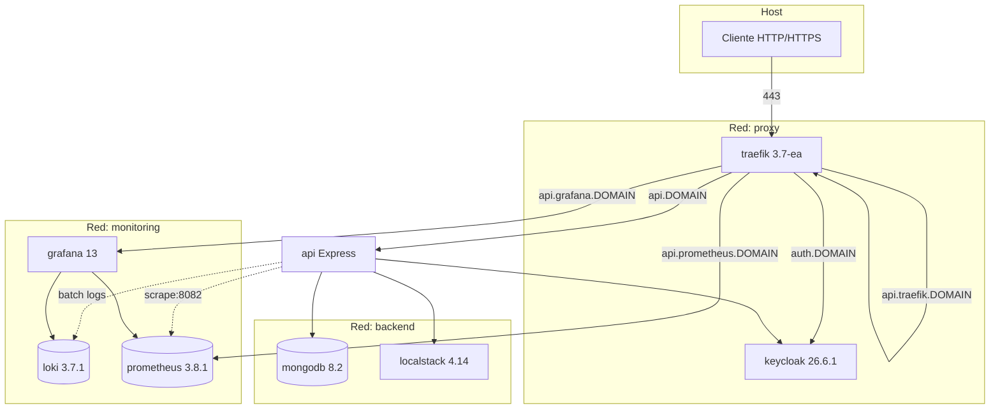
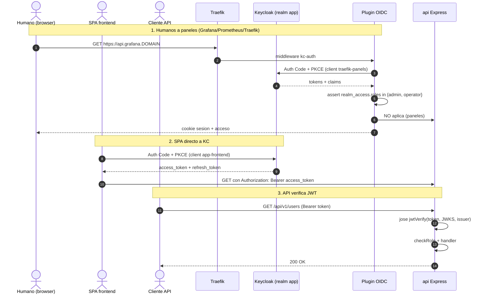

# Platform & Deployment

> Operational stack via `docker-compose.yml` (462 lines): Traefik 3.7 reverse proxy with ACME and OIDC plugin, Keycloak 26.6.1, MongoDB 8.2, LocalStack 4.14, and observability stack (Loki/Grafana/Prometheus). Three isolated networks, multiple compose profiles.

---

## Indice

1. [Stack docker-compose](#stack-docker-compose)
2. [Topologia de red](#topologia-de-red)
3. [Traefik](#traefik)
4. [Plugin OIDC + flujo auth de paneles](#plugin-oidc--flujo-auth-de-paneles)
5. [Keycloak realm `app`](#keycloak-realm-app)
6. [Dockerfile API](#dockerfile-api)
7. [Scripts de bootstrap](#scripts-de-bootstrap)
8. [Inicio rápido](#inicio-rapido)

---

## Stack docker-compose

`docker-compose.yml` — 8 servicios.

| Servicio | Imagen | Profile | Networks | Healthcheck |
|---|---|---|---|---|
| `traefik` | `traefik:v3.7.0-ea.1` | default | `proxy`, `monitoring` | `traefik healthcheck --ping` (`docker-compose.yml:127-132`) |
| `mongodb` | `mongo:8.2` | default | `backend` | `mongosh ... db.adminCommand('ping').ok` (`:218-223`) |
| `keycloak` | `quay.io/keycloak/keycloak:26.6.1` | default | `proxy`, `backend` | Java inline contra `:9000/health/live` (`:262-267`) |
| `api` | build local | default | `proxy`, `backend`, `monitoring` | `wget --spider http://localhost:3000/health/ready` (`:325-330`) |
| `localstack` | `localstack/localstack:4.14.0` | `dev` | `backend` | `/_localstack/health` (`:368-373`) |
| `loki` | `grafana/loki:3.7.1` | `observability` | `monitoring` | `:3100/ready` (`:389-394`) |
| `prometheus` | `prom/prometheus:v3.8.1` | `observability` | `monitoring` | `:9090/-/ready` (`:410-414`) |
| `grafana` | `grafana/grafana:13.0.1` | `observability` | `monitoring`, `proxy` | (sin healthcheck explicito) |

> [!NOTE] Traefik 3.7-ea.1
> `traefik:v3.7.0-ea.1` (`docker-compose.yml:42`) es **early-access**.
> Riesgo bajo de breaking changes pero conviene clavar version y
> documentar fallback. Politica recomendada: pin de version, plan de
> bumps coordinado, fallback a `traefik:v3.6.x` (estable) si surge
> regresion. Ver pregunta abierta 14 en research-summary.

> [!NOTE] Plugin OIDC v0.19.0
> Plugin de terceros `sevensolutions/traefik-oidc-auth` v0.19.0
> (`docker-compose.yml:108`). Riesgo de abandonment moderado.
> Fallback documentado: `oauth2-proxy` con `forward-auth` middleware
> de Traefik.

### Volumes

Named volumes (gestionados por Docker, persistencia entre `compose
down`):
`mongo_data`, `keycloak_data`, `localstack_data`, `loki_data`,
`prometheus_data`, `grafana_data` (`docker-compose.yml:457-463`).

Bind mounts para inspeccion humana:
- `./data/traefik/acme` → `/etc/traefik/acme` (acme.json).
- `./logs/traefik` → `/var/log/traefik`.
- `./monitoring/prometheus.yml:ro`.
- `./keycloak/app-realm.json:ro`.
- `./scripts/localstack-init.sh:ro`.

### Profiles

| Profile | Servicios añadidos | Comando |
|---|---|---|
| (default) | traefik, mongodb, keycloak, api | `docker compose up` |
| `dev` | + localstack | `docker compose --profile dev up` |
| `observability` | + loki, prometheus, grafana | `docker compose --profile observability up` |

Combinable: `docker compose --profile dev --profile observability up`.

### Puertos expuestos al host

| Puerto host | Servicio | Notas |
|---|---|---|
| `80`, `443`, `443/udp` | traefik | HTTP/HTTPS + HTTP/3 QUIC. |
| `127.0.0.1:27017` | mongodb | Solo loopback — para `pnpm dev` desde host. |
| `127.0.0.1:8080` | keycloak | Solo loopback — evita cert auto-firmado en local. |
| `127.0.0.1:4566` | localstack | Solo loopback — S3 dev. |

---

## Topologia de red

Tres redes aisladas (`docker-compose.yml:29-35`):

| Red | Nombre externo | Servicios |
|---|---|---|
| `proxy` | `proxy` | traefik, keycloak, api, grafana |
| `backend` | `backend` | mongodb, localstack, keycloak, api |
| `monitoring` | `monitoring` | traefik, api, loki, prometheus, grafana |



Nombres de redes externalizados (`name: proxy`, etc.) — permite
`docker network connect` desde fuera para integrar otros stacks.

---

## Traefik

Configuracion 100% via `command:` flags + `labels` (no usa archivo
estatico).

### Entrypoints

| Entrypoint | Puerto | Notas |
|---|---|---|
| `web` | `:80` | Redirect 301 a `websecure` (`docker-compose.yml:75-78`). |
| `websecure` | `:443` (TLS) + `:443/udp` (HTTP/3 QUIC) | `--entrypoints.websecure.http3=true` (`:81`). |
| `metrics` | `:8082` | Metricas Prometheus + ping (interno, no expuesto al host). |

### Middlewares globales

7 middlewares definidos via labels en el servicio `traefik`
(`docker-compose.yml:140-191`):

| Middleware | Tipo | Configuracion clave |
|---|---|---|
| `security-headers` | headers | HSTS 1 año + preload, nosniff, XSS, frame SAMEORIGIN, referrer strict-origin-when-cross-origin (`:140-146`). |
| `ratelimit-api` | ratelimit | 100 req/min, burst 200 (`:149-151`). Solo en router `api`. |
| `cors-api` | headers | Whitelist `CORS_ORIGINS`, expose `X-Request-Id`, max-age 86400 (`:154-159`). |
| `compress` | compress | gzip/brotli (`:162`). |
| `lan-only` | ipallowlist | RFC1918 + loopback (`:165`). Defensa en profundidad para paneles. |
| `basicauth-traefik` | basicauth | htpasswd `TRAEFIK_AUTH` (`:169-170`). 2FA sobre dashboard Traefik. |
| `kc-auth` | plugin OIDC | Ver seccion plugin OIDC abajo. |

> [!NOTE] `TRAEFIK_AUTH` placeholder
> Default `${TRAEFIK_AUTH:-admin:$$apr1$$placeholder$$placeholder}`
> (`docker-compose.yml:169`) **no es un hash htpasswd valido**. Si el
> arranque ocurre sin override, el dashboard de Traefik queda
> protegido solo por OIDC + lan-only. Generar hash real con
> `htpasswd -nb admin <password>` y exportar en `.env.local`.

#### Chain `chain-admin-panel`

`lan-only,kc-auth,security-headers,compress` (`docker-compose.yml:191`).
Aplicada a paneles administrativos.

### Routers

5 routers (`docker-compose.yml:196-200`, `:273-277`, `:337-341`,
`:418-421`, `:451-454`):

| Router | Host | Servicio | Middlewares |
|---|---|---|---|
| `traefik-dashboard` | `api.traefik.${DOMAIN}` | `api@internal` | `chain-admin-panel,basicauth-traefik` |
| `keycloak` | `auth.${DOMAIN}` | keycloak | `security-headers,compress` |
| `api` | `api.${DOMAIN}` | api | `security-headers,ratelimit-api,cors-api,compress` (sin auth — la API verifica JWT por su cuenta) |
| `grafana` | `api.grafana.${DOMAIN}` | grafana | `kc-auth,security-headers,compress` |
| `prometheus` | `api.prometheus.${DOMAIN}` | prometheus | `chain-admin-panel` |

### Diagrama: routers + middlewares

```mermaid
flowchart LR
    web[":80 web<br/>redirect 301"]
    websecure[":443 websecure<br/>TLS + HTTP/3"]
    metrics[":8082 metrics<br/>interno"]

    web --> websecure

    subgraph routers[Routers]
        r_api[api.DOMAIN]
        r_auth[auth.DOMAIN]
        r_dash[api.traefik.DOMAIN]
        r_graf[api.grafana.DOMAIN]
        r_prom[api.prometheus.DOMAIN]
    end

    websecure --> r_api
    websecure --> r_auth
    websecure --> r_dash
    websecure --> r_graf
    websecure --> r_prom

    subgraph mws[Middlewares]
        m_sec[security-headers]
        m_rl[ratelimit-api]
        m_cors[cors-api]
        m_comp[compress]
        m_lan[lan-only]
        m_kc[kc-auth OIDC]
        m_ba[basicauth-traefik]
    end

    r_api --> m_sec
    r_api --> m_rl
    r_api --> m_cors
    r_api --> m_comp

    r_auth --> m_sec
    r_auth --> m_comp

    r_dash --> m_lan
    r_dash --> m_kc
    r_dash --> m_sec
    r_dash --> m_comp
    r_dash --> m_ba

    r_graf --> m_kc
    r_graf --> m_sec
    r_graf --> m_comp

    r_prom --> m_lan
    r_prom --> m_kc
    r_prom --> m_sec
    r_prom --> m_comp

    s_api[api Express]
    s_kc[keycloak]
    s_dash[api@internal]
    s_graf[grafana]
    s_prom[prometheus]

    m_comp -.-> s_api
    m_comp -.-> s_kc
    m_ba -.-> s_dash
    m_comp -.-> s_graf
    m_comp -.-> s_prom
```

### ACME / Let's Encrypt

Resolver `le` (`docker-compose.yml:100-104`):

- `email`: `${SSL_EMAIL:-info@example.com}`.
- `caserver`: `${LE_CA_SERVER:-https://acme-v02.api.letsencrypt.org/directory}`
  — default produccion, override a staging
  (`https://acme-staging-v02.api.letsencrypt.org/directory`) en pruebas.
- `httpchallenge.entrypoint=web` (HTTP-01 sobre `:80`).
- Storage: `/etc/traefik/acme/acme.json`. **Permisos 600 obligatorios**:
  Traefik refusa arrancar si no.

En `DOMAIN=localhost` los routers no piden `certResolver` explicito —
Traefik genera self-signed para `*.localhost`.

### Metricas Prometheus

`--metrics.prometheus.entrypoint=metrics` + `addrouterslabels=true` +
`addserviceslabels=true` (`docker-compose.yml:119-122`). Prometheus
scrapea `traefik:8082/metrics`. Granularidad por router/servicio.

### HTTP/3 QUIC

`--entrypoints.websecure.http3=true` (`:81`). Requiere puerto UDP/443
abierto en firewall en deploy real.

---

## Plugin OIDC + flujo auth de paneles

Plugin `sevensolutions/traefik-oidc-auth v0.19.0`
(`docker-compose.yml:106-108`).

### Configuracion middleware `kc-auth`

`docker-compose.yml:175-188`:

| Parametro | Valor |
|---|---|
| `Provider.Url` | `https://auth.${DOMAIN}/realms/app` |
| `Provider.ClientId` | `traefik-panels` |
| `Provider.ClientSecret` | `${KC_PANELS_SECRET}` |
| `Provider.UsePkce` | `true` |
| `Scopes` | `openid,profile,email` |
| `Authorization.AssertClaims[0].Name` | `realm_access.roles` |
| `Authorization.AssertClaims[0].AnyOf` | `admin,operator` |
| `Headers[0]` | `X-Auth-User: {{.claims.preferred_username}}` |
| `Headers[1]` | `X-Auth-Email: {{.claims.email}}` |
| `Secret` | `${OIDC_PLUGIN_SECRET}` (cifra cookie de sesion) |

`OIDC_PLUGIN_SECRET` y `KC_PANELS_SECRET` son **mandatorios**: compose
los enforce con `:?required` (`docker-compose.yml:61-62`).

### Headers fwded al backend

Grafana lee `X-Auth-User` (var `GF_AUTH_PROXY_HEADER_NAME=X-Auth-User`)
y auto-crea usuarios via `GF_AUTH_PROXY_AUTO_SIGN_UP=true`
(`docker-compose.yml:432-436`).

> [!NOTE] API auth directa
> La API en `api.${DOMAIN}` **no recibe** `X-Auth-User` porque su router no
> lleva el middleware `kc-auth`. La API verifica JWTs directamente con jose.

### Diagrama: tres vias de autenticacion



---

## Keycloak realm `app`

`keycloak/app-realm.json` — auto-importado en arranque
(`start-dev --import-realm`, `docker-compose.yml:232`).

### Configuracion realm

| Parametro | Valor | Linea |
|---|---|---|
| `sslRequired` | `external` | `app-realm.json:4` |
| `registrationAllowed` | `false` | `:5` |
| `loginWithEmailAllowed` | `true` | `:6` |
| `duplicateEmailsAllowed` | `false` | `:7` |
| `bruteForceProtected` | `true` | `:10` |
| `accessTokenLifespan` | `900` (15 min) | `:11` |
| `refreshTokenMaxReuse` | `0` (rotacion estricta) | `:12` |
| `ssoSessionIdleTimeout` | `1800` | `:13` |
| `ssoSessionMaxLifespan` | `36000` (10h) | `:14` |

### Roles realm-level (4)

`app-realm.json:15-23`:

| Rol | Descripcion |
|---|---|
| `buyer` | Default para registros nuevos (`defaultRoles: ['buyer']`). |
| `seller` | Publica y gestiona sus propios listings. |
| `operator` | Gestiona listings y transactions. |
| `admin` | Acceso total. |

> [!NOTE] `defaultRoles` deprecado
> `defaultRoles` (`app-realm.json:23`) esta deprecado en KC 26.
> Migracion sugerida: usar composite role `default-roles-app`. Funciona
> hoy.

### Clients (3)

`app-realm.json:24-82`:

| ClientId | Tipo | Flow | Uso |
|---|---|---|---|
| `app-api` | confidential | client_credentials + standard + direct-access | Backend API. Login (password grant) + admin REST (`KeycloakAdapter`). |
| `app-frontend` | public | standard (Auth Code + PKCE implicito) | SPA. |
| `traefik-panels` | confidential | standard + PKCE S256 | Plugin OIDC para paneles. |

### Usuarios bootstrap (dev only)

`app-realm.json:83-104`:

- `admin@app.local` / `<bootstrap-password>` → rol `admin`.
- `operator@app.local` / `<bootstrap-password>` → rol `operator`.

> Las contraseñas reales se definen en `.env.local` y deben rotarse en el primer arranque. Nunca usar valores por defecto en staging/prod.

En staging/prod: NO usar estos. Crear users via API
(`KeycloakAdapter.registerUser`).

### `webOrigins: ["+"]`

NO es wildcard. Significa "cualquier origen registrado en
`redirectUris`" (`app-realm.json:40`, `:57`, `:77`). Trade-off correcto.

---

## Dockerfile API

`Dockerfile` — 3 stages sobre `node:22-alpine`. Container `api`
(`docker-compose.yml:282-342`).

| Stage | Proposito |
|---|---|
| `deps` | Instala dependencias con pnpm. |
| `build` | Compila TypeScript → `dist/` + post-process JS extensions. |
| `runtime` | Solo deps prod + `dist/`. `USER node`, `EXPOSE 3000`. |

### Variables esperadas en runtime

Las env vars del servicio `api` en `docker-compose.yml:287-315`
inyectan la configuracion. Detalle en cap 08.

---

## Scripts de bootstrap

| Script | Proposito | Cuando correrlo |
|---|---|---|
| `scripts/init-acme.sh` | Crea `data/traefik/acme/acme.json` con `chmod 600`. Idempotente. | Antes del primer `compose up` y tras `git clone` |
| `scripts/generate-secrets.sh` | Genera 7 secrets con openssl + escribe en `.env.secrets`. | Antes de cualquier despliegue staging/prod. Detalle cap 08 |
| `scripts/localstack-init.sh` | `awslocal s3api create-bucket` con `LocationConstraint=eu-west-1`. Idempotente. | Auto-ejecutado por LocalStack al iniciar |
| `scripts/add-js-extensions.mjs` | Post-process build: añade `.js` a imports relativos (ESM strict requirements). | Auto-ejecutado por `pnpm build` |

`init-acme.sh:14-29`:

```bash
mkdir -p "$ACME_DIR"
touch "$ACME_FILE"
chmod 600 "$ACME_FILE"
```

`generate-secrets.sh:38-46` genera (entre otros): `OIDC_PLUGIN_SECRET`,
`KC_PANELS_SECRET`, `KC_API_SECRET`, `KC_ADMIN_PASSWORD`, `JWT_SECRET`.

---

## Inicio rápido

Stack completo desde cero:

```bash
# 1. ACME init (idempotente)
./scripts/init-acme.sh

# 2. Generar secrets (escribe a .env.secrets)
./scripts/generate-secrets.sh

# 3. Crear .env.local (o symlink a .env)
cp .env.example .env.local
# Editar .env.local con los valores de .env.secrets + DOMAIN, etc.
ln -sf .env.local .env  # symlink opcional, ver cap 08

# 4. Levantar stack core
docker compose up -d

# 5. Stack con S3 dev
docker compose --profile dev up -d

# 6. Stack con observability
docker compose --profile dev --profile observability up -d
```

Hosts a probar:

- `https://api.localhost/health/ready` — API healthy.
- `https://auth.localhost/realms/app` — Keycloak realm.
- `https://api.traefik.localhost/dashboard/` — Traefik dashboard
  (requiere lan-only + OIDC + basicauth).
- `https://api.grafana.localhost/` — Grafana (OIDC).
- `https://api.prometheus.localhost/` — Prometheus (chain admin).

---

## Referencias cruzadas

- Cap 05 (Infraestructura): adapters consumidos en compose.
- Cap 07 (Seguridad): cadena auth E2E, trust proxy.
- Cap 08 (Configuracion): tabla `.env reference` (API + stack vars).
- Cap 09 (Observabilidad): pipeline Loki/Prometheus/Grafana.
- Cap 11 (Operacion): runbook, healthchecks, graceful shutdown.
