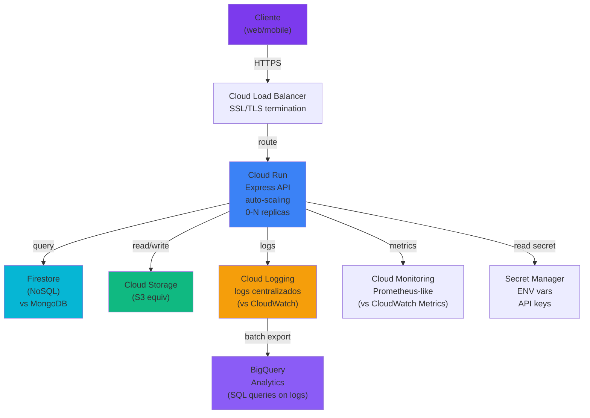

# GCP

> Google Cloud Platform as alternative or complement to AWS. Documentation for evaluation and future multi-cloud strategy.

## Qué

Google Cloud Platform proporciona compute (Cloud Run), almacenamiento (Cloud Storage), mensajería (Pub/Sub), bases de datos (Firestore, Cloud SQL), ML (Vertex AI) y análisis (BigQuery).

## Por qué

GCP ofrece un modelo de precios diferente (basado en uso, descuentos comprometidos), servicios especializados (BigQuery para analytics, Vertex AI para ML, Firestore para NoSQL real-time), una Cloud Console moderna y un CLI gcloud limpio.

## Configuración

Evalúa costos GCP vs AWS, prepárate para multi-cloud y usa los servicios especializados de GCP.

## Ayuda con

- Cost modeling for Cloud Run vs ECS Fargate
- Service mapping between AWS and GCP
- Firebase Auth as alternative to Keycloak
- BigQuery for long-term log and metric analysis

---

## Estado actual

**El proyecto corre en AWS.** GCP está documentado para evaluación futura.

**Stack AWS actual:**
- Compute: EC2 (manual) → futuro: ECS Fargate
- Storage: S3
- Secrets: Secrets Manager
- Logging: CloudWatch
- Networking: VPC, ALB

**Equivalentes GCP:**
- Compute: Cloud Run (serverless) o GCE (manual)
- Storage: Cloud Storage (gs://)
- Secrets: Secret Manager
- Logging: Cloud Logging
- Networking: VPC, Cloud Load Balancer

---

## Servicios GCP relevantes

| Servicio | Caso de uso | AWS equiv |
|---|---|---|
| **Cloud Run** | API Express serverless, auto-scaling | ECS Fargate |
| **Cloud Storage** | Almacenamiento objetos (S3 equivalent) | S3 |
| **Secret Manager** | Gestión de secretos (ENV vars, API keys) | Secrets Manager |
| **Cloud Logging** | Agregación de logs centralizados | CloudWatch Logs |
| **Cloud Monitoring** | Métricas + alertas | CloudWatch Metrics |
| **Cloud SQL** | Managed PostgreSQL/MySQL | RDS |
| **Firestore** | NoSQL real-time, auto-sync | DynamoDB |
| **BigQuery** | Data warehouse analytics | Athena + Redshift |
| **Vertex AI** | ML models, embeddings, LLMs | SageMaker |
| **Pub/Sub** | Message queue | SQS / SNS |

---

## Diagrama: Arquitectura GCP (futura)



---

## Comparativa: AWS vs GCP

| Aspecto | AWS | GCP |
|---|---|---|
| **Compute** | EC2 (VM) + ECS (containers) | GCE (VM) + Cloud Run (serverless) |
| **Container registry** | ECR | Artifact Registry |
| **Storage** | S3 | Cloud Storage |
| **Database** | RDS (SQL) + DynamoDB (NoSQL) | Cloud SQL + Firestore |
| **Message queue** | SQS / SNS | Pub/Sub |
| **Secrets** | Secrets Manager | Secret Manager |
| **Logging** | CloudWatch Logs | Cloud Logging |
| **Monitoring** | CloudWatch Metrics | Cloud Monitoring |
| **Analytics** | Athena + Redshift | BigQuery |
| **ML** | SageMaker | Vertex AI |
| **Pricing** | Complex (regional, on-demand + reserved) | Simple (usage-based, committed discounts) |
| **Console UI** | AWS Console (older) | GCP Console (modern) |
| **CLI** | aws (many subcommands) | gcloud (clean) |

**Nota:** GCP es más moderno en DX y analytics. AWS es más mature en enterprise features.

---

## Roadmap GCP (futuro)

### Phase 1: Evaluation
- [ ] Setup GCP project + billing account
- [ ] Cost modeling: Cloud Run vs ECS Fargate
- [ ] Setup gcloud CLI + auth
- [ ] Create service account for app

### Phase 2: Core Infrastructure
- [ ] Migrar API a Cloud Run
- [ ] Migrar S3 → Cloud Storage
- [ ] Migrar Secrets Manager → Secret Manager
- [ ] Setup VPC + Load Balancer

### Phase 3: Persistence
- [ ] Evaluate Firestore vs MongoDB (Firestore tiene real-time, MongoDB tiene aggregations)
- [ ] Setup Cloud SQL para relational data si aplica
- [ ] Migration script MongoDB → Firestore (o keep MongoDB)

### Phase 4: Analytics
- [ ] BigQuery setup
- [ ] Logs export (Cloud Logging → BigQuery)
- [ ] SQL analytics queries

### Phase 5: Optimization
- [ ] Vertex AI embeddings (si hay NLP use cases)
- [ ] Pub/Sub para async jobs (vs cron)
- [ ] Committed use discounts (save 25-50%)

---

## Estructura

| Archivo | Tema |
|---|---|
| [`README.md`](./README.md) | Este barrel (visión general GCP) |
| [`services.md`](./services.md) | Servicios GCP detallados + setup |
| [`auth.md`](./auth.md) | Autenticación GCP (IAM, service accounts, Workload Identity) |
| [`firebase/README.md`](./firebase/README.md) | Firebase como alternativa a Keycloak |
| [`firebase/auth.md`](./firebase/auth.md) | Firebase Auth integration |

---

## Referencias rápidas

**GCP Console:**
```
https://console.cloud.google.com
```

**gcloud CLI:**
```bash
gcloud auth login
gcloud config set project PROJECT_ID
gcloud run deploy --help
```

**References:**
- [GCP docs](https://cloud.google.com/docs)
- [Cloud Run quickstart](https://cloud.google.com/run/docs/quickstarts/build-and-deploy)
- [Cloud Storage](https://cloud.google.com/storage/docs)
- [BigQuery](https://cloud.google.com/bigquery/docs)
- [Pricing calculator](https://cloud.google.com/products/calculator)
