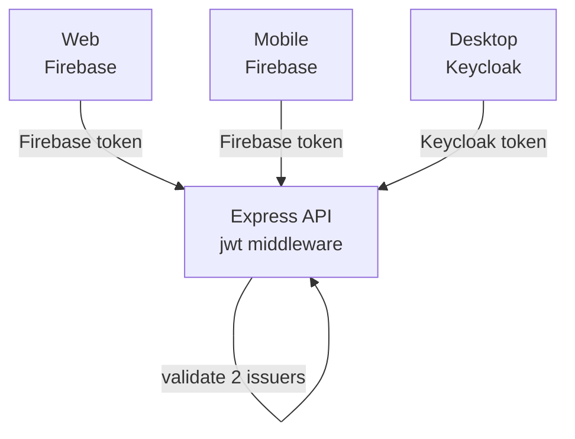

# Firebase

> Firebase Authentication: Google-managed IAM with social login built-in. Alternative or complement to self-hosted Keycloak.

## What

Firebase Authentication is Google's managed authentication service. Supports email/password, Google, Apple, GitHub, anonymous, and custom tokens.

## Why

Firebase handles:
- Server management, scaling, backups, and security with zero operations
- Built-in social login (Google, Apple, GitHub, Facebook, Microsoft)
- Official SDKs for web, iOS, Android, React Native
- 50,000 free tokens per month
- Real-time event listeners for auth state changes
- Mobile-optimized with offline support and session persistence

## Setup

Use Firebase for:
- Mobile authentication (iOS/Android) without self-hosted Keycloak
- Web frontend with social login
- Reducing operational burden of managing IAM
- Gradual migration from Keycloak (backend) to Firebase (frontend)

## Helps with

- Zero authentication infrastructure to operate
- 30-minute setup vs 2+ hours for Keycloak
- Official mobile SDKs with offline support
- Built-in social login with no manual OAuth configuration
- Free tier covers ~1 million users

## Estructura

| Archivo | Tema |
|---|---|
| [`README.md`](./README.md) | Este barrel (visión general Firebase) |
| [`auth.md`](./auth.md) | Firebase Auth setup, client SDK, backend integration |

---

## Comparativa: Keycloak vs Firebase

| Aspecto | Keycloak | Firebase |
|---|---|---|
| **Hosting** | Self-hosted (EC2) | Google managed |
| **Costo** | $0 (infra propia) | Free 50k tokens/mo, luego $1-2 per 100k |
| **Setup** | 2+ horas (Docker, config) | 30 min (console) |
| **Complejidad** | Alto (realms, clients, roles) | Bajo (simple rules, SDKs) |
| **Social login** | Integrable (trabajo manual) | Built-in (Google, Apple, GitHub) |
| **Mobile SDKs** | Manual implementation | Oficial, full-featured (iOS, Android) |
| **Customización** | Muy alto (themes, realms, extensiones) | Limitado (console UI) |
| **GDPR/Compliance** | Self-configured, full control | Google managed, GDPR certified |
| **Data residency** | Control total | Limitado a GCP regions |
| **Mejor para** | Enterprise, custom flows | Startups, mobile-first, rapid deployment |

**Veredicto:**
- **Firebase:** mejor para startups/mobile, reducir ops
- **Keycloak:** mejor para enterprise con reqs complejos, full control

---

## Diagrama: Arquitectura con Firebase + Express API

```mermaid
flowchart TB
    subgraph Frontend["Frontend (web/mobile)"]
        Web["Web (React)<br/>firebase/auth"]
        Mobile["Mobile (iOS/Android)<br/>FirebaseAuth SDK"]
    end
    
    subgraph Firebase["Firebase (Google managed)"]
        FBAuth["Firebase Auth<br/>email/password<br/>Google OAuth<br/>Apple OAuth"]
        FBConsole["Firebase Console<br/>user management"]
    end
    
    subgraph API["Express API (backend)"]
        Middleware["Firebase JWT<br/>middleware<br/>verifyIdToken()"]
        Routes["Routes<br/>auth, users, storage"]
        Mongo["MongoDB<br/>(optional sync)"]
    end
    
    Web -->|signInWithPopup()| FBAuth
    Mobile -->|signInWithGoogle()| FBAuth
    FBAuth -->|idToken| Web
    FBAuth -->|idToken| Mobile
    
    Web -->|Bearer idToken| Middleware
    Mobile -->|Bearer idToken| Middleware
    Middleware -->|validate with JWKS| FBAuth
    FBAuth -->|claims (sub, email, roles)| Middleware
    Middleware -->|route| Routes
    Routes -->|sync user| Mongo
    
    FBConsole -->|manage users| FBAuth
    
    style Frontend fill:#7c3aed
    style Firebase fill:#fff3e0
    style API fill:#3b82f6
```

---

## Arquitectura alternativa: Keycloak + Firebase

Si necesitas custom auth flows + mobile convenience:

1. **Keycloak** (self-hosted): autenticación backend, roles complejos
2. **Firebase** (Google): frontend web/mobile, social login
3. **Express API:** valida ambos tokens



---

## Setup rápido (30 min)

### 1. Crear Firebase project

```bash
# Via Firebase Console
open https://console.firebase.google.com
# Click "Create project" → nombre: "express-clean-backend" → GCP project
```

### 2. Habilitar Firebase Auth

Console → Authentication → Get started
- Enable "Email/Password"
- Add "Google" OAuth (optional)
- Add "Apple" OAuth (optional, para iOS)

### 3. Crear app web

Console → Project settings → Your apps → "Web" → Register

Copiar config:

```javascript
const firebaseConfig = {
  apiKey: "AIzaSy...",  // public
  authDomain: "my-app.firebaseapp.com",
  projectId: "my-app",
  storageBucket: "my-app.appspot.com",
  messagingSenderId: "123456789",
  appId: "1:123456789:web:abc123"
};
```

### 4. Backend: validar Firebase tokens

```typescript
import { initializeApp, cert } from 'firebase-admin/app';
import { getAuth } from 'firebase-admin/auth';

const adminApp = initializeApp({
  credential: cert(serviceAccountKey)  // Descargar de Firebase Console
});

const auth = getAuth(adminApp);

// Middleware
export async function verifyFirebaseToken(token: string) {
  try {
    return await auth.verifyIdToken(token);
  } catch (err) {
    throw new Error('Invalid token');
  }
}
```

**Service account key:** Console → Project settings → Service accounts → Generate key

---

## Integración con Express API

### Middleware: validar Firebase token

```typescript
// src/infrastructure/auth/firebase-middleware.ts
import { Request, Response, NextFunction } from 'express';
import { getAuth } from 'firebase-admin/auth';

export async function firebaseAuthMiddleware(
  req: Request,
  res: Response,
  next: NextFunction
) {
  const token = req.headers.authorization?.replace('Bearer ', '');

  if (!token) {
    return res.status(401).json({
      statusCode: 401,
      message: 'Missing authorization header',
      error: { code: 'UNAUTHORIZED' }
    });
  }

  try {
    const decodedToken = await getAuth().verifyIdToken(token);
    req.user = {
      id: decodedToken.uid,
      email: decodedToken.email,
      name: decodedToken.name,
      roles: decodedToken.roles || ['user']
    };
    next();
  } catch (err) {
    return res.status(401).json({
      statusCode: 401,
      message: 'Invalid token',
      error: { code: 'UNAUTHORIZED' }
    });
  }
}
```

### Router example

```typescript
// src/presentation/routers/user-router.ts
import { Router } from 'express';
import { firebaseAuthMiddleware } from '#infrastructure/auth/firebase-middleware';

const router = Router();

/**
 * @swagger
 * /api/v1/users/me:
 *   get:
 *     summary: Get current user profile
 *     security:
 *       - BearerAuth: []
 */
router.get('/me', firebaseAuthMiddleware, (req, res) => {
  res.json({
    statusCode: 200,
    data: req.user
  });
});

export default router;
```

---

## Frontend integration

### Web (React + firebase/auth)

```typescript
// src/auth.ts
import { initializeApp } from 'firebase/app';
import { getAuth, signInWithEmailAndPassword, signOut } from 'firebase/auth';

const firebaseConfig = {
  apiKey: process.env.REACT_APP_FIREBASE_API_KEY,
  authDomain: process.env.REACT_APP_FIREBASE_AUTH_DOMAIN,
  projectId: process.env.REACT_APP_FIREBASE_PROJECT_ID,
  // ... otros campos
};

const app = initializeApp(firebaseConfig);
export const auth = getAuth(app);

// Login
export async function login(email: string, password: string) {
  const credential = await signInWithEmailAndPassword(auth, email, password);
  const idToken = await credential.user.getIdToken();
  return idToken;  // Send to API: Authorization: Bearer <idToken>
}

// Logout
export async function logout() {
  await signOut(auth);
}
```

### Mobile (React Native + firebase)

```typescript
import { initializeApp } from 'firebase/app';
import { getAuth } from 'firebase/auth';

const firebaseConfig = { /* ... */ };
initializeApp(firebaseConfig);
const auth = getAuth();

// Sign in
const credential = await signInWithEmailAndPassword(auth, email, password);
const idToken = await credential.user.getIdToken();

// Send to API
fetch('https://api.example.com/api/v1/users/me', {
  headers: {
    'Authorization': `Bearer ${idToken}`
  }
});
```

---

## Social login (Google OAuth)

### Frontend setup

```typescript
import { signInWithPopup, GoogleAuthProvider } from 'firebase/auth';

const provider = new GoogleAuthProvider();

async function signInWithGoogle() {
  const result = await signInWithPopup(auth, provider);
  const idToken = await result.user.getIdToken();
  // Send to API
}
```

### Backend: ej no cambios

El token es válido incluso si users se autenticó con Google. `auth.verifyIdToken()` valida independientemente del method.

---

## Sincronizar usuarios con MongoDB

Si mantienes MongoDB como sync:

```typescript
// Sync Firebase user → MongoDB
async function syncFirebaseUser(uid: string, idToken: string) {
  const decodedToken = await auth.verifyIdToken(idToken);

  const user = await User.findOneAndUpdate(
    { firebaseUid: uid },
    {
      firebaseUid: uid,
      email: decodedToken.email,
      name: decodedToken.name,
      lastLogin: new Date()
    },
    { upsert: true, new: true }
  );

  return user;
}
```

Llamar en middleware post-auth:

```typescript
router.get('/me', firebaseAuthMiddleware, async (req, res) => {
  await syncFirebaseUser(req.user.id, token);
  res.json({ statusCode: 200, data: req.user });
});
```

---

## Costo: calculadora

```
Scenario: 10k active users, 5 logins/mes por usuario

Firebase Auth:
  - 10k × 5 logins = 50k tokens/mes
  - 50k < 50k free tier
  - Cost: $0/mo

10x growth (100k users):
  - 500k tokens/mes = $2.40 @ 50k/mo = $100/mo (aproximado)
```

Ver [Firebase pricing](https://firebase.google.com/pricing).

---

## Migración: Keycloak → Firebase (gradual)

```
Phase 1: Parallel
  - Keycloak corre (legacy)
  - Firebase corre (new)
  - Backend valida AMBOS tokens

Phase 2: Firebase primary
  - Nuevos users → Firebase
  - Usuarios antiguos → Keycloak
  - Backend still valida both

Phase 3: Full migration
  - Todos → Firebase
  - Keycloak deprecated
  - Backend solo Firebase
```

---

## Roadmap

1. ✓ Entender Firebase vs Keycloak
2. [ ] Setup Firebase project (30 min)
3. [ ] Implement backend token validation (1 hour)
4. [ ] Build frontend sign-in (web/mobile, 2 hours)
5. [ ] Test end-to-end
6. [ ] Document SDKs (web, iOS, Android)
7. [ ] (Future) Retire Keycloak

---

## Referencias

- [Firebase Auth docs](https://firebase.google.com/docs/auth)
- [firebase-admin SDK](https://firebase.google.com/docs/admin/setup)
- [`auth.md`](./auth.md) — setup detallado
- [GCP README](../README.md) — contexto general GCP
