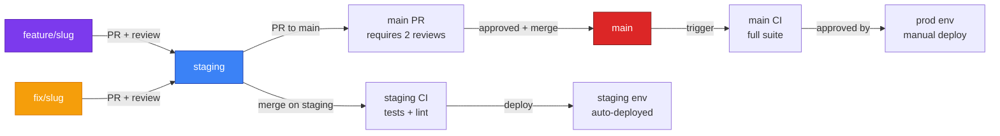
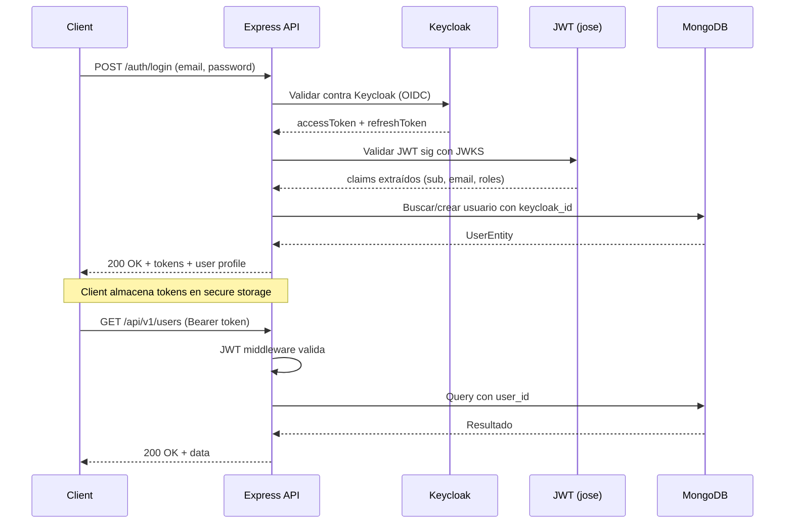
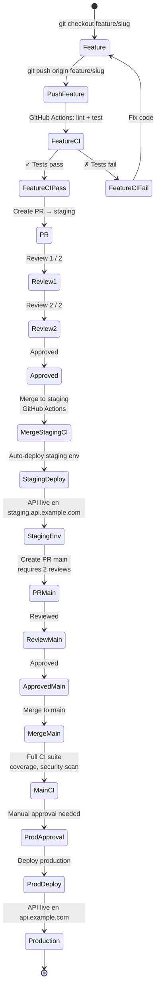

# Proyecto

## Qué

Esta carpeta documenta el ciclo de vida del desarrollo: ramas, convenciones de commits, code standards, estrategia de testing e integración continua desde commit hasta deployment.

## Por qué

Un equipo necesita reglas claras: cuándo crear rama, qué tipo de commit, quién revisa antes de merge, cómo se despliega. Sin esto, el código diverge y los PR se vuelven complicados de gestionar.

## Para qué

Acelerar onboarding de nuevos devs, reducir fricción en PR reviews, y automatizar deployments con confianza.

## En qué ayuda

- **Flujo claro**: feature → branch → test → PR → review → merge → deploy
- **Commits trazables**: Conventional Commits permiten auditoría y generación automática de changelogs
- **Standards unificados**: linting, formatting, JSDoc/TSDoc obligatorio
- **CI gates**: pre-commit hooks, pre-push tests, GitHub Actions checks
- **Deployment seguro**: manual approval en prod, rollback rápido si falla

## Qué hace

- Define estructura de branches (`main`, `staging`, `feature/*`, `fix/*`)
- Establece reglas de commit (Conventional Commits con scopes)
- Documenta proceso de PR (checklist, reviews requeridas)
- Especifica code standards (naming, errors, documentation)
- Detalla CI/CD pipeline (tests, linting, deployment gates)

## Estructura

| Archivo | Tema |
|---|---|
| [`README.md`](./README.md) | Este barrel (visión general) |
| [`workflow.md`](./workflow.md) | Git flow, branches, commits, PR checklist |
| [`testing/README.md`](./testing/README.md) | Estrategia testing, helpers, matriz cobertura |
| [`codebase.md`](./codebase.md) | Walkthrough técnico del codebase (arquitectura, patrones) |

## Stack visual

```
Node.js 22 LTS
    ↓
Express 5.2.1 (router, middleware)
    ↓
TypeScript 5.5.4 (compilation to ES2022)
    ↓
Zod 4.3.6 (schema validation + types)
    ↓
Mongoose 9.2 (MongoDB ODM, aggregations)
    ↓
Keycloak 26.6.1 + jose 6.1.3 (auth, JWT validation)
    ↓
Winston 3.19.0 + Loki 3.7.1 (logging)
    ↓
prom-client 15.1.3 (Prometheus metrics)
    ↓
AWS SDK v3 S3 (object storage)
```

## Decisiones arquitectónicas clave

| Decisión | Razón | Trade-off |
|---|---|---|
| **Hexagonal + DDD-lite** | Inversión de dependencias, testeable, agnóstico de frameworks | Más archivos, puede parecer excesivo para CRUD simple |
| **CQRS-lite repos** | Separación read/write, escalable | Extra abstracción comparado con Mongoose directo |
| **Facade per feature** | Single entry point, orquestación visible | Extra indirection |
| **Observer pattern (audit)** | Event-driven, non-blocking logging | Complejidad async |
| **Keycloak (no custom auth)** | Estándar OIDC, roles/perms centralizados | Infra para mantener (vs Firebase) |
| **Mongoose (no Prisma)** | Flexible aggregations, document-friendly | Menos type-safety que SQL ORMs |
| **Winston/Loki (no console.log)** | Structured logs, agregación, alertas | Extra dependency |

## Links relacionados

**Flat docs (legacy, pero autoridad):**
- [`docs/project/foundations.md`](./foundations.md) — stack, glosario, prerequisites
- [`docs/project/architecture.md`](./architecture.md) — Hexagonal deep-dive, patrones GoF
- [`docs/project/features.md`](./features.md) — auth, user, storage, audit features
- [`docs/api/reference.md`](../api/reference.md) — endpoints, schemas, error codes
- [`docs/project/adapters.md`](./adapters.md) — adapters (Mongo, Keycloak, S3, Winston)
- [`docs/project/testing/strategy.md`](./testing/strategy.md) — vitest setup, helpers, matriz de cobertura
- [`docs/project/contributing.md`](./contributing.md) — code standards, PR checklist

**New organized docs:**
- [`docs/docker/`](../docker/) — Docker Compose profiles (local, dev, prod)
- [`docs/api/`](../api/) — REST API reference + Swagger setup
- [`docs/gcp/`](../gcp/) — GCP services, pricing vs AWS
- [`docs/aws/`](../aws/) — AWS infrastructure (EC2, S3, RDS, etc.)

## Diagrama del workflow



## Inicio rápido

1. Lee [`workflow.md`](./workflow.md) para entender el flujo de branches y commits.
2. Copia la checklist de PR de ese mismo archivo antes de crear un PR.
3. Para code standards, consulta [`codebase.md`](./codebase.md) y las reglas en `.claude/rules/jsdoc-tsdoc.md`.
4. Testing: lee [`testing/README.md`](./testing/README.md) y ejecuta `npm run test:coverage` antes de push.

## Convenciones

- **Branches**: `main` (production) | `staging` (development) | `feature/<slug>` (new feature) | `fix/<slug>` (bug fix)
- **Commits**: Conventional Commits con scopes: `feat(auth):`, `fix(user):`, `docs(api):`, etc.
- **Code style**: ESLint + Prettier. Ejecuta `npm run lint:fix && npm run format` antes de commit.
- **Documentation**: JSDoc/TSDoc en funciones/clases públicas. Sin comentarios inline.
- **Tests**: Vitest. Mínimo 75% cobertura. Antes de push: `npm run test` debe pasar.

## Diagramas

### Flujo de autenticación E2E (OIDC)


### Pipeline CI/CD


## Links relacionados

- Flat docs: [`docs/project/foundations.md`](./foundations.md) (stack, glosario)
- Flat docs: [`docs/project/architecture.md`](./architecture.md) (hexagonal, patrones)
- Flat docs: [`docs/project/contributing.md`](./contributing.md) (code standards legacy)
- Research: Conventional Commits 1.0.0 (especificación CC 1.0.0)
