# Adapters de infraestructura

Capa `src/infrastructure/**`: cinco adapters que implementan los puertos
definidos en `src/domain/**`. Cero leaks de SDKs hacia dominio o
aplicación (verificado por grep). Aislamiento estricto Hexagonal.

---

## Indice

1. [Mapping puertos ↔ adapters](#mapping-puertos--adapters)
2. [Lifecycle por adapter](#lifecycle-por-adapter)
3. [MongoDB / Mongoose](#mongodb--mongoose)
4. [Keycloak + jose](#keycloak--jose)
5. [S3 + presigner](#s3--presigner)
6. [Winston + Loki](#winston--loki)
7. [EventBus in-memory](#eventbus-in-memory)
8. [Notas transversales](#notas-transversales)

---

## Mapping puertos ↔ adapters

Siete puertos del dominio, cada uno con un unico adapter en
`src/infrastructure/`. Inyectados por DI en composition root
(`src/main.ts`) o en cada feature router.

| Puerto (dominio) | Adapter (infraestructura) | Archivo |
|---|---|---|
| `IamPort` | `KeycloakAdapter` | `src/infrastructure/keycloak/keycloak.adapter.ts:44` |
| `LoggerPort` | `WinstonLoggerAdapter` (+ `RequestContextLoggerDecorator`) | `src/infrastructure/logger/winston.adapter.ts:25-69`, `src/infrastructure/logger/request-context.decorator.ts:22-51` |
| `StoragePort` | `S3StorageAdapter` | `src/infrastructure/services/s3/s3-storage.adapter.ts:44-67` |
| `EventBusPort` | `InMemoryEventBus` | `src/infrastructure/events/in-memory-event-bus.ts:30-44` |
| `UserCommandRepositoryPort` | `UserCommandRepository` | `src/infrastructure/mongodb/repositories/user.command.repository.ts:24-29,41-53` |
| `UserQueryRepositoryPort` | `UserQueryRepository` | `src/infrastructure/mongodb/repositories/user.query.repository.ts:41-63` |
| `LoginAuditLogRepositoryPort` | `LoginAuditLogRepository` | `src/infrastructure/mongodb/repositories/login-audit-log.repository.ts:8-19` |

### Diagrama: wiring puertos → adapters

```mermaid
classDiagram
    class IamPort {
        <<interface>>
        +login(email, password) Tokens
        +refresh(token) Tokens
        +verifyToken(token) AuthenticatedUser
        +decodeToken(token) AuthenticatedUser
        +registerUser(input) string
        +assignRoles(userId, roles) void
    }
    class LoggerPort {
        <<interface>>
        +info(msg, meta) void
        +warn(msg, meta) void
        +error(msg, meta) void
        +debug(msg, meta) void
        +child(bindings) LoggerPort
    }
    class StoragePort {
        <<interface>>
        +listObjects(opts) StorageObject[]
        +getSignedDownloadUrl(key, ttl) string
        +putObject(key, body, type) void
        +deleteObject(key) void
    }
    class EventBusPort {
        <<interface>>
        +publish(event) void
        +subscribe(type, handler) void
    }
    class UserQueryRepositoryPort {
        <<interface>>
        +findById(id) User
        +findByEmail(email) User
        +findPaginated(query, filter) PaginatedResult
    }
    class UserCommandRepositoryPort {
        <<interface>>
        +create(data) User
        +update(id, data) User
        +softDelete(id) void
        +recordLoginSuccess(kcId) void
    }
    class LoginAuditLogRepositoryPort {
        <<interface>>
        +create(entry) void
        +findRecentByEmail(email, limit) entry[]
    }

    class KeycloakAdapter
    class WinstonLoggerAdapter
    class RequestContextLoggerDecorator
    class S3StorageAdapter
    class InMemoryEventBus
    class UserQueryRepository
    class UserCommandRepository
    class LoginAuditLogRepository

    IamPort <|.. KeycloakAdapter
    LoggerPort <|.. WinstonLoggerAdapter
    LoggerPort <|.. RequestContextLoggerDecorator
    RequestContextLoggerDecorator --> WinstonLoggerAdapter : delega
    StoragePort <|.. S3StorageAdapter
    EventBusPort <|.. InMemoryEventBus
    UserQueryRepositoryPort <|.. UserQueryRepository
    UserCommandRepositoryPort <|.. UserCommandRepository
    LoginAuditLogRepositoryPort <|.. LoginAuditLogRepository
```



---

## Lifecycle por adapter

| Adapter | Lifecycle | Quien lo construye | Notas |
|---|---|---|---|
| `MongoDatabase` | Singleton estatico | `src/main.ts` (`MongoDatabase.connect`) | Flag `connected` evita doble `mongoose.connect` (`src/config/database.ts:11-31`). |
| `KeycloakAdapter` | Singleton | `src/main.ts` | Cachea JWKS y service-account token. |
| `WinstonLoggerAdapter` | Singleton | `src/main.ts` (`WinstonLoggerAdapter.create`) | Factory async (lazy import de `winston-loki`). |
| `RequestContextLoggerDecorator` | Per-request | `RequestContextMiddleware` | Una instancia por request (`src/presentation/bootstrap/middlewares/request-context.middleware.ts:28-40`). |
| `S3StorageAdapter` | Singleton (opcional) | `src/main.ts` solo si `env.s3.isConfigured` | Si falta config, `StorageRouter` no se monta. |
| `InMemoryEventBus` | Singleton | `src/main.ts` | Mapa `eventType → handlers[]`. |
| Repos Mongo | Per-feature-router | Cada router en su constructor | Stateless; barato instanciar. |

---

## MongoDB / Mongoose

### Conexion

`MongoDatabase` (`src/config/database.ts:11-31`) — wrapper estatico con
metodos `connect`, `disconnect`, `isHealthy`. Idempotente (flag
`connected` en linea 12 evita doble `mongoose.connect`).

```ts
// src/config/database.ts:14-19
public static async connect(logger: LoggerPort): Promise<void> {
  if (MongoDatabase.connected) return;
  await mongoose.connect(env.mongo.uri, { serverSelectionTimeoutMS: 5000 });
  MongoDatabase.connected = true;
  logger.info('MongoDB connected', { uri: env.mongo.uri });
}
```

- `serverSelectionTimeoutMS: 5000` (5s) — falla rapido si Mongo no responde.
- Sin opciones de pool explicitas → Mongoose usa defaults
  (`maxPoolSize=100`).
- `isHealthy()` chequea `mongoose.connection.readyState === 1` —
  consumido por `/health/ready` (`src/presentation/bootstrap/app.ts:63-70`).

### Schemas

#### `UserSchema` (`src/infrastructure/mongodb/schemas/user.schema.ts:44-99`)

- `keycloak_id`: unique + index — fuente de identidad de la app.
- `email`: unique, lowercase, trim.
- `slug`: unique + index (lowercase). Generado con
  `Slugger.withRandomSuffix` (anti race-condition).
- `picture`: URL externa (provider OAuth).
- `avatar_url`: clave S3 — la API responde con URL firmada al servir.
- Enums controlados desde dominio: `USER_ROLES`, `USER_PROVIDERS`.
- `timestamps: true`, `versionKey: false`.
- `toJSON.transform`: mapea `_id → id`, elimina `_id` y `__v`. **Cero
  leakage de Mongo en respuestas API**.
- Statics: `findByKeycloakId`, `findByEmail`, `findBySlug`.

**Indices compuestos** (`user.schema.ts:84-85`):

| Indice | Uso |
|---|---|
| `{is_active:1, roles:1}` | Listado admin filtrado por estado + rol. |
| `{roles:1, createdAt:-1}` | Listado admin ordenado por antiguedad por rol. |

#### `LoginAuditLogSchema` (`src/infrastructure/mongodb/schemas/login-audit-log.schema.ts:42-43`)

- Logs inmutables: `timestamps: { createdAt: true, updatedAt: false }`.
- Ref opcional a `User._id` por `user_id` (puede ser anonimo si email
  no existia).

**TTL 90 dias** (`login-audit-log.schema.ts:42`):

```ts
loginAuditLogSchema.index({ occurred_at: 1 }, { expireAfterSeconds: 60 * 60 * 24 * 90 });
```

Mongo elimina docs cuyo `occurred_at` sea > 90 dias atras. Politica
hardcoded — para cambiarla hay que editar schema y redesplegar (ver
pregunta abierta en cap 09 sobre exponer `AUDIT_TTL_DAYS`).

**Indice compuesto** (`login-audit-log.schema.ts:43`):
`{email:1, success:1, occurred_at:-1}` — query "ultimos N intentos por
email".

### Repositorios (CQRS-lite)

Split a nivel de **interfaz**, no de almacenamiento. Ambos repos pegan a
la misma collection `users`. Beneficio: ISP + futura decoracion con
cache sin tocar el lado escritura.

#### `UserCommandRepository` (`src/infrastructure/mongodb/repositories/user.command.repository.ts`)

| Metodo | SDK call | Notas |
|---|---|---|
| `create(data)` | `UserModel.create` | — |
| `update(id, data)` | `findByIdAndUpdate(..., {runValidators:true})` | Enums se aplican igual que en creates (line 24-29). |
| `softDelete(id)` | set `is_active=false` | No borra; preserva foreign refs. |
| `recordLoginSuccess(keycloakId)` | `$set last_login_at + reset failed_login_attempts` | Invocado por `AuditLoginObserver`. |
| `recordLoginFailure(keycloakId)` | `$inc failed_login_attempts` | Incrementa contador `failed_login_attempts`. |

#### `UserQueryRepository` (`src/infrastructure/mongodb/repositories/user.query.repository.ts:41-63`)

- `findById/findByEmail/findByKeycloakId/findBySlug` — single-doc lookups.
- `findPaginated(query, filter)`:
  - Filtros `email` y `name` con `$regex` case-insensitive
    (`user.query.repository.ts:46-47`). **Sin escapar input** —
    vulnerabilidad ReDoS / regex injection.
  - Paginacion: `Promise.all([find().skip().limit(), countDocuments()])`
    (count clasico paralelo, decision documentada in-line).

#### `LoginAuditLogRepository` (`src/infrastructure/mongodb/repositories/login-audit-log.repository.ts:8-19`)

- `create(entry)`: insert.
- `findRecentByEmail(email, limit=20)`: lowercase forzado, sort
  descendente por `occurred_at`.

### Mapping documento → entidad

Estrategia uniforme — el `toJSON.transform` del schema hace el 90% del
trabajo (rename `_id → id`, drop `__v`/`_id`). Los repos solo castean:

```ts
private static toEntity(doc: UserDocument): UserEntity {
  const json = doc.toJSON() as unknown as UserEntity;
  return json;
}
```

> [!NOTE] Cast doble seguro
> El cast doble `as unknown as XEntity` **bypassea TypeScript**. Si el
> schema diverge de la entity, el compilador no lo detecta. Mitigacion:
> tests de integracion + disciplina al añadir campos.

### Decisiones explicitas

- **Sin transactions** (`mongoose.startSession` no usado en ningun
  repo). El `AuditLoginObserver` ejecuta dos escrituras en paralelo
  (`Promise.all`) sin atomicidad — aceptable porque el audit log es
  independiente del update de `User.last_login_at`.
- **Cero hooks Mongoose** (`pre`/`post`). Invariantes (lowercase, trim)
  son del schema. YAGNI.

---

## Keycloak + jose

`KeycloakAdapter` (`src/infrastructure/keycloak/keycloak.adapter.ts`,
~277 LOC) implementa `IamPort`. Tres bloques.

### 1. Tokens (user-flow)

| Metodo | Endpoint Keycloak | Grant |
|---|---|---|
| `login(email, password)` | `/protocol/openid-connect/token` | `password` |
| `refresh(refreshToken)` | `/protocol/openid-connect/token` | `refresh_token` |

Ambos devuelven `{access_token, refresh_token, expires_in}`.

### 2. Verify / Decode (jose 6.1.3)

JWKS cacheado en constructor:

```ts
// src/infrastructure/keycloak/keycloak.adapter.ts:54-62
this.jwks = createRemoteJWKSet(new URL(jwksUrl));
this.issuer = `${env.keycloak.url}/realms/${env.keycloak.realm}`;
```

`createRemoteJWKSet` gestiona cache, rotacion automatica, y refetch al
ver un `kid` desconocido. **Sin codigo de cache propio**.

#### `verifyToken(token)` (`keycloak.adapter.ts:124-142`)

1. Path principal: `jwtVerify(token, this.jwks, { issuer })` — RS256
   firmado por Keycloak.
2. Fallback HS256: solo si `env.jwt.secret` esta seteado. Pensado para
   tests donde Keycloak no corre.
3. Cualquier otro fallo → `CustomError.unauthorized('Invalid or expired token')`.

#### `decodeToken(token)` (`keycloak.adapter.ts:144-151`)

```ts
public decodeToken(token: string): AuthenticatedUser {
  const payload = decodeJwt(token); // SIN verificar firma
  return KeycloakAdapter.extractClaims(payload);
}
```

### 3. Admin REST API

Service-account token cacheado:

```ts
// src/infrastructure/keycloak/keycloak.adapter.ts:255-259
this.adminTokenCache = {
  token: data.access_token,
  expiresAt: now + (data.expires_in - 30) * 1000, // margen anti-carrera
};
```

| Metodo | Endpoint admin | Notas |
|---|---|---|
| `registerUser(input)` | `POST /admin/realms/{realm}/users` | 409 → `CustomError.conflict`. Parsea `Location` header para extraer ID. |
| `assignRoles(userId, roleNames)` | `GET roles/{name}` + `POST role-mappings/realm` | Roles inexistentes: warn + skip. |
| `getAdminToken()` | `client_credentials` | Cache TTL = `expires_in - 30s`. |

### Limites declarados

- **Sin revocation check**: tokens validos hasta `exp`. Trade-off OK
  con `accessTokenLifespan: 900s` (15 min).
- **Sin introspection endpoint**: confiamos en JWKS. Cero round-trips
  por request.
- **Sin retry** en fetch admin: timeout puntual → 502 al caller.
- **`name`-split heuristica** (`keycloak.adapter.ts:160-161`):
  `[firstName, ...rest] = input.name.split(' ')`. Buggy para "Cher"
  (firstName=lastName) o "Mary Jane Smith" (lastName="Jane Smith").

---

## S3 + presigner

`S3StorageAdapter` (`src/infrastructure/services/s3/s3-storage.adapter.ts:44-67`)
implementa `StoragePort`.

### Factory defensiva

```ts
public static create(logger: LoggerPort): S3StorageAdapter {
  if (!env.s3.isConfigured || !env.s3.bucket) {
    throw CustomError.internal('S3 not configured');
  }
  // ... construye client
}
```

`src/main.ts:60` envuelve la creacion en `if (env.s3.isConfigured)` para
evitar matar el bootstrap; en su defecto desactiva el `StorageRouter`.

### Configuracion S3 client

| Opcion | Valor | Origen |
|---|---|---|
| `region` | `env.s3.region` | `AWS_REGION` |
| `endpoint` | `env.s3.endpoint` (solo si seteado) | `AWS_S3_ENDPOINT` (LocalStack/MinIO) |
| `forcePathStyle` | `env.s3.forcePathStyle` | `AWS_S3_FORCE_PATH_STYLE` (true para LocalStack) |
| `credentials` | `{accessKeyId, secretAccessKey}` | env vars |

### Operaciones

| Metodo | SDK call | Notas |
|---|---|---|
| `listObjects({prefix, maxKeys=100, continuationToken})` | `ListObjectsV2Command` | Mapea `Contents[]` a `StorageObject[]`, normaliza ETag (quita `"`). |
| `getSignedDownloadUrl(key, expiresInSeconds=900)` | `GetObjectCommand` + `getSignedUrl` (`s3-storage.adapter.ts:100-108`) | Default 15 min. |
| `putObject(key, body, contentType?)` | `PutObjectCommand` | Sin multipart — body completo en memoria. |
| `deleteObject(key)` | `DeleteObjectCommand` | Single object. |

Errores: cualquier fallo del SDK → log + `CustomError.badGateway(...)`.

### Lo que NO esta

- **Multipart upload** (presigned multipart URLs). Para `>5 MB`
  habria que añadir `CreateMultipartUploadCommand` +
  `UploadPartCommand` + `CompleteMultipartUploadCommand`. YAGNI.
- **Presigned PUT** (upload directo desde frontend). Solo hay GET.
- **Server-side encryption** (SSE-S3/SSE-KMS). En LocalStack es no-op;
  en AWS real conviene activar.

### LocalStack

`docker-compose.yml` profile `dev`. Bucket auto-creado por
`scripts/localstack-init.sh:6-15` mediante `awslocal s3api create-bucket`
con `LocationConstraint=eu-west-1`. Idempotente (ignora "already exists").

---

## Winston + Loki

`WinstonLoggerAdapter` (`src/infrastructure/logger/winston.adapter.ts:25-69`).

### Factory async

```ts
public static async create(): Promise<WinstonLoggerAdapter>
```

Async porque `winston-loki` se importa **dinamicamente** solo si hace
falta (evita penalizar startup en dev/test).

### Strategy de formato

| Entorno | Formato |
|---|---|
| `local` / `development` / `test` | `combine(colorize, timestamp HH:mm:ss, errors{stack:true}, printf custom)` — legible en consola. |
| `staging` / `production` | `combine(timestamp ISO, errors{stack:true}, json())` — estructurado para shipping. |

### Strategy de transports

```ts
// src/infrastructure/logger/winston.adapter.ts:43-58
const transports: Transport[] = [new winston.transports.Console({...})];
if ((env.server.isProduction || env.server.isStaging) && env.loki.host) {
  transports.push(new LokiTransport({
    host: env.loki.host,
    labels: { app: 'express-clean-backend', env: nodeEnv },
    json: true,
    batching: true,
    interval: 5,
  }));
}
```

**Reglas Loki low-cardinality**: labels estaticos (`app`, `env`)
SOLAMENTE. NO meter `requestId`/`userId` como labels — esos van en el
body JSON (Loki los indexa via `| json` en LogQL). Ver cap 09.

### Otros

- `level`: `debug` en development, `info` en el resto.
- `exitOnError: false` — un fallo de transport no mata el proceso.
- `child(bindings)` aprovecha `winston.child` nativo.

### Decorator request-scoped

`RequestContextLoggerDecorator`
(`src/infrastructure/logger/request-context.decorator.ts:22-51`)
implementa `LoggerPort` y delega a un `inner: LoggerPort`, mergeando
`bindings` (e.g. `requestId`, `userId`) en cada llamada.

```ts
public info(message: string, meta?: Record<string, unknown>): void {
  this.inner.info(message, { ...this.bindings, ...meta });
}
```

`child` crea otro decorator con bindings acumulados — permite stacking
(decorator sobre decorator sobre adapter base).

Quien lo instancia: `RequestContextMiddleware`
(`src/presentation/bootstrap/middlewares/request-context.middleware.ts:28-40`)
— middleware Express que cuelga `req.logger` con `requestId` UUID v4.

---

## EventBus in-memory

`InMemoryEventBus`
(`src/infrastructure/events/in-memory-event-bus.ts:30-44`) implementa
`EventBusPort`. Estructura interna: `Map<eventType, EventHandler[]>`.

### `publish<T>(event)`

```ts
const handlers = this.subscribers.get(event.type) ?? [];
const results = await Promise.allSettled(handlers.map(h => h(event)));
results.forEach((r, i) => {
  if (r.status === 'rejected') {
    this.logger.error(`Handler failed for ${event.type}`, {
      error: r.reason instanceof Error ? r.reason.message : String(r.reason),
    });
  }
});
```

- `Promise.allSettled` paraleliza, captura fallos individualmente.
- Cada `rejected` → `logger.error`. **No re-lanza**: el publisher
  (e.g. `LoginUseCase`) no se entera de fallos en handlers downstream.

### Trade-off declarado

El login NO debe fallar porque la audit log no escribio. Es lo correcto
en este contexto. Implicacion: **fallos silenciosos de auditoria solo
se ven en logs** — convendria una metric counter
(`audit_failures_total`) emitidos a `/metrics`.

### Subscribers actuales

Unico observer registrado (`src/main.ts`):
`AuditLoginObserver` (`src/application/audit/use-cases/audit-login.observer.ts:32-37,40-66`).

Suscribe a `'user.logged_in'` y `'user.login_failed'`.

### Limites in-memory

- **Si el proceso muere antes de procesar, los eventos se pierden**.
  Para garantia at-least-once: Outbox pattern (Mongo collection
  `outbox` + worker) o cola externa (Redis Streams, RabbitMQ). YAGNI
  mientras solo audit log. Trigger para migrar: cuando se añadan
  handlers no idempotentes (emails, webhooks).
- **Sin replay** ni deduplicacion. Aceptable para Observer interno.

---

## Notas transversales

### Cast doble en repos Mongo

`doc.toJSON() as unknown as XEntity` bypassea TypeScript. Documentado
en cada repo. Riesgo bajo: tests integration cubren divergencia
schema↔entity.

### `mongoose 9.2.0` declarado en `package.json`

Validado por team-lead: `pnpm-lock.yaml` resuelve a **mongoose 9.2.0
real** (publicada en serie 9.x). El flag del reviewer-01 era falso
positivo. Se documenta como version actual.

### Sin SSE en S3

LocalStack ignora SSE. En AWS real, activar SSE-S3 (default) o SSE-KMS
para datos sensibles. Detalle en cap 07 (Seguridad).

### No introspection ni revocation Keycloak

Confiamos en `exp` del JWT + `accessTokenLifespan: 900s`. Si se
requiere logout invalidacion inmediata, hay que añadir blacklist
distribuida (Redis) o introspection endpoint (round-trip extra por
request).

---

## Referencias cruzadas

- Cap 02 (Arquitectura): direccion de dependencias, hexagonal estricta.
- Cap 06 (Plataforma + Deploy): docker-compose, Traefik, Keycloak realm.
- Cap 07 (Seguridad): cadena auth E2E, hardening regex y secrets.
- Cap 08 (Configuracion): tabla `.env reference` por subsistema.
- Cap 09 (Observabilidad): pipeline Winston→Loki, `/metrics`, dashboards, audit TTL.
