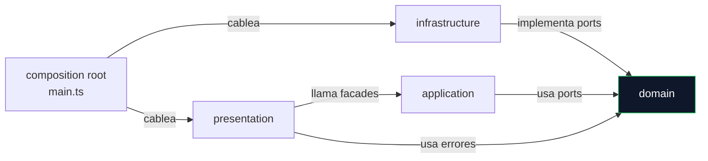
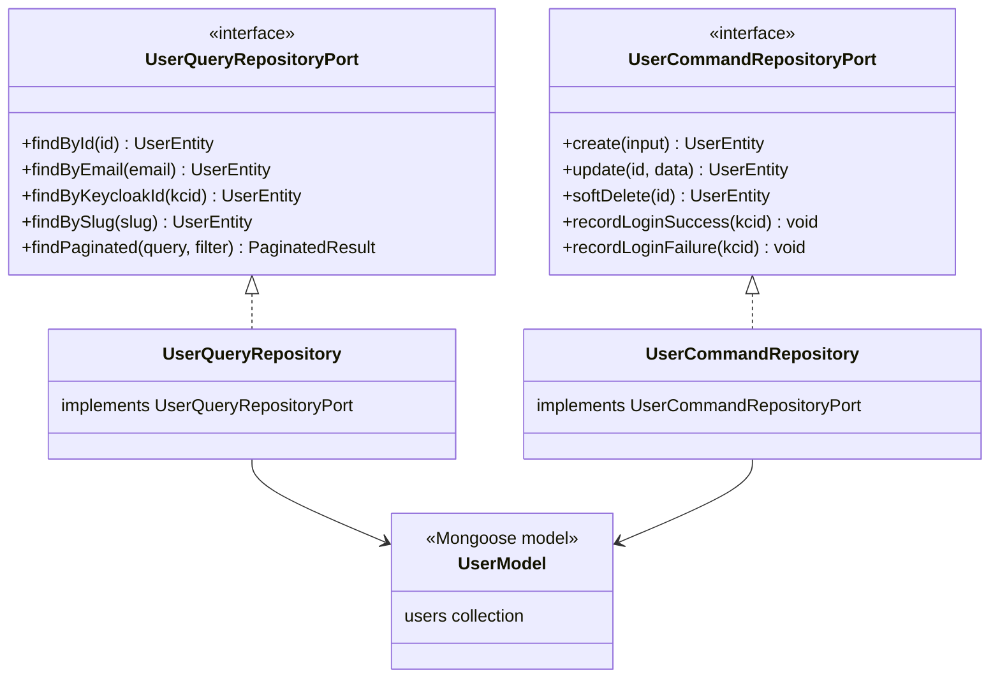
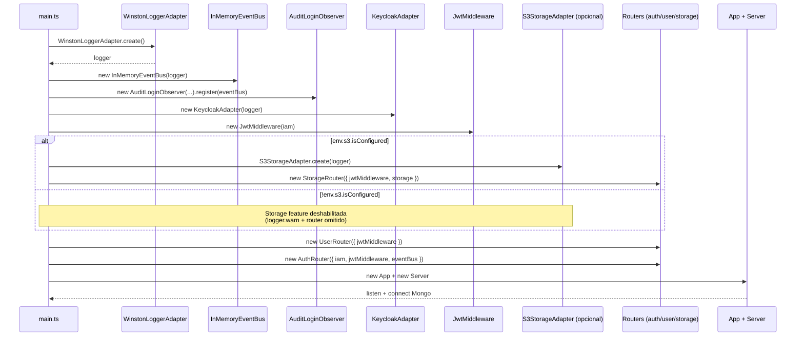
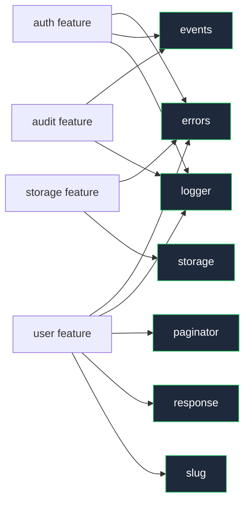

# Arquitectura

> Hexagonal estricta, CQRS-lite, ports↔adapters, patrones GoF aplicados,
> composition root y DI por feature router.

---

## Capas (hexagonal estricta)

| Capa | Path | Responsabilidad | Sabe de |
|---|---|---|---|
| Domain | `src/domain/**` | Entidades planas, ports, DTOs Zod, errores base, eventos | Solo TypeScript + Zod |
| Application | `src/application/**` | Use-cases unitarios, Facades por feature, Observer | Domain |
| Infrastructure | `src/infrastructure/**` | Adapters: Mongo, Keycloak, S3, Winston, EventBus | Domain (implementa ports) + librerías externas |
| Presentation | `src/presentation/**` | Routers Express, controllers, middlewares, error chain | Domain + Application + Express |
| Config | `src/config/**` | Env Zod fail-fast, Swagger jsdoc, Mongo singleton | Domain (Zod) |
| Composition | `src/main.ts` | Cablea transversales; los routers se autocablean | Todas |

### Dirección de dependencias



Regla: el dominio no importa nada de infraestructura ni presentación.

### Verificación por grep (cero leaks)

Contra el codebase actual:

```bash
grep -rE "(mongoose|express|aws|keycloak|jose|@aws|winston)" \
  src/domain src/application
```

La única coincidencia es la palabra `keycloak` como parte de `keycloak_id`
(claim `sub`), nunca como import de la librería. Cero acoplamiento a
adapters concretos.

---

## CQRS-lite (split de interfaz, no event sourcing)

### Lo que es

Separación del puerto del repositorio en dos interfaces:

- `UserQueryRepositoryPort` — solo lectura (`findById`, `findByEmail`,
  `findByKeycloakId`, `findBySlug`, `findPaginated`).
  - `src/domain/user/user.repository.port.ts:51`.
- `UserCommandRepositoryPort` — solo escritura (`create`, `update`,
  `softDelete`, `recordLoginSuccess`, `recordLoginFailure`).
  - `src/domain/user/user.repository.port.ts:63`.

### Lo que no es

No es CQRS canónico. No hay event sourcing, no hay collections separadas
y no hay sincronización eventualmente consistente. Las dos implementaciones
(`UserQueryRepository`, `UserCommandRepository`) tocan la misma collection
`users`.

### Por qué se hace

Por Interface Segregation Principle: un consumidor que solo lee no recibe
métodos de escritura que no usa, lo que da más claridad y simplifica los
tests. El split también habilita meter un decorator de cache (Redis) sobre
la rama Query sin tocar Command, está en el roadmap pero no implementado.
Y como efecto lateral, distinguir un UC "de consulta" de uno "de mutación"
se vuelve trivial al leer el código.



---

## Tabla ports ↔ adapters

| Port (domain) | Adapter (infrastructure) | Tecnología |
|---|---|---|
| `IamPort` (`src/domain/auth/iam.port.ts:21`) | `KeycloakAdapter` | Keycloak 26.6.1 + jose 6.1.3 |
| `UserQueryRepositoryPort` (`src/domain/user/user.repository.port.ts:51`) | `UserQueryRepository` | Mongoose 9.x |
| `UserCommandRepositoryPort` (`src/domain/user/user.repository.port.ts:63`) | `UserCommandRepository` | Mongoose 9.x |
| `LoginAuditLogRepositoryPort` (`src/domain/audit/login-audit.entity.ts`) | `LoginAuditLogRepository` | Mongoose 9.x (TTL 90d) |
| `StoragePort` (`src/domain/shared/storage/storage.port.ts:35`) | `S3StorageAdapter` | `@aws-sdk/client-s3` 3.654.0 |
| `LoggerPort` (`src/domain/shared/logger/logger.port.ts:15`) | `WinstonLoggerAdapter` | Winston 3.19 + winston-loki 6.1.3 |
| `EventBusPort` (`src/domain/shared/events/event-bus.port.ts:22`) | `InMemoryEventBus` | Promesas + `Promise.allSettled` |

Detalle de cada adapter (config, errores, edge cases) en
[`adapters.md`](adapters.md).

---

## Patrones aplicados (GoF + organizacionales)

| # | Patrón | Ubicación | Por qué |
|---|---|---|---|
| 1 | Adapter | `infrastructure/keycloak/keycloak.adapter.ts`, `infrastructure/services/s3/s3-storage.adapter.ts`, `infrastructure/logger/winston.adapter.ts`, `infrastructure/mongodb/repositories/*.ts` | Encajar librerías externas en ports del dominio |
| 2 | Facade | `application/auth/auth.facade.ts:22`, `application/user/user.facade.ts:35`, `application/storage/storage.facade.ts:11` | Una API estable por feature; el controller no inyecta N use-cases |
| 3 | Decorator | `infrastructure/logger/request-context-logger.decorator.ts` (request-scoped) | Añadir `request_id` por request sobre el logger global |
| 4 | Chain of Responsibility | `presentation/bootstrap/error-handler/error-handler.middleware.ts` (5 eslabones) | Cada handler decide si responde o delega; orden controlado |
| 5 | Observer | `domain/shared/events/event-bus.port.ts:22` + `application/audit/use-cases/audit-login.observer.ts:25` | El publisher (`LoginUseCase`) no conoce a los subscribers |
| 6 | Strategy | `infrastructure/logger/winston.adapter.ts` (formato dev/staging/production + transport Loki on/off) | Comportamiento intercambiable por entorno |
| 7 | Template Method | `presentation/bootstrap/error-handler/error-handler.base.ts` (`handle/delegate`) | Las subclases solo implementan `handle`; el flujo de delegación es fijo |
| 8 | Factory Method | `CustomError.badRequest/unauthorized/...` (`domain/shared/errors/custom.error.ts`), `WinstonLoggerAdapter.create` | Constructores parametrizados sin exponer detalles internos |
| 9 | Singleton | `MongoDatabase` (`config/database.ts`), cliente S3 interno al adapter | Recursos compartidos con coste de creación |
| 10 | Repository CQRS-lite | `UserQueryRepositoryPort` + `UserCommandRepositoryPort` | ISP + cache decorator a futuro |
| 11 | Use-case por archivo | `application/<feature>/use-cases/*.ts` | Un archivo, una operación de negocio; <100 LOC |

---

## Composition root (`src/main.ts`)

`main.ts` es el único punto donde se cablean dependencias transversales.
Cada feature router se autocablea internamente con sus repos.

### Secuencia de bootstrap



Código: `src/main.ts:34-77`.

### Qué conoce `main.ts`

`main.ts` conoce: Logger, EventBus, AuditObserver, IAM, JwtMiddleware, S3
(opcional), AppRouter, App y Server.

No conoce: `UserQueryRepository`, `UserCommandRepository`, `AuthFacade`,
`UserFacade`, `StorageFacade` ni los controllers. Cada router los instancia
en su propio constructor.

---

## DI por feature router

Cada router instancia sus repos y su facade en su constructor. Recibe solo
lo transversal: `jwtMiddleware`, `eventBus`, `iam`, `storage` cuando aplica.

### Ejemplo: `AuthRouter` (`src/presentation/auth/auth.router.ts:36`)

```ts
public constructor(options: AuthRouterOptions) {
  this.router = Router();
  this.jwtMiddleware = options.jwtMiddleware;

  const userQuery = new UserQueryRepository();
  const userCommand = new UserCommandRepository();
  const facade = new AuthFacade(
    options.iam, userQuery, userCommand, options.eventBus,
  );
  this.controller = new AuthController(facade);
  this.register();
}
```

### Ventajas

| Ventaja | Explicación |
|---|---|
| `main.ts` mínimo | Solo cablea cosas que comparten varias features |
| Feature autónoma | Copiar `presentation/<feature>/` arrastra todo lo necesario |
| Tests por router | El constructor acepta mocks; no hace falta tocar el composition root |
| Aislamiento de cambios | Añadir un repo nuevo dentro de una feature no impacta a `main.ts` ni a otras features |

### Trade-offs

No hay un container DI tipo InversifyJS: la composición es manual y
explícita. Los repos transversales (los repos de User, usados también por
Auth) se instancian dos veces (una en `UserRouter`, otra en `AuthRouter`).
Los modelos de Mongoose son singletons internamente, así que el coste real
es cero, solo se duplican objetos repo livianos.

---

## Shared kernel (`src/domain/shared/`)

Primitivas reutilizables sin dependencias de feature concreta.

| Módulo | Path | Qué aporta |
|---|---|---|
| `errors` | `domain/shared/errors/{base,custom}.error.ts` | `BaseError` (abstract), `ClientError` (4xx), `ServerError` (5xx), factory `CustomError.badRequest/notFound/...` |
| `events` | `domain/shared/events/event-bus.port.ts:22` | `EventBusPort`, `DomainEvent`, `EventHandler<T>`. Eventos concretos en `user.events.ts` |
| `logger` | `domain/shared/logger/logger.port.ts:15` | `LoggerPort` (info, warn, error, debug + child) |
| `paginator` | `domain/shared/paginator/paginator.ts:3`, `pagination.dto.ts` | `Paginator` helper, `PaginationQuery`, `PaginationMeta`, `PaginatedResult<T>` |
| `response` | `domain/shared/response/response.formatter.ts:22` | `ResponseFormatter.success<T>`, `ResponseFormatter.error` |
| `slug` | `domain/shared/slug/slugger.ts:25,38` | `Slugger.base`, `Slugger.withRandomSuffix` (evita la race condition de pre-check + retry) |
| `storage` | `domain/shared/storage/storage.port.ts:35`, `storage.dto.ts` | `StoragePort`, `StorageObject`, `ListObjectsResult`, DTOs Zod |



### `Slugger.withRandomSuffix`

`Slugger.withRandomSuffix(name)` añade un sufijo aleatorio determinista al
slug derivado de `name`. Así no hace falta el flujo `findBySlug → if exists,
retry`, que sufre race conditions cuando dos `register` llegan a la vez con
el mismo nombre. El slug deja de ser puramente legible, pero la unicidad
queda garantizada en un solo round-trip a Mongo.

---

## Identidad: `keycloak_id` (no `_id`)

| Aspecto | Detalle |
|---|---|
| Definición | claim `sub` del JWT: opaco, estable, generado por Keycloak |
| Uso en código | Todos los lookups (`findByKeycloakId`), todos los eventos (`UserLoggedInEvent.keycloakId`), todas las publicaciones de auditoría |
| Por qué no `_id` Mongo | Anti-IDOR: aunque un cliente conozca el `_id`, no le sirve para impersonar. Y permite migrar de BBDD sin perder usuarios |
| Excepción | `User.id` (= `_id` Mongo transformado a string) se usa en endpoints admin `/users/:id` (path param). Patrón admin-only protegido por `checkRole('admin')` |

Detalle del flujo de identidad en login: [`features.md`](features.md).

---

## Cómo se añade un feature nuevo

Receta corta:

1. Domain: definir `entity.ts` (interfaces planas), `dto.ts` (Zod schemas),
   `*.port.ts` (interfaces de repos / servicios externos), eventos en
   `domain/shared/events/` si publica.
2. Application: crear `application/<feature>/use-cases/*.ts` (uno por
   operación) y `<feature>.facade.ts` que los compone.
3. Infrastructure: implementar adapters de los ports.
4. Presentation: crear `presentation/<feature>/<feature>.router.ts`
   (autocablea repos + facade), `<feature>.controller.ts` (handler Express),
   montar en `presentation/bootstrap/app-router.ts`.
5. Composition root: solo si introduce dependencias transversales nuevas,
   tocar `main.ts`. Si no, queda intacto.
6. Tests: unit por use-case, integration por router (ver
   [`testing/strategy.md`](testing/strategy.md)).

---

## Siguiente capítulo

- [`features.md`](features.md): mapa de las cuatro features actuales
  (auth, user, storage, audit).
- [`adapters.md`](adapters.md): detalle adapter por adapter.
