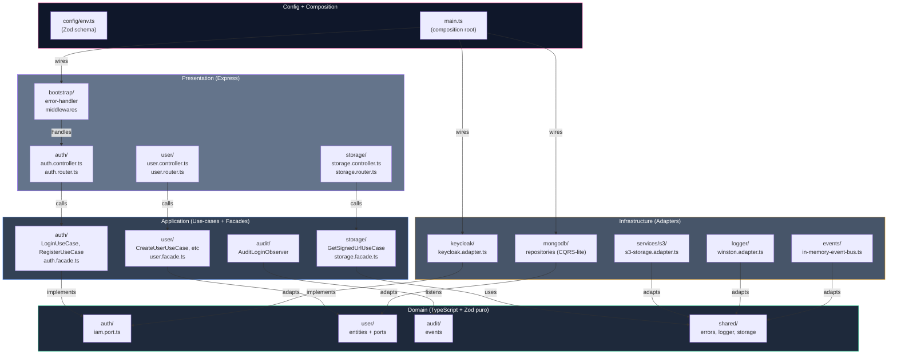
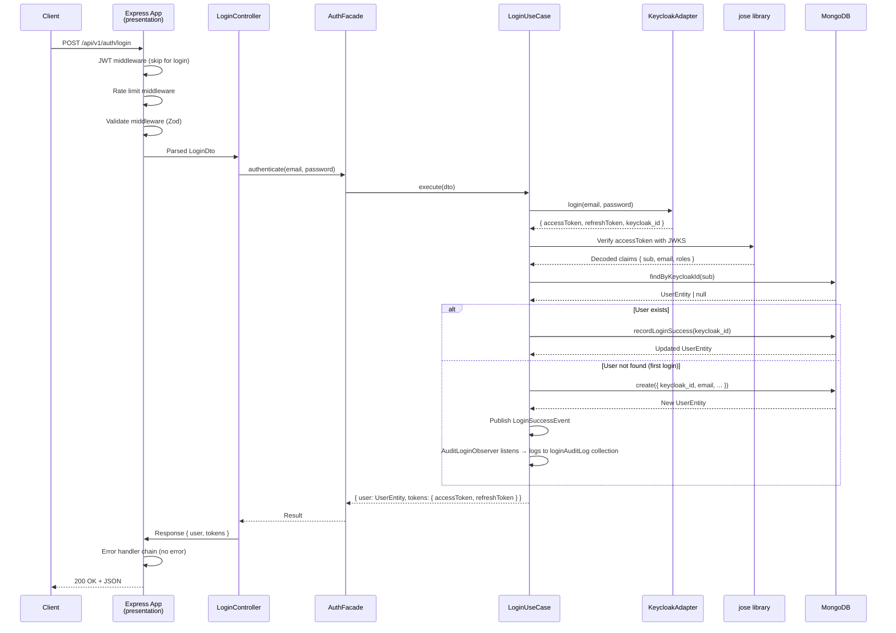

# Walkthrough del Codebase

Navegación técnica por `src/` con referencias a conceptos de arquitectura, patrones y decisiones de diseño.

## Mapa visual de capas



## Estructura de directorios

```
src/
├── domain/                          # Lógica pura, agnóstica de frameworks
│   ├── auth/
│   │   ├── auth.dto.ts             # Schemas Zod para login/register
│   │   ├── auth.entity.ts          # Token, claims, user session
│   │   ├── iam.port.ts             # IamPort interface (abstract)
│   │   └── README.md               # Documentación de auth domain
│   ├── user/
│   │   ├── user.dto.ts             # CreateUserDto, UpdateUserDto, etc
│   │   ├── user.entity.ts          # UserEntity fields + validation
│   │   ├── user.repository.port.ts # IUserQueryRepository + IUserCommandRepository (CQRS-lite)
│   │   └── README.md
│   ├── audit/
│   │   ├── login-audit.entity.ts   # LoginAuditEntity (event sink)
│   │   └── README.md
│   └── shared/
│       ├── errors/                 # Custom error classes
│       │   ├── base.error.ts       # BaseError (abstract)
│       │   ├── custom.error.ts     # DomainError, ValidationError, etc
│       │   └── index.ts            # Barrel export
│       ├── events/                 # Event system
│       │   ├── event-bus.port.ts   # IEventBus (pub/sub)
│       │   └── user.events.ts      # UserCreatedEvent, LoginSuccessEvent, etc
│       ├── logger/
│       │   └── logger.port.ts      # ILoggerPort (abstract)
│       ├── paginator/
│       │   ├── pagination.dto.ts   # PaginatedDto<T>
│       │   └── paginator.ts        # Paginator class (offset/limit logic)
│       ├── response/
│       │   └── response.formatter.ts # ApiResponse<T> standardized
│       ├── storage/
│       │   ├── storage.dto.ts      # SignedUrlRequest, etc
│       │   └── storage.port.ts     # IStoragePort (abstract)
│       └── slug/
│           └── slugger.ts          # URL-safe slug generation
├── application/                     # Use-cases + Facades
│   ├── auth/
│   │   ├── use-cases/
│   │   │   ├── login.use-case.ts          # LoginUseCase orchestrates Keycloak + DB
│   │   │   ├── register.use-case.ts       # RegisterUseCase (idempotent)
│   │   │   ├── refresh-token.use-case.ts  # Refresh access token
│   │   │   └── get-me.use-case.ts         # Get current user profile
│   │   ├── auth.facade.ts          # Single entry point for auth operations
│   │   └── README.md
│   ├── user/
│   │   ├── use-cases/
│   │   │   ├── create-user.use-case.ts
│   │   │   ├── find-user-by-id.use-case.ts
│   │   │   ├── list-users.use-case.ts     # With pagination + filtering
│   │   │   ├── update-user.use-case.ts
│   │   │   └── delete-user.use-case.ts    # Soft delete
│   │   ├── user.facade.ts          # Single API for user operations
│   │   └── README.md
│   ├── storage/
│   │   ├── use-cases/
│   │   │   ├── get-signed-url.use-case.ts  # GET/PUT/DELETE presigned URLs
│   │   │   └── list-storage-objects.use-case.ts
│   │   ├── storage.facade.ts
│   │   └── README.md
│   ├── audit/
│   │   ├── use-cases/
│   │   │   └── audit-login.observer.ts    # Watches LoginSuccessEvent via EventBus
│   │   └── README.md
│   └── index.ts                    # Barrel exports for all facades
├── infrastructure/                  # Adapters concretos: Mongo, Keycloak, S3, Winston
│   ├── keycloak/
│   │   ├── keycloak.adapter.ts     # IamPort implementation
│   │   │                           # Methods: login, register, refreshToken, validateToken
│   │   └── README.md
│   ├── mongodb/
│   │   ├── repositories/
│   │   │   ├── user.command.repository.ts     # UserCommandRepositoryPort impl
│   │   │   ├── user.query.repository.ts       # UserQueryRepositoryPort impl
│   │   │   ├── login-audit-log.repository.ts  # LoginAuditLogRepositoryPort impl
│   │   │   └── README.md
│   │   ├── schemas/
│   │   │   ├── user.schema.ts      # Mongoose schema + indexes
│   │   │   └── login-audit-log.schema.ts
│   │   └── README.md
│   ├── services/
│   │   └── s3/
│   │       ├── s3-storage.adapter.ts    # StoragePort implementation
│   │       │                           # Methods: presignedUrl, listObjects
│   │       └── README.md
│   ├── logger/
│   │   ├── winston.adapter.ts       # LoggerPort implementation
│   │   │                           # Transports: dev (console), staging/prod (Loki)
│   │   ├── request-context.decorator.ts  # @RequestContext for request_id
│   │   └── README.md
│   ├── events/
│   │   ├── in-memory-event-bus.ts   # EventBusPort implementation
│   │   │                           # Uses Promise.allSettled for fan-out
│   │   └── README.md
│   └── index.ts                    # Barrel exports
├── presentation/                    # Express controllers, routers, middlewares
│   ├── auth/
│   │   ├── auth.controller.ts      # POST /auth/login, POST /auth/register, etc
│   │   ├── auth.router.ts          # Router setup + middleware chain
│   │   └── README.md
│   ├── user/
│   │   ├── user.controller.ts      # GET /users, POST /users, etc
│   │   ├── user.router.ts
│   │   └── README.md
│   ├── storage/
│   │   ├── storage.controller.ts
│   │   ├── storage.router.ts
│   │   └── README.md
│   ├── bootstrap/
│   │   ├── app.ts                  # Express app setup (middleware, swagger)
│   │   ├── app-router.ts           # Mount all routers (/api/v1/auth, /api/v1/users, etc)
│   │   ├── server.ts               # HTTP server + graceful shutdown
│   │   ├── error-handler/
│   │   │   ├── error-handler.base.ts         # Template Method pattern
│   │   │   ├── error-handler.middleware.ts   # Chain of Responsibility (5 handlers)
│   │   │   ├── error-logger.ts
│   │   │   └── README.md
│   │   ├── middlewares/
│   │   │   ├── jwt.middleware.ts        # Validar JWT via JWKS Keycloak
│   │   │   ├── check-role.middleware.ts # admin vs user role check
│   │   │   ├── rate-limit.middleware.ts # express-rate-limit
│   │   │   ├── metrics.middleware.ts    # Prometheus metrics (prom-client)
│   │   │   ├── request-context.middleware.ts # Inject request_id
│   │   │   ├── validate.middleware.ts   # Zod schema validation
│   │   │   ├── validate-object-id.middleware.ts # MongoDB ObjectId validation
│   │   │   └── README.md
│   │   └── README.md
│   └── index.ts
├── config/                         # Configuration & setup
│   ├── env.ts                      # Zod schema para env vars (fail-fast)
│   ├── database.ts                 # MongoDB singleton connection
│   ├── swagger.ts                  # Swagger JSDoc config
│   └── README.md
├── main.ts                         # Entry point: composition root
└── index.ts                        # Barrel export (si se usa como lib)
```

## Flujo de ejecución típico: Login



## Decisiones clave

### 1. CQRS-lite (no event sourcing)

**Port split:**
```typescript
// domain/user/user.repository.port.ts
export interface IUserQueryRepository {
  findById(id: string): Promise<UserEntity | null>;
  findByEmail(email: string): Promise<UserEntity | null>;
  // ... otros read methods
}

export interface IUserCommandRepository {
  create(data: CreateUserDto): Promise<UserEntity>;
  update(id: string, data: UpdateUserDto): Promise<UserEntity>;
  // ... otros write methods
}
```

**Razón:** Interface Segregation Principle. Un use-case que solo lee no ve métodos de escritura. Habilita decorador future de cache (Redis) sobre Query sin tocar Command.

**No es CQRS canónico:** ambos repos tocan la misma collection `users`. Sin event sourcing ni eventual consistency.

### 2. Facade pattern por feature

**Ubicación:** `src/application/{feature}/{feature}.facade.ts`

**Ejemplo:** `AuthFacade`
```typescript
export class AuthFacade {
  constructor(
    private keycloakAdapter: IamPort,
    private userRepo: IUserCommandRepository,
    private eventBus: IEventBusPort
  ) {}

  async authenticate(email: string, password: string) {
    // Orquesta LoginUseCase + eventos
  }

  async register(dto: RegisterDto) {
    // Orquesta RegisterUseCase
  }
}
```

**Razón:** Presentation layer ve una API simple por feature. Controllers no inyectan N use-cases; solo la Facade.

### 3. Observer pattern para auditoría

**Flujo:**
1. `LoginUseCase` ejecuta y emite `LoginSuccessEvent`
2. `EventBus` (in-memory) publica evento
3. `AuditLoginObserver` escucha y persiste en `loginAuditLog` collection
4. No hay acoplamiento entre LoginUseCase y auditoría

**Ubicación:** `src/application/audit/use-cases/audit-login.observer.ts`

### 4. Middleware chain de error handling

**Template Method Pattern** en `error-handler/error-handler.base.ts`:

```typescript
export abstract class BaseErrorHandler {
  abstract handle(error: Error): ErrorResponse | null;
  
  delegate(error: Error, next: BaseErrorHandler): ErrorResponse {
    const result = this.handle(error);
    if (result) return result;
    return next.delegate(error, this);
  }
}
```

**Chain:**
1. `ValidationErrorHandler` → Zod errors
2. `NotFoundErrorHandler` → 404
3. `AuthErrorHandler` → JWT, permisos
4. `BusinessErrorHandler` → Custom domain errors
5. `UnknownErrorHandler` → Catch-all 500

### 5. Zod fail-fast en config

**`src/config/env.ts`:**
```typescript
const envSchema = z.object({
  NODE_ENV: z.enum(['local', 'staging', 'production']),
  MONGODB_URI: z.string().url(),
  KEYCLOAK_URL: z.string().url(),
  // ... más
});

export const env = envSchema.parse(process.env);
```

**Startup:** Si env var falta o tipo inválido → proceso sale con error claro.

### 6. Request-scoped logger via Decorator

**`src/infrastructure/logger/request-context.decorator.ts`:**

```typescript
@RequestContext()
async login(@Body() dto: LoginDto) {
  // logger.info(...) automáticamente incluye request_id
}
```

**Razón:** Trazabilidad E2E en logs; mismo request_id en BD, logs, Loki.

## Patrones implementados (GoF)

| Patrón | Archivo | Aplicación |
|---|---|---|
| **Adapter** | `infrastructure/*` | Encajar Keycloak, Mongo, S3, Winston |
| **Facade** | `application/{feature}/*.facade.ts` | API estable por feature |
| **Decorator** | `request-context.decorator.ts` | Request-scoped logger |
| **Chain of Responsibility** | `error-handler.middleware.ts` | Manejo errores por niveles |
| **Observer** | `EventBus + AuditLoginObserver` | Auditoría desacoplada |
| **Strategy** | `winston.adapter.ts` | Comportamiento por entorno |
| **Template Method** | `error-handler.base.ts` | Flujo fijo, impl subclases |

## Convenciones de naming

| Concepto | Convención | Ejemplo |
|---|---|---|
| **Archivos de clase** | kebab-case | `user.entity.ts`, `keycloak.adapter.ts` |
| **Interfaces / Ports** | `I{Nombre}` + `Port` | `IUserRepository`, `IamPort` |
| **Implementaciones** | `{Nombre}{Adapter\|Repository}` | `UserCommandRepository`, `KeycloakAdapter` |
| **Use-cases** | `{Action}.use-case.ts` | `login.use-case.ts`, `get-signed-url.use-case.ts` |
| **DTOs** | `{Entity}{Operation}Dto` | `CreateUserDto`, `LoginDto`, `UpdateUserDto` |
| **Entities** | `{Name}.entity.ts` | `user.entity.ts`, `login-audit.entity.ts` |
| **Routers** | `{feature}.router.ts` | `auth.router.ts`, `user.router.ts` |
| **Controllers** | `{feature}.controller.ts` | `auth.controller.ts`, `user.controller.ts` |
| **Facades** | `{feature}.facade.ts` | `auth.facade.ts`, `storage.facade.ts` |
| **Schemas Mongo** | `{entity}.schema.ts` | `user.schema.ts`, `login-audit-log.schema.ts` |

## Reglas de dependencias (verificadas)

```
domain/
  ↓ (nada importa de aquí, es puro)

application/
  ↓ (usa domain)

infrastructure/
  ↓ (implementa domain, depende externas)

presentation/
  ↓ (usa application + domain + express)

config + main
  ↓ (cablea todo)
```

**Verificación:** `grep -rE "(mongoose|express|aws|keycloak|jose|@aws|winston)" src/domain src/application` → resultado vacío ✓

## Links relacionados

- Full architecture: [`docs/project/architecture.md`](./architecture.md)
- Infrastructure detail: [`docs/project/adapters.md`](./adapters.md)
- API reference: [`docs/api/reference.md`](.../api/reference.md)
- Testing strategy: [`testing/README.md`](./testing/README.md)
