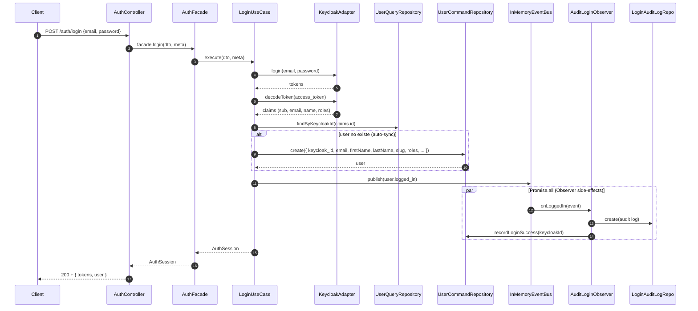

# Features

Cuatro features documentados: **auth**, **user**, **storage**, **audit**.
Por feature: entidades, DTOs, use-cases, eventos, errores específicos y
notas de inconsistencias documentadas.

---

## Mapa global de use-cases

| Feature | Use-cases                                                                                                   | Facade / Observer                                                               |
| ------- | ----------------------------------------------------------------------------------------------------------- | ------------------------------------------------------------------------------- |
| auth    | `LoginUseCase`, `RegisterUseCase`, `RefreshUseCase`, `GetMeUseCase`                                         | `AuthFacade` (`application/auth/auth.facade.ts:22`)                             |
| user    | `ListUsersUseCase`, `GetUserByIdUseCase`, `CreateUserUseCase`, `UpdateUserUseCase`, `SoftDeleteUserUseCase` | `UserFacade` (`application/user/user.facade.ts:35`)                             |
| storage | `ListStorageObjectsUseCase`, `GetSignedUrlUseCase`                                                          | `StorageFacade` (`application/storage/storage.facade.ts:11`)                    |
| audit   | (no use-cases ortodoxos — Observer)                                                                         | `AuditLoginObserver` (`application/audit/use-cases/audit-login.observer.ts:25`) |

Total: **11 use-cases** + 3 Facades + 1 Observer = **14 unidades** de logica.

---

## auth

### Endpoints

| Metodo | Path             | Auth       | Validator        | Use-case          | Status exito |
| ------ | ---------------- | ---------- | ---------------- | ----------------- | ------------ |
| POST   | `/auth/login`    | publico    | `LoginSchema`    | `LoginUseCase`    | 200          |
| POST   | `/auth/register` | publico    | `RegisterSchema` | `RegisterUseCase` | 201          |
| POST   | `/auth/refresh`  | publico    | `RefreshSchema`  | `RefreshUseCase`  | 200          |
| GET    | `/auth/me`       | Bearer JWT | —                | `GetMeUseCase`    | 200          |

> Codigo: `src/presentation/auth/auth.router.ts:51-138`.

### Entidades

`src/domain/auth/auth.entity.ts`:

| Type                | Campos                                                                                         |
| ------------------- | ---------------------------------------------------------------------------------------------- |
| `AuthTokens`        | `access_token`, `refresh_token`, `id_token?`, `expires_in`, `refresh_expires_in`, `token_type` |
| `AuthSession`       | `tokens: AuthTokens`, `user: UserPublic`                                                       |
| `AuthenticatedUser` | `id` (= `sub`), `email`, `name`, `roles: string[]` (claims decodificadas)                      |

### DTOs Zod

| Schema           | Campos                                                     | Notas                                           |
| ---------------- | ---------------------------------------------------------- | ----------------------------------------------- |
| `LoginSchema`    | `email`, `password`                                        | email lowercase + trim                          |
| `RegisterSchema` | `email`, `password` (8-72 chars), `firstName` (2-50), `lastName` (1-50), `phone?` | breaking: `name` retirado en favor de `firstName` + `lastName` |
| `RefreshSchema`  | `refresh_token`                                            | string min 1                                    |

> Codigo: `src/domain/auth/auth.dto.ts:3,9,17`.

### Puerto IAM (`IamPort`)

`src/domain/auth/iam.port.ts:21`:

| Metodo                       | Proposito                                                 |
| ---------------------------- | --------------------------------------------------------- |
| `login(email, password)`     | Resource Owner Password grant → tokens                    |
| `refresh(refreshToken)`      | Renovar access via refresh_token                          |
| `registerUser(input)`        | Crear usuario en Keycloak, devuelve `sub` (`keycloak_id`) |
| `assignRoles(userId, roles)` | Asignar roles realm en Keycloak                           |
| `verifyToken(token)`         | Verificar firma + exp (lo usa `JwtMiddleware`)            |
| `decodeToken(token)`         | Decode SIN verificar firma (solo tras login valido)       |

### Eventos publicados

| Evento              | Cuando                                | Publisher                                     | Subscriber                         |
| ------------------- | ------------------------------------- | --------------------------------------------- | ---------------------------------- |
| `user.logged_in`    | Login exitoso                         | `LoginUseCase` (`login.use-case.ts:78`)       | `AuditLoginObserver.onLoggedIn`    |
| `user.login_failed` | Excepcion en `iam.login`              | `LoginUseCase` (`login.use-case.ts:48`)       | `AuditLoginObserver.onLoginFailed` |
| `user.registered`   | Usuario creado en Mongo tras Keycloak | `RegisterUseCase` (`register.use-case.ts:50`) | **(sin handler)**                  |

### Login con auto-sync (flujo E2E)



> Codigo: `src/application/auth/use-cases/login.use-case.ts:43-91` +
> `src/application/audit/use-cases/audit-login.observer.ts:40-66`.

### Auto-sync (decision)

Si el JWT trae claims validas (sub, email, name) pero NO existe `User`
local, `LoginUseCase` lo **crea** con:

- `keycloak_id` ← `claims.id`
- `email` ← `claims.email` (fallback `dto.email`)
- `firstName` / `lastName` ← `claims.name` partido por ÚLTIMO espacio (helper privado `splitFullNameByLastSpace`). Si solo hay una palabra, `lastName=''`. Fallback de `firstName` cuando el claim viene vacio: `dto.email.split('@')[0]`.
- `slug` ← `Slugger.withRandomSuffix("${firstName} ${lastName}".trim())`
- `provider: 'password'`, `is_active: true`, `email_verified: true`
- `roles` ← interseccion `claims.roles ∩ USER_ROLES`, fallback `['buyer']`

> Codigo: `src/application/auth/use-cases/login.use-case.ts`.

Esto habilita login con usuarios creados directamente en el panel
Keycloak — no obliga a usar `/auth/register` siempre.

### Registro dual (Keycloak + Mongo)

Estrategia consciente:

1. PRIMERO Keycloak (`registerUser` con `firstName` + `lastName` nativos → `assignRoles`).
2. LUEGO Mongo (`userCommand.create`).
3. Login final para devolver tokens.

El cliente envía `firstName` y `lastName` separados en `RegisterSchema` (breaking change documentado en `docs/api/reference.md`). `KeycloakAdapter` los traslada uno a uno al payload del admin API. No hay heurística de split: cada campo viaja explícito de cliente a IAM.

---

## user

### Endpoints (admin-only)

| Metodo | Path         | Auth                  | Validator                               | Use-case                | Status exito |
| ------ | ------------ | --------------------- | --------------------------------------- | ----------------------- | ------------ |
| GET    | `/users`     | Bearer + role `admin` | `ListUserSchema`                        | `ListUsersUseCase`      | 200          |
| GET    | `/users/:id` | Bearer + role `admin` | `validateObjectId`                      | `GetUserByIdUseCase`    | 200          |
| POST   | `/users`     | Bearer + role `admin` | `CreateUserSchema`                      | `CreateUserUseCase`     | 201          |
| PUT    | `/users/:id` | Bearer + role `admin` | `validateObjectId` + `UpdateUserSchema` | `UpdateUserUseCase`     | 200          |
| DELETE | `/users/:id` | Bearer + role `admin` | `validateObjectId`                      | `SoftDeleteUserUseCase` | 200          |

> Codigo: `src/presentation/user/user.router.ts:39-178`.

### Entidad `UserEntity`

`src/domain/user/user.entity.ts:13`:

```ts
interface UserEntity {
  id: string;                      // Mongo _id transformado
  keycloak_id: string;             // ANCLA de identidad (claim sub)
  email: string;
  firstName: string;
  lastName: string;
  slug: string;                    // url-friendly, unique
  phone?: string;
  picture?: string;                // URL externa (Google, gravatar)
  avatar_url?: string;             // S3 key (NO URL completa)
  email_verified: boolean;
  provider: 'password' | 'google';
  roles: ('buyer' | 'seller' | 'operator' | 'admin')[];
  is_active: boolean;              // soft-delete sentinel
  last_login_at?: Date;
  failed_login_attempts: number;
  createdAt: Date;
  updatedAt: Date;
}
```

### DTOs Zod relevantes

| Schema             | Notas                                                                           |
| ------------------ | ------------------------------------------------------------------------------- |
| `CreateUserSchema` | `.transform()` deriva `slug` con `Slugger.withRandomSuffix("${firstName} ${lastName}")` si no se pasa |
| `UpdateUserSchema` | `firstName?`, `lastName?` (independientes) + resto opcional; `.refine()` exige al menos un campo presente |
| `ListUserSchema`   | filtros `email`, `firstName`, `slug`, `is_active`, `roles` + paginacion |

> Codigo: `src/domain/user/user.dto.ts:32,52,57-70`.

### Soft-delete

`UserCommandRepositoryPort.softDelete(id)` marca `is_active = false`. NO
borra la fila. Razon: trazabilidad audit + posibilidad de reactivar.
Endpoint `DELETE /users/:id` invoca este metodo (no hay hard delete
expuesto).

### Roles

```ts
const USER_ROLES = ['buyer', 'seller', 'operator', 'admin'];
```

---

## storage

### Endpoints (admin-only, montaje condicional)

| Metodo | Path                  | Auth                  | Validator                | Use-case                    |
| ------ | --------------------- | --------------------- | ------------------------ | --------------------------- |
| GET    | `/storage/objects`    | Bearer + role `admin` | `ListStorageQuerySchema` | `ListStorageObjectsUseCase` |
| GET    | `/storage/signed-url` | Bearer + role `admin` | `SignedUrlParamsSchema`  | `GetSignedUrlUseCase`       |

> Codigo: `src/presentation/storage/storage.router.ts:28-107`.

### Montaje condicional

```ts
// src/main.ts:60-66
if (env.s3.isConfigured) {
  storage = S3StorageAdapter.create(logger);
  storageRouter = new StorageRouter({ jwtMiddleware, storage });
} else {
  logger.warn('S3 not configured: /storage endpoints disabled');
}
```

Si `env.s3.isConfigured` es `false`, los endpoints `/storage/*`
**no se montan** y devuelven 404 natural. No se intenta degradar a otra
implementacion.

### `StoragePort` (`src/domain/shared/storage/storage.port.ts:35`)

| Metodo                                        | Implementado en `S3StorageAdapter` | Use-case consumidor         |
| --------------------------------------------- | ---------------------------------- | --------------------------- |
| `listObjects(input)`                          | si                                 | `ListStorageObjectsUseCase` |
| `getSignedDownloadUrl(key, expiresInSeconds)` | si                                 | `GetSignedUrlUseCase`       |
| `putObject(key, body, contentType?)`          | si                                 | **(sin consumidor)**        |
| `deleteObject(key)`                           | si                                 | **(sin consumidor)**        |

### Path-traversal guard

`src/application/storage/use-cases/get-signed-url.use-case.ts:8`:

```ts
if (!key || key.includes('..')) throw CustomError.badRequest('Invalid object key');
```

Bloquea `key="../../etc/passwd"`. Aceptado como defensa minima.

### Presigned URLs

| Aspecto             | Valor                   |
| ------------------- | ----------------------- |
| Operacion soportada | GET (download)          |
| TTL default         | 900s (15 min)           |
| TTL maximo          | 3600s (1h) — limite Zod |
| Multipart upload    | NO                      |
| Presigned PUT       | NO                      |

---

## audit

### Que es

Feature **reactiva** sin endpoints publicos. Vive enteramente como
Observer del `EventBus`.

### Wiring (`src/main.ts:46-48`)

```ts
const auditRepo = new LoginAuditLogRepository();
const userCommandForAudit = new UserCommandRepository();
new AuditLoginObserver(auditRepo, userCommandForAudit, logger).register(eventBus);
```

`register(eventBus)` suscribe dos handlers:
- `user.logged_in` → `onLoggedIn`
- `user.login_failed` → `onLoginFailed`

> Codigo: `src/application/audit/use-cases/audit-login.observer.ts:32-41`.

### `LoginAuditLog` (`src/domain/audit/login-audit.entity.ts`)

| Campo          | Tipo    | Notas                                 |
| -------------- | ------- | ------------------------------------- |
| `id`           | string  | Mongo _id transformado                |
| `email`        | string  | siempre presente                      |
| `keycloak_id?` | string  | solo en `success: true`               |
| `user_id?`     | string  | id Mongo del User local               |
| `success`      | boolean | true/false                            |
| `reason?`      | string  | mensaje de error en `success: false`  |
| `ip?`          | string  | tomado de `req.ip`                    |
| `user_agent?`  | string  | tomado de `req.headers['user-agent']` |
| `occurred_at`  | Date    | timestamp del evento                  |

### TTL hardcoded 90 dias

`src/infrastructure/mongodb/schemas/login-audit-log.schema.ts:42-43`:

```ts
schema.index({ occurred_at: 1 }, { expireAfterSeconds: 90 * 24 * 3600 });
```

### Indice compuesto

Existe indice secundario para queries del estilo "ultimos logins de un
usuario": `{ email: 1, occurred_at: -1 }` en el schema (verificar en
`login-audit-log.schema.ts`).

### `Promise.all` y aislamiento

`onLoggedIn` ejecuta auditoria + `recordLoginSuccess` con `Promise.all`. Si
cualquiera falla, el `EventBus` (con `Promise.allSettled` interno) loggea
el error pero NO interrumpe la cadena del login — el usuario ya tiene
sus tokens.

---

## Errores especificos por feature

| Feature | Error patron                                                     | Status             |
| ------- | ---------------------------------------------------------------- | ------------------ |
| auth    | `CustomError.unauthorized('Invalid token: missing subject')`     | 401                |
| auth    | `CustomError.unauthorized('Invalid credentials')` (via Keycloak) | 401                |
| auth    | `CustomError.conflict('Email already registered')`               | 409                |
| user    | `CustomError.notFound('User not found')`                         | 404                |
| user    | duplicate Mongo (email/slug unico) → MongoErrorHandler 11000     | 409                |
| storage | `CustomError.badRequest('Invalid object key')` (path-traversal)  | 400                |
| global  | Zod validation                                                   | 400 con `errors[]` |

> Detalle del error chain en [`../api/reference.md`](../api/reference.md).

---

## Siguiente capitulo

- [`../api/reference.md`](../api/reference.md): tabla maestra de
  endpoints, request/response shapes y error chain detallado.
  