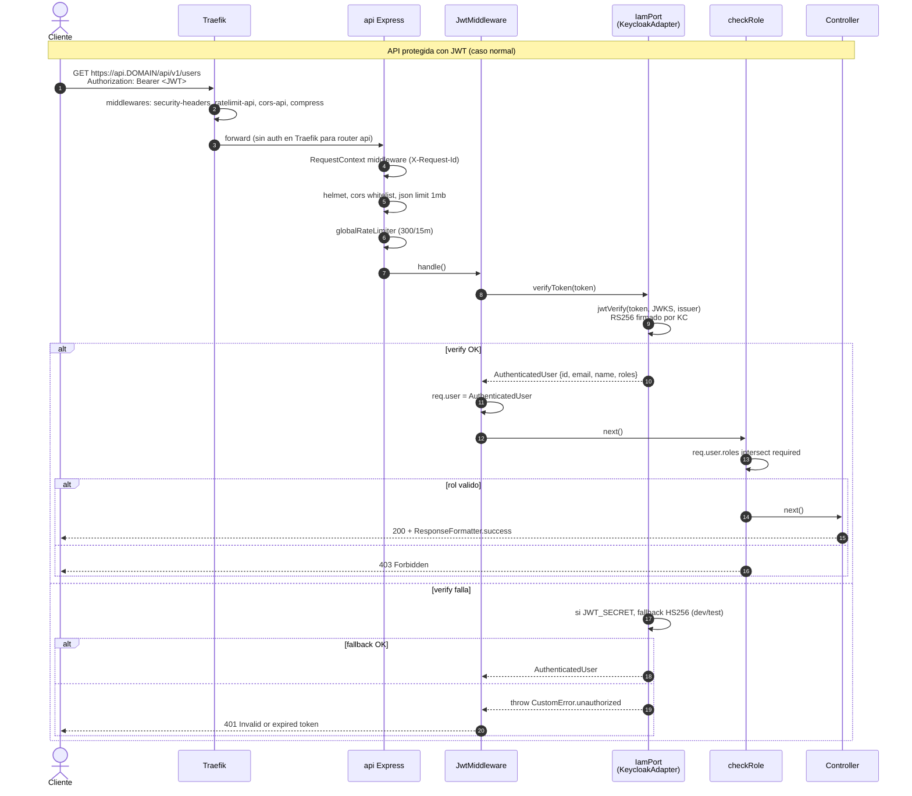

# Seguridad

Capítulo más crítico de la documentación. Cubre la cadena de
autenticación E2E (3 vías coexistiendo) + las políticas de defensa
aplicadas en el sistema.

---

## Indice

1. [Cadena de autenticacion E2E](#cadena-de-autenticacion-e2e)
2. [verifyToken vs decodeToken](#verifytoken-vs-decodetoken)
3. [Realm Keycloak: roles, clients, lifespans](#realm-keycloak-roles-clients-lifespans)
4. [Despliegue detras de Traefik (`trust proxy`)](#despliegue-detras-de-traefik-trust-proxy)
5. [Rate limiting](#rate-limiting)
6. [NoSQL injection / regex sanitization](#nosql-injection--regex-sanitization)
7. [Secrets management](#secrets-management)
8. [CORS whitelist](#cors-whitelist)
9. [helmet defaults](#helmet-defaults)
10. [Logging y privacidad](#logging-y-privacidad)
11. [Defensa anti-bruteforce](#defensa-anti-bruteforce)

---

## Cadena de autenticacion E2E

Tres vias coexisten **deliberadamente**. Cada una resuelve un problema
distinto:

| Via | Quien | Como | Donde |
|---|---|---|---|
| Plugin OIDC en Traefik | Humanos a paneles (Grafana, Prometheus, dashboard Traefik) | Browser flow Auth Code + PKCE → claims `realm_access.roles ∈ {admin, operator}` | `docker-compose.yml:175-188` |
| Keycloak directo | SPAs frontend | Auth Code + PKCE (client `app-frontend`) | `keycloak/app-realm.json:43-58` |
| API verify JWT | Clientes API (mobile, server-to-server, SPAs autenticadas) | `jose.createRemoteJWKSet` + `jwtVerify` issuer-bound | `src/infrastructure/keycloak/keycloak.adapter.ts:124-142` |

### Diagrama: cadena auth E2E



### Codigo verificable

| Componente | Archivo | Lineas |
|---|---|---|
| `JwtMiddleware` | `src/presentation/bootstrap/middlewares/jwt.middleware.ts` | `13-18,23-38` |
| `checkRole` | `src/presentation/bootstrap/middlewares/check-role.middleware.ts` | `13-24` |
| Verify token | `src/infrastructure/keycloak/keycloak.adapter.ts` | `124-142` |
| Realm `app` | `keycloak/app-realm.json` | full |
| Bootstrap middlewares | `src/presentation/bootstrap/app.ts` | `25-36,44-52` |

`JwtMiddleware` es **una unica instancia transversal** inyectada por
`src/main.ts` a cada feature router. No se construye dentro de los
routers.

---

## verifyToken vs decodeToken

`KeycloakAdapter` expone dos metodos para procesar JWT. Usan APIs
distintas y tienen garantias muy distintas:

| Metodo | Verifica firma? | Caso de uso |
|---|---|---|
| `verifyToken(token)` (`keycloak.adapter.ts:124-142`) | **SI** (RS256 via JWKS, fallback HS256 dev/test) | Cualquier token recibido del cliente. **Default**. |
| `decodeToken(token)` (`keycloak.adapter.ts:144-151`) | **NO** (`decodeJwt` solo decodifica) | Solo flow interno: tokens recien obtenidos de KC en el mismo handler, sobre HTTPS. |

### Regla estricta

> **Nunca** llamar `decodeToken` sobre input recibido del cliente.
> Solo es seguro si:
>
> 1. El token acaba de salir de `iam.login()` o `iam.refresh()` 1-2
>    lineas arriba.
> 2. La conexion a Keycloak es HTTPS.
> 3. No hay enrutamiento intermedio que haya manipulado el payload.

El token recién recibido del IAM pasa por validación de firma + expiración contra el JWKS público
antes de extraer claims (`src/application/auth/use-cases/login.use-case.ts:59`).
El `decodeToken` está disponible para contextos donde la firma está garantizada por el propio adapter.

---

## Realm Keycloak: roles, clients, lifespans

Detalle completo en cap 06. Resumen de seguridad:

| Configuracion | Valor | Ubicacion | Comentario |
|---|---|---|---|
| `bruteForceProtected` | `true` | `app-realm.json:10` | Defensa real anti-bruteforce. |
| `accessTokenLifespan` | `900` (15 min) | `app-realm.json:11` | Compromiso refresh frequency vs ventana de ataque. |
| `refreshTokenMaxReuse` | `0` | `app-realm.json:12` | Rotacion estricta — replay deteccion delegada en KC. |
| `ssoSessionIdleTimeout` | `1800` | `app-realm.json:13` | 30 min sin actividad → cierre. |
| `sslRequired` | `external` | `app-realm.json:4` | HTTPS obligatorio salvo loopback. |
| `registrationAllowed` | `false` | `app-realm.json:5` | Registro va por API (admin REST). |
| `duplicateEmailsAllowed` | `false` | `app-realm.json:7` | Email = identidad unica. |

Los secrets de los clients Keycloak `app-api` y `traefik-panels` se rotan vía script
`scripts/rotate-keycloak-secrets.sh`. El procedimiento para staging/producción:

```bash
# 1. Generar secrets fuertes
./scripts/generate-secrets.sh

# 2. Setear en el .env del entorno
export KC_ADMIN_USER=... KC_ADMIN_PASSWORD=... KC_API_SECRET=... KC_PANELS_SECRET=...

# 3. Rotar tras el primer arranque
./scripts/rotate-keycloak-secrets.sh

# 4. Reiniciar api + traefik para que tomen los nuevos secrets
docker compose restart api traefik
```

El script soporta `DRY_RUN=1` para auditar sin aplicar cambios.

---

## Despliegue detras de Traefik (`trust proxy`)

La configuración `trust proxy` está establecida en `App.configureProxyTrust()`
(`src/presentation/bootstrap/app.ts:`) con valor `1`, indicando un único hop confiable (Traefik).
Express extrae la IP real del cliente desde `X-Forwarded-For`, permitiendo rate limiting y auditoría por IP real.

---

## Rate limiting

`src/presentation/bootstrap/middlewares/rate-limit.middleware.ts:12-27`:

| Limiter | Ventana | Max | `skipSuccessfulRequests` | Aplicado en |
|---|---|---|---|---|
| `loginRateLimiter` | 60 s | 5 | true | `/auth/login` (`auth.router.ts:73-78`) |
| `globalRateLimiter` | 15 min | 300 | false | Toda la API (`app.ts:56`) |

`skipSuccessfulRequests:true` permite que un usuario legitimo que se
equivoque y luego acierte no quede bloqueado.

### Matriz endpoints sensibles

| Endpoint | Rate-limit | Detalles |
|---|---|---|
| `POST /auth/login` | `loginRateLimiter` | 5/min, salta éxitos |
| `POST /auth/register` | `registerRateLimiter` | 3/min, bloquea mass-registration |
| `POST /auth/refresh` | (global) | No dedicado |
| `GET /auth/me` | (global) | Solo límite global |

Los limiters están configurados en `src/presentation/bootstrap/middlewares/rate-limit.middleware.ts`
y se aplican en los correspondientes routers. Swagger documenta `429` como respuesta posible.

---

## NoSQL injection / regex sanitization

Los filtros `$regex` en `src/infrastructure/mongodb/repositories/user.query.repository.ts` pasan
por `escapeRegex` antes de enviarse a MongoDB, neutralizando ReDoS y pattern injection:

```ts
private static escapeRegex(input: string): string {
  return input.replace(/[.*+?^${}()|[\]\\]/g, '\\$&');
}
```
>   se escapan; el filtro pasa a ser búsqueda por subcadena literal.
>
> Sigue siendo recomendable activar `mongoose.set('sanitizeFilter', true)`
> como defensa-en-profundidad contra operadores Mongo inyectados (`$gt`,
> `$ne`, …) vía JSON. Tracked en IMPORTANT — pendiente.

### Sanitizacion general (estado actual)

- **Zod en presentation** valida estructura, tipos y formato (email,
  uuid, longitudes). NO sanitiza contenido para regex Mongo.
- **`$where`, `$function`, `$accumulator`**: cero usos en `src/`
  (verificado por grep). No hay vectores SSJI clasicos.
- **`mongoose.set('sanitizeFilter', true)`**: NO esta activado.
  Recomendable como defensa-en-profundidad — bloquea operadores Mongo
  (`$gt`, `$ne`, etc.) inyectados via JSON malicioso.

---

## Secrets management

### Generacion

`scripts/generate-secrets.sh:38-46` genera con `openssl rand -base64`:

- `OIDC_PLUGIN_SECRET` (cifra cookie sesion plugin OIDC).
- `KC_PANELS_SECRET` (client `traefik-panels`).
- `KC_API_SECRET` (client `app-api`).
- `KC_ADMIN_PASSWORD` (admin Keycloak).
- `JWT_SECRET` (fallback HS256, solo dev/test).
- `GRAFANA_ADMIN_PASSWORD`.
- `TRAEFIK_AUTH` (htpasswd para basicauth dashboard).

Salida en `.env.secrets` (gitignored — verificado por team-lead).

### `.gitignore`

`.gitignore:10-14` excluye correctamente (validado por team-lead):

- `.env.local`
- `.env.staging`
- `.env.production`
- `.env.secrets`

`app-realm.json` esta en repo con secrets placeholder rotables via `scripts/rotate-keycloak-secrets.sh`.

### Procedimiento override en staging/prod

1. Generar `.env.secrets` con el script.
2. Mergear vars en `.env.staging` o `.env.production`.
3. Levantar compose: `docker compose --env-file .env.production up`.
4. Tras primer arranque KC, rotar secrets de clients via `kcadm.sh`:
   ```bash
   docker exec keycloak /opt/keycloak/bin/kcadm.sh config credentials \
     --server http://localhost:8080 --realm master \
     --user "$KC_ADMIN_USER" --password "$KC_ADMIN_PASSWORD"
   docker exec keycloak /opt/keycloak/bin/kcadm.sh update \
     clients/<client-uuid> -r app -s secret="$KC_API_SECRET"
   ```

Detalle completo de tabla `.env reference` en cap 08.

---

## CORS whitelist

`src/presentation/bootstrap/app.ts:44-52`:

```ts
this.expressApp.use(
  cors({
    origin: env.server.corsOrigins.length > 0 ? env.server.corsOrigins : false,
    methods: ['GET', 'POST', 'PUT', 'PATCH', 'DELETE', 'OPTIONS'],
    allowedHeaders: ['Content-Type', 'Authorization', 'X-Request-Id'],
    exposedHeaders: ['X-Request-Id'],
    credentials: true,
  }),
);
```

- **`origin: false`** si `corsOrigins` esta vacio → CORS bloquea **toda**
  request cross-origin. Sin `*` por defecto.
- `CORS_ORIGINS` en env vars: lista coma-separada
  (`src/config/env.ts:34-37`).
- `credentials: true` — habilita cookies cross-origin (usar con
  responsabilidad).
- `exposedHeaders: ['X-Request-Id']` — el cliente puede leer el
  request id para correlacionar logs.

Traefik tambien aplica CORS a nivel router (`cors-api` middleware,
`docker-compose.yml:154-159`). Doble capa — cualquier divergencia es
un bug.

---

## helmet defaults

`src/presentation/bootstrap/app.ts:43`: `this.expressApp.use(helmet())`.

helmet 8 aplica defaults razonables:

| Header | Valor default helmet 8 |
|---|---|
| `Content-Security-Policy` | `default-src 'self'; ...` (estricto) |
| `Strict-Transport-Security` | `max-age=15552000; includeSubDomains` (180d) |
| `X-Content-Type-Options` | `nosniff` |
| `X-Frame-Options` | `DENY` |
| `X-DNS-Prefetch-Control` | `off` |
| `Referrer-Policy` | `no-referrer` |
| `Cross-Origin-Resource-Policy` | `same-origin` |

Traefik añade su propio `security-headers` middleware
(`docker-compose.yml:140-146`) con HSTS 1 año + preload — los headers
se acumulan, el mas restrictivo gana.

---

## Logging y privacidad

---

## Defensa anti-bruteforce

### Estado actual

- **Capa Keycloak**: `bruteForceProtected: true` en
  `keycloak/app-realm.json:10`. KC bloquea cuentas tras N intentos
  fallidos consecutivos (defaults KC 26: 30 intentos, lockout 60 min).
  **Esta es la defensa real**.
- **Capa API**: `loginRateLimiter` 5/min/IP frena bots a nivel proceso.


## Notas adicionales

- **`name`-split heuristica en `KeycloakAdapter.registerUser:160-161`**:
  divide por espacio simple en firstName/lastName. Casos límite con nombres compuestos
  deben manejarse en la UI.
- **Plugin OIDC Headers `X-Auth-User`/`X-Auth-Email`**: aplicados solo
  en routers de paneles (Grafana, dashboard Traefik, Prometheus).
  Router `api` NO usa `kc-auth` middleware — la API verifica JWTs directamente.
- **Reset password endpoints**: cuando se añadan, requieren
  `loginRateLimiter` o equivalente. Hoy el realm permite reset
  (`resetPasswordAllowed: true` en `app-realm.json:8`) via UI Keycloak.

---

## Referencias cruzadas

- Cap 05 (Infraestructura): `KeycloakAdapter` detalle, repos Mongo.
- Cap 06 (Plataforma): plugin OIDC, ACME, realm `app` completo.
- Cap 08 (Configuracion): `.env reference`, `JWT_SECRET` opcional.
- Cap 09 (Observabilidad): `morgan`/audit log, Loki retention.
- Cap 10 (Testing): cobertura de Storage.
