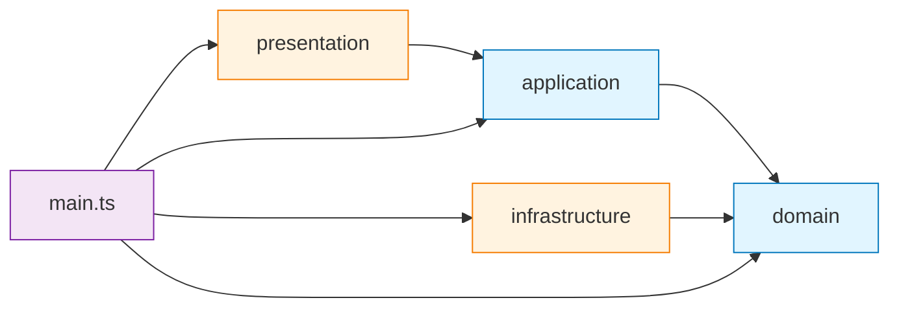
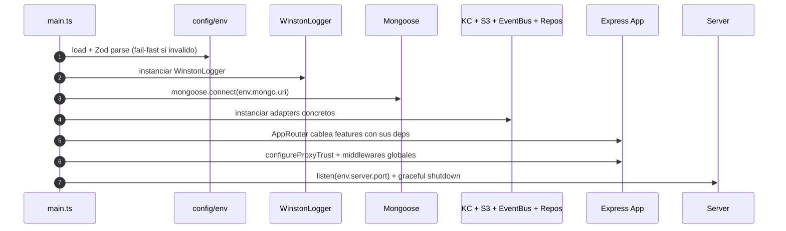

# Estructura del código `src/`

Mapa de la estructura interna del backend. Como está organizado el codigo
fuente, qué vive en cada carpeta y qué reglas de dependencia rigen entre
capas.

Este capítulo es **descriptivo**: refleja el estado actual de `src/` tal
cual existe, sin opinar sobre patrones (eso vive en
[`architecture.md`](architecture.md)).

---

## Resumen ejecutivo

| Capa | Carpeta | Archivos `.ts` | Funcion |
|---|---|---|---|
| Configuration | `src/config/` | 3 | Env Zod + Swagger + Mongo connection |
| Domain | `src/domain/` | 19 | Entidades, value objects, puertos (interfaces), DTOs, errores |
| Application | `src/application/` | 15 | Use cases por feature (auth, user, storage, audit) |
| Infrastructure | `src/infrastructure/` | 10 | Adapters concretos: Keycloak, Mongo, S3, Winston, EventBus |
| Presentation | `src/presentation/` | 19 | Routers Express, middlewares, bootstrap, error handler |
| Composition root | `src/main.ts` | 1 | Cableado de toda la aplicacion (DI manual) |

**Total**: 67 archivos `.ts` distribuidos en 4 capas hexagonales + bootstrap.

---

## Layout completo

```
src/
├── main.ts                              # Composition root: cablea adapters + ports + features
│
├── config/                              # Boundary externo: env + persistencia + docs API
│   ├── env.ts                           # Zod fail-fast por dominio (server, mongo, kc, s3, jwt)
│   ├── database.ts                      # Mongoose connection
│   └── swagger.ts                       # OpenAPI spec generator
│
├── domain/                              # Capa interna: NO depende de nada
│   ├── auth/
│   │   ├── auth.entity.ts               # AuthSession, AuthTokens (value objects)
│   │   ├── auth.dto.ts                  # Login/Register/Refresh DTOs (Zod schemas)
│   │   └── iam.port.ts                  # IamPort (puerto Keycloak)
│   ├── user/
│   │   ├── user.entity.ts               # User aggregate
│   │   ├── user.dto.ts                  # CreateUser, UpdateUser, ListUsers DTOs
│   │   └── user.repository.port.ts      # IUserRepository (puerto persistencia)
│   ├── audit/
│   │   └── login-audit.entity.ts        # LoginAuditLog (TTL 90d)
│   └── shared/
│       ├── errors/                      # CustomError factory + base error chain
│       ├── events/                      # EventBusPort + UserEvents (Observer pattern)
│       ├── logger/                      # LoggerPort
│       ├── paginator/                   # Paginator + PaginationDto
│       ├── response/                    # ResponseFormatter (envelope estandar API)
│       ├── slug/                        # Slugger (slug gen con sufijo random)
│       └── storage/                     # StoragePort + Storage DTOs
│
├── application/                         # Use cases: orquestan domain + ports
│   ├── auth/use-cases/
│   │   ├── login.use-case.ts            # Verifica credenciales en KC + sync user
│   │   ├── register.use-case.ts         # Alta KC + persiste perfil
│   │   ├── refresh-token.use-case.ts    # Renueva access token
│   │   └── get-me.use-case.ts           # Devuelve perfil del bearer
│   ├── user/use-cases/                  # CRUD admin: create, update, delete, list, find-by-id
│   ├── storage/use-cases/
│   │   ├── get-signed-url.use-case.ts   # Pre-signed URL S3 + guard path-traversal
│   │   └── list-storage-objects.use-case.ts
│   └── audit/use-cases/
│       └── audit-login.observer.ts      # Observer: persiste login OK/KO
│
├── infrastructure/                      # Adapters: implementan ports de domain
│   ├── keycloak/
│   │   └── keycloak.adapter.ts          # IamPort via jose (JWKS + HS256 fallback)
│   ├── mongodb/
│   │   ├── schemas/                     # Mongoose schemas (User, LoginAuditLog)
│   │   └── repositories/                # CQRS-lite: user.command, user.query, login-audit
│   ├── services/s3/
│   │   └── s3-storage.adapter.ts        # StoragePort via @aws-sdk/client-s3
│   ├── logger/
│   │   ├── winston.adapter.ts           # LoggerPort via winston + winston-loki
│   │   └── request-context-logger.decorator.ts  # Decorator pattern
│   └── events/
│       └── in-memory-event-bus.ts       # EventBusPort en memoria (Pub/Sub)
│
└── presentation/                        # HTTP boundary: Express + middleware
    ├── bootstrap/
    │   ├── app.ts                       # Express app + middleware chain
    │   ├── app-router.ts                # Mount /api/v1/* + /metrics + /api-docs
    │   ├── server.ts                    # listen + graceful shutdown
    │   ├── error-handler/               # Chain of Responsibility (Mongo, Zod, JWT, default)
    │   └── middlewares/
    │       ├── jwt.middleware.ts        # Verifica access token contra IamPort
    │       ├── check-role.middleware.ts # RBAC por roles realm KC
    │       ├── rate-limit.middleware.ts # globalRateLimiter, loginRateLimiter, registerRateLimiter
    │       ├── metrics.middleware.ts    # PrometheusMetrics (Counter + Histogram)
    │       ├── request-context.middleware.ts  # AsyncLocalStorage para correlationId
    │       ├── validate.middleware.ts   # Zod parser sobre body/query/params
    │       └── validate-object-id.middleware.ts  # Pre-cast Mongo ObjectId
    ├── auth/auth.router.ts              # POST /auth/{login,register,refresh}, GET /auth/me
    ├── user/user.router.ts              # GET/POST/PUT/DELETE /users
    └── storage/storage.router.ts        # GET /storage/* (signed-url, list)
```

---

## Reglas de dependencia

> Hexagonal estricta. Las flechas indican _depende de_.



**Invariantes**:

1. `domain/` no importa de **ninguna** otra capa. Si lo hace, es bug.
2. `application/` solo importa de `domain/` (puertos, entidades, DTOs).
3. `infrastructure/` implementa puertos de `domain/`. No importa `application/`.
4. `presentation/` importa de `application/` (use cases) y `domain/` (DTOs/errors).
5. `main.ts` es el **unico** sitio que conoce las 4 capas — cablea todo via DI manual.

---

## Path aliases (`#namespace/...`)

Definidos en `package.json:imports` y replicados en `tsconfig.json` y `vitest.config.ts`. Permiten imports planos sin `../../..`.

| Alias | Apunta a |
|---|---|
| `#config/*` | `src/config/*` |
| `#domain/*` | `src/domain/*` |
| `#application/*` | `src/application/*` |
| `#infrastructure/*` | `src/infrastructure/*` |
| `#presentation/*` | `src/presentation/*` |

Ejemplo:
```ts
import { env } from '#config/env';
import type { IUserRepository } from '#domain/user/user.repository.port';
import { UserCommandRepository } from '#infrastructure/mongodb/repositories/user.command.repository';
```

---

## Composition root (`main.ts`)

`main.ts` es el unico archivo que crea instancias concretas y las cablea entre si. Orden de boot:



**Lo que se cablea transversalmente** (compartido entre features):

- `WinstonLoggerAdapter` (logger global).
- `KeycloakAdapter` (IamPort).
- `S3StorageAdapter` (StoragePort).
- `InMemoryEventBus` (EventBusPort).
- `LoginAuditLogRepository` (subscribe a `user.login.*` events).

**Lo que se cablea por feature** (en su propio router):

- Repositorios concretos del feature (`user.command`, `user.query`).
- Use cases del feature.
- Validacion Zod del DTO via `validate.middleware`.
- Rate limiters dedicados (login, register, global).
- Roles via `check-role.middleware`.

---

## Convenciones de naming

| Tipo de archivo | Sufijo | Ejemplo |
|---|---|---|
| Entidad de dominio | `.entity.ts` | `user.entity.ts` |
| DTO + Zod schema | `.dto.ts` | `user.dto.ts` |
| Puerto (interface) | `.port.ts` | `iam.port.ts`, `storage.port.ts` |
| Repositorio (puerto) | `.repository.port.ts` | `user.repository.port.ts` |
| Use case | `.use-case.ts` | `login.use-case.ts` |
| Adapter de infra | `.adapter.ts` | `keycloak.adapter.ts` |
| Repositorio concreto | `.repository.ts` | `user.command.repository.ts` |
| Schema Mongoose | `.schema.ts` | `user.schema.ts` |
| Router Express | `.router.ts` | `auth.router.ts` |
| Middleware | `.middleware.ts` | `jwt.middleware.ts` |
| Decorator | `.decorator.ts` | `request-context-logger.decorator.ts` |
| Observer | `.observer.ts` | `audit-login.observer.ts` |

**Regla**: el nombre describe el patron + el dominio. `kebab-case` siempre.

---

## CQRS-lite por feature `user`

El feature `user` separa lectura y escritura en repositorios distintos para optimizar queries de admin sin impactar el path de escritura:

```
src/infrastructure/mongodb/repositories/
├── user.command.repository.ts      # save, delete, update — write-side
├── user.query.repository.ts        # find, list, paginate, filter — read-side
└── login-audit-log.repository.ts   # audit, write-only via Observer
```

`UserCommandRepository` implementa `IUserCommandRepository` (puerto en `domain/user/user.repository.port.ts`), igual el query.

Detalle del patron y trade-offs en [`architecture.md`](architecture.md).

---

## Patrones GoF presentes en `src/`

| Patron | Donde | Archivo |
|---|---|---|
| Adapter | Cada port → adapter concreto | `keycloak.adapter.ts`, `s3-storage.adapter.ts`, `winston.adapter.ts` |
| Facade | Use case agrega operaciones | `register.use-case.ts` (KC + Mongo) |
| Decorator | Logger con request context | `request-context-logger.decorator.ts` |
| Chain of Responsibility | Error handler | `presentation/bootstrap/error-handler/` |
| Observer | Audit de login | `audit-login.observer.ts` + `event-bus.port.ts` |
| Strategy | Validate middleware (cualquier Zod schema) | `validate.middleware.ts` |
| Template Method | Repos CQRS comparten esqueleto | `user.command.repository.ts` |
| Factory | `CustomError.create()` | `custom.error.ts` |
| Singleton | Mongoose connection, Express app | `database.ts`, `app.ts` |
| Repository | Acceso a persistencia | `user.command.repository.ts`, `user.query.repository.ts` |

---

## Como añadir una feature nueva

Pasos en orden, sin saltos:

1. **`domain/<feature>/`**: definir entidad, DTOs (Zod), errores especificos, puertos (repository, port externo si aplica).
2. **`application/<feature>/use-cases/`**: un archivo `.use-case.ts` por accion. Recibe puertos por DI (constructor).
3. **`infrastructure/`**: implementar adapters concretos de los puertos (Mongo schema + repository, o adapter externo).
4. **`presentation/<feature>/<feature>.router.ts`**: rutas Express, middleware chain (jwt → check-role → validate → handler), Swagger JSDoc.
5. **`presentation/bootstrap/app-router.ts`**: montar el router en `/api/v1/<feature>`.
6. **`main.ts`**: cablear si hay deps transversales nuevas (event bus subscriber, etc).
7. **`test/integration/<feature>.integration.spec.ts`**: cobertura E2E con `buildTestApp`.

Plantilla detallada en [`contributing.md`](contributing.md).

---

## Referencias cruzadas

- [`architecture.md`](architecture.md) — patrones, justificaciones, trade-offs.
- [`features.md`](features.md) — auth, user, storage, audit en detalle.
- [`../api/reference.md`](../api/reference.md) — endpoints, schemas, error codes.
- [`adapters.md`](adapters.md) — adapters Mongo, KC, S3, Winston en detalle.
- [`configuration.md`](configuration.md) — variables de entorno + Zod fail-fast.
- [`testing/strategy.md`](testing/strategy.md) — `buildTestApp`, helpers, matriz de cobertura.
