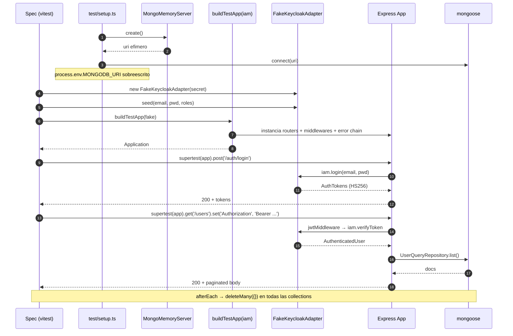

# Testing strategy

Estrategia de testing del backend Express 5 hexagonal. Stack:
**Vitest 4.0.18** + **supertest 7.2.2** + **mongodb-memory-server 11.0.1**
+ helpers locales (`buildTestApp` + `FakeKeycloakAdapter`).

Estrategia de cobertura de tests: unit e integration sobre componentes clave.

---

## Indice

- [Stack](#stack)
- [Estructura de directorios](#estructura-de-directorios)
- [Comandos npm](#comandos-npm)
- [Setup global](#setup-global)
- [Helpers de test](#helpers-de-test)
- [Matriz de cobertura](#matriz-de-cobertura)
- [Diagrama: flujo integration test](#diagrama-flujo-integration-test)
- [Como añadir un test integration](#como-añadir-un-test-integration)
- [Como añadir un test unit](#como-añadir-un-test-unit)
- [Convenciones](#convenciones)

---

## Stack

| Herramienta | Version | Proposito |
|---|---|---|
| Vitest | `4.0.18` | runner + coverage v8 (`package.json:103`) |
| `@vitest/coverage-v8` | `4.0.18` | reporter HTML + text (`package.json:98`) |
| supertest | `7.2.2` | HTTP assertions sobre `Application` Express (`package.json:101`) |
| mongodb-memory-server | `11.0.1` | Mongo efimero in-process (`package.json:99`) |
| jose | `6.1.3` | firma HS256 de JWTs en `FakeKeycloakAdapter` |

Path aliases configurados en `vitest.config.ts:16-25`
(replican `package.json:imports` `#domain/*`, `#application/*`,
`#infrastructure/*`, `#presentation/*`, `#config/*`).

---

## Estructura de directorios

```
test/
├── setup.ts                       # bootstrap global vitest (env vars + Mongo)
├── helpers/
│   ├── build-test-app.ts          # buildTestApp(iam) + buildTestAppWithBus
│   └── fake-keycloak.adapter.ts   # IamPort fake con HS256
├── unit/
│   ├── custom-error.spec.ts       # CustomError factories
│   ├── event-bus.spec.ts          # InMemoryEventBus.publish
│   ├── paginator.spec.ts          # Paginator skip/build
│   ├── request-context-logger.spec.ts  # RequestContextLoggerDecorator
│   └── slugger.spec.ts            # Slugger base + withRandomSuffix
└── integration/
    ├── auth.integration.spec.ts   # /auth login, register, me
    └── users.integration.spec.ts  # /users list, getById, delete
```

**Total:** 5 unit specs + 2 integration specs.
Verificado por `ls test/` (`test/unit/`, `test/integration/`, `test/helpers/`).

---

## Comandos npm

Definidos en `package.json:44-48`:

| Comando | Equivalencia | Cuando usar |
|---|---|---|
| `pnpm test` | `vitest run` | CI: corre todo (unit + integration) |
| `pnpm test:watch` | `vitest` | TDD interactivo en local |
| `pnpm test:unit` | `vitest run test/unit` | feedback rapido en logica pura |
| `pnpm test:integration` | `vitest run test/integration` | requiere MongoMemoryServer |
| `pnpm test:coverage` | `vitest run --coverage` | reporte HTML en `coverage/` (sin gating) |


---

## Setup global

`test/setup.ts:9-49` se ejecuta antes de cada suite (registrado en
`vitest.config.ts:8` como `setupFiles`).

**Responsabilidades:**

1. **Pre-set env vars** (`test/setup.ts:9-17`) ANTES de cualquier import que
   transitivamente cargue `#config/env`:
   - `NODE_ENV=test`
   - `PORT=0`
   - `JWT_SECRET=test-secret-vitest-min-16-chars` (cumple `min(16)` Zod en
     `src/config/env.ts:51-56`)
   - `KEYCLOAK_URL`, `KEYCLOAK_REALM`, `KEYCLOAK_CLIENT_ID` (placeholders)
   - `CORS_ORIGINS=http://localhost:3000`
   - `MONGODB_URI` placeholder valido como URL (sobreescrito en `beforeAll`).

2. **`beforeAll`** (`test/setup.ts:19-36`):
   - Levanta `MongoMemoryServer.create()`.
   - Sobreescribe `MONGODB_URI` con el URI efimero.
   - Conecta `mongoose.connect(...)`.
   - Si offline (sandbox), avisa por consola y deja que las integration
     fallen claramente.

3. **`afterEach`** (`test/setup.ts:43-49`): `deleteMany({})` sobre todas las
   collections para aislar tests.

4. **`afterAll`** (`test/setup.ts:38-41`): `mongoose.disconnect()` + stop
   `MongoMemoryServer`.

---

## Helpers de test

### `buildTestApp(iam: IamPort): Application`

Definido en `test/helpers/build-test-app.ts:26-33`. Clona la composition
root de produccion (`AppRouter` + `App`) **sin** registrar el
`AuditObserver` y con un `IamPort` inyectado.

Devuelve `Application` listo para `supertest(app)`:

```ts
import request from 'supertest';
import { buildTestApp } from '../helpers/build-test-app.js';
import { FakeKeycloakAdapter } from '../helpers/fake-keycloak.adapter.js';

const fake = new FakeKeycloakAdapter('test-secret-vitest-min-16-chars');
fake.seed('alice@example.com', 'pwd123', ['buyer'], 'Alice');
const app = buildTestApp(fake);
const res = await request(app).post('/api/v1/auth/login').send({
  email: 'alice@example.com',
  password: 'pwd123',
});
```

### `buildTestAppWithBus(iam: IamPort)`

`test/helpers/build-test-app.ts:35-47`. Variante que ademas devuelve el
`InMemoryEventBus` y el `LoggerPort` para suites que quieran subscribir
observers manualmente y verificar emisiones.


### `FakeKeycloakAdapter`

`test/helpers/fake-keycloak.adapter.ts:14-111`. Implementa `IamPort`
completo sin red:

- Mantiene `Map<email, { password, sub, roles, name }>` in-memory.
- `seed(email, password, roles?, name?)` (`fake-keycloak.adapter.ts:79-83`)
  para preparar usuarios antes del test.
- `login` valida password local y firma HS256 con `jose.SignJWT`
  (`fake-keycloak.adapter.ts:85-110`):
  - Access token: `exp 15m`, claims `email`, `name`, `realm_access.roles`.
  - Refresh token: `typ: 'Refresh'`, `exp 30d`.
- `verifyToken` (`fake-keycloak.adapter.ts:51-64`) valida HS256 con el
  mismo secret.

**Por que funciona contra el `JwtMiddleware` real:** el `KeycloakAdapter`
de produccion (`src/infrastructure/keycloak/keycloak.adapter.ts`) cae a
HS256 cuando `JWT_SECRET` esta seteado. En tests, `test/setup.ts:11` lo
fija a `test-secret-vitest-min-16-chars`. El runtime acepta los tokens
firmados por el fake sin tocar Keycloak.

---

## Matriz de cobertura

Cruce **use-case ↔ test** verificado contra `src/application/**` y
`test/**`. UCs reales por feature:

- `src/application/auth/use-cases/`: 4 archivos (`get-me`, `login`,
  `refresh-token`, `register`).
- `src/application/user/use-cases/`: 5 archivos (`create`, `delete`,
  `find-by-id`, `list`, `update`).
- `src/application/storage/use-cases/`: 2 archivos (`get-signed-url`,
  `list-storage-objects`).
- `src/application/audit/use-cases/audit-login.observer.ts` (clasificado
  como Observer, no UC — ver §"Inconsistencias" en cap 02).

### Auth feature (4 UCs)

| Use-case | Unit | Integration | Gap |
|---|---|---|---|
| `LoginUseCase` | ❌ | ✅ login 200 + auto-sync, 401 bad creds | Evento `user.login_failed` cubierto implícitamente |
| `RegisterUseCase` | ❌ | ✅ 201, 409 dup, 400 Zod | Cobertura de error Mongo cubierta |
| `RefreshTokenUseCase` | ❌ | ✅ POST `/auth/refresh` | OK |
| `GetMeUseCase` | ❌ | ✅ me 200 con Bearer, 401 sin | OK |

### User feature (5 UCs)

| Use-case | Unit | Integration | Gap |
|---|---|---|---|
| `CreateUserUseCase` | ❌ | ✅ POST `/users` | OK |
| `FindUserByIdUseCase` | ❌ | ✅ GET `/users/:id` 200, 404 | OK |
| `ListUsersUseCase` | ❌ | ✅ 200 admin + paginacion, 401 sin auth, 403 rol no-admin | OK |
| `UpdateUserUseCase` | ❌ | ✅ PUT `/users/:id` | OK |
| `DeleteUserUseCase` | ❌ | ✅ soft-delete 200 con `is_active=false` | OK |

### Storage feature (2 UCs)

| Use-case | Unit | Integration | Estado |
|---|---|---|---|
| `ListStorageObjectsUseCase` | ✅ `test/unit/list-storage-objects.spec.ts` (5 tests) | ⏳ requiere `buildTestApp` con `storage` | OK unit |
| `GetSignedUrlUseCase` | ✅ `test/unit/get-signed-url.spec.ts` (9 tests, **incluye los 5 vectores de path-traversal**) | ⏳ requiere `buildTestApp` con `storage` | OK unit |

### Audit (Observer)

| Componente | Unit | Integration | Gap |
|---|---|---|---|
| `AuditLoginObserver.onLoggedIn` | ✅ implicito via `event-bus.spec.ts` | ✅ implicito en login flow | OK |
| `AuditLoginObserver.onLoginFailed` | ✅ implicito via event-bus | ✅ cubierto en login fallido | OK |

### Shared kernel — bien cubierto

| Componente | Unit | Notas |
|---|---|---|
| `Paginator.{skip,build}` | ✅ `paginator.spec.ts` | hasNext/hasPrev, last page, empty |
| `Slugger.{base,withRandomSuffix}` | ✅ `slugger.spec.ts` | lowercase, accents, truncate-80, fallback hex |
| `CustomError.*` factories | ✅ `custom-error.spec.ts` | ramas Client/Server |
| `InMemoryEventBus.publish` | ✅ `event-bus.spec.ts` | aislamiento de fallos via `Promise.allSettled` |
| `RequestContextLoggerDecorator` | ✅ `request-context-logger.spec.ts` | merge bindings + child stacking |

### Infrastructure — cero unit tests

| Componente | Test | Gap |
|---|---|---|
| `KeycloakAdapter` | ❌ | jose `verifyToken` + admin REST sin cobertura |
| `S3StorageAdapter` | ❌ | path-style + LocalStack sin test |
| `WinstonLoggerAdapter` | ❌ | strategy dev/prod + Loki transport sin cobertura |
| `MongoDatabase` | ❌ (uso indirecto) | `isHealthy()` no testea fallo |
| `User{Command,Query}Repository` | ❌ (uso indirecto) | sin assertion directa sobre `runValidators`, indices, `recordLoginSuccess/Failure` |
| `LoginAuditLogRepository` | ❌ | TTL 90d no testeable en MongoMemoryServer |

### HTTP layer (middlewares + error chain)

| Middleware | Test | Gap |
|---|---|---|
| `RequestContextMiddleware` | ⚠️ indirecto via integration | OK |
| `JwtMiddleware` | ⚠️ indirecto via integration | sin unit aislado |
| `CheckRoleMiddleware` | ⚠️ indirecto (403 admin) | sin unit aislado |
| `validateObjectId` | ⚠️ indirecto (400) | sin unit aislado |
| Error chain (`ZodErrorHandler` → `ClientErrorHandler` → `ServerErrorHandler` → `MongoErrorHandler` → `FallbackErrorHandler`) | ❌ | **Cero unit tests del Chain of Responsibility** (`error-handler.middleware.ts:13-132`) |
| `loginRateLimiter` 5/min | ❌ | sin test multi-IP |

---

## Diagrama: flujo integration test

Sintaxis Mermaid v11.



---

## Como añadir un test integration

### Plantilla minima

```ts
// test/integration/my-feature.integration.spec.ts
import { describe, expect, it, beforeEach } from 'vitest';
import request from 'supertest';
import { buildTestApp } from '../helpers/build-test-app.js';
import { FakeKeycloakAdapter } from '../helpers/fake-keycloak.adapter.js';

describe('GET /api/v1/my-feature', () => {
  const secret = 'test-secret-vitest-min-16-chars';
  let fake: FakeKeycloakAdapter;
  let token: string;

  beforeEach(async () => {
    fake = new FakeKeycloakAdapter(secret);
    fake.seed('admin@example.com', 'pwd', ['admin'], 'Admin');
    const login = await request(buildTestApp(fake))
      .post('/api/v1/auth/login')
      .send({ email: 'admin@example.com', password: 'pwd' });
    token = login.body.data.access_token;
  });

  it('200 con bearer admin', async () => {
    const app = buildTestApp(fake);
    const res = await request(app)
      .get('/api/v1/my-feature')
      .set('Authorization', `Bearer ${token}`);
    expect(res.status).toBe(200);
  });
});
```

### Checklist al añadir test integration

- [ ] Endpoint nuevo → al menos un caso 200 (happy path) y un caso 401/403.
- [ ] Validacion Zod → caso 400 con field errors.
- [ ] Conflict (`409`) si el endpoint puede colisionar (unique index).
- [ ] No dejar usuarios sembrados huerfanos: `afterEach` en `setup.ts`
      ya limpia, pero los `seed()` del fake son in-memory (mueren con el
      adapter al final del archivo).
- [ ] Para flujos con observer, usar `buildTestAppWithBus(iam)` y
      subscribir observers explicitos en el test.

---

## Como añadir un test unit

### Plantilla para use-case puro

```ts
// test/unit/my-use-case.spec.ts
import { describe, expect, it, vi } from 'vitest';
import { MyUseCase } from '#application/my-feature/use-cases/my.use-case.js';

describe('MyUseCase', () => {
  it('happy path', async () => {
    const port = { findById: vi.fn().mockResolvedValue({ id: '1' }) };
    const uc = new MyUseCase(port as never);
    const result = await uc.execute('1');
    expect(result).toEqual({ id: '1' });
    expect(port.findById).toHaveBeenCalledWith('1');
  });

  it('lanza CustomError.notFound cuando no existe', async () => {
    const port = { findById: vi.fn().mockResolvedValue(null) };
    const uc = new MyUseCase(port as never);
    await expect(uc.execute('1')).rejects.toThrowError(/not found/i);
  });
});
```

### Checklist al añadir test unit

- [ ] No tocar Mongo: usar `vi.fn()` para los ports.
- [ ] AAA (Arrange/Act/Assert) implicito — no introducir abstraccion sobre
      vitest.
- [ ] Cubrir ramas: happy path + cada error class lanzada por el UC.
- [ ] Si el UC publica eventos, mockear `EventBusPort.publish` con `vi.fn()`
      y assert sobre los argumentos.

---

## Convenciones

- **AAA implicito**: Arrange/Act/Assert en lineas, sin comentarios `// ARRANGE`.
- **No `vi.mock()` de modulos completos** salvo necesidad (rompe el principio
  hexagonal: si necesitas mock de modulo entero, probablemente falta un port).
- **`vi.fn()`** para handlers, loggers y repos en unit tests.
- **No usar fakes globales**: cada test instancia su `FakeKeycloakAdapter`
  y `seed()` sus usuarios.
- **Aislamiento BBDD**: confiar en el `afterEach` de `test/setup.ts:43-49`
  para `deleteMany({})`. No re-implementar.
- **`describe('METHOD /path', ...)`** en integration; `describe('ClassName', ...)`
  en unit.
- **No flakiness**: si un test depende de timing real (rate limiter, TTL),
  documentar el motivo y plantear alternativa (mock del clock).

---

## Ver tambien

- [03 — Features](../features.md): UCs por feature.
- [05 — Infraestructura](../adapters.md): adapters bajo test.
- [09 — Observabilidad](../../aws/observability.md): logs en tests + audit TTL.
- [12 — Onboarding + Contribucion](../contributing.md): tests
  requeridos en PR.
