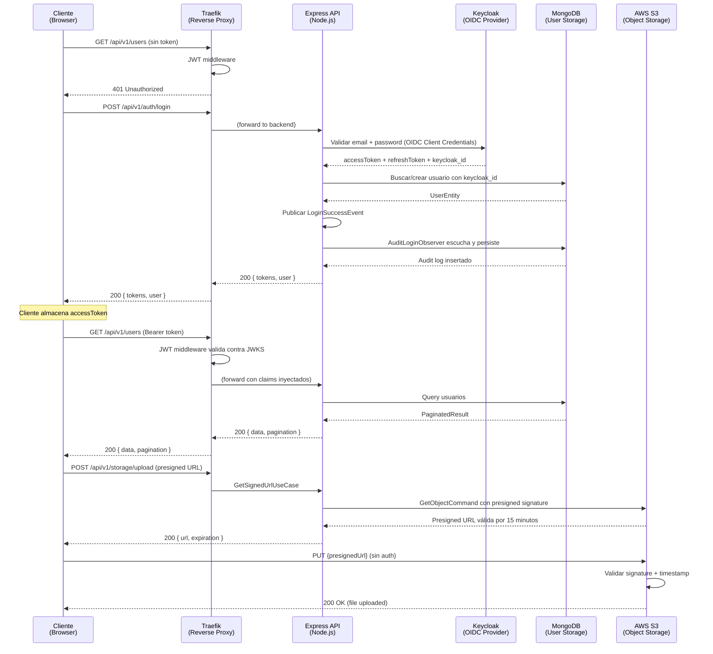
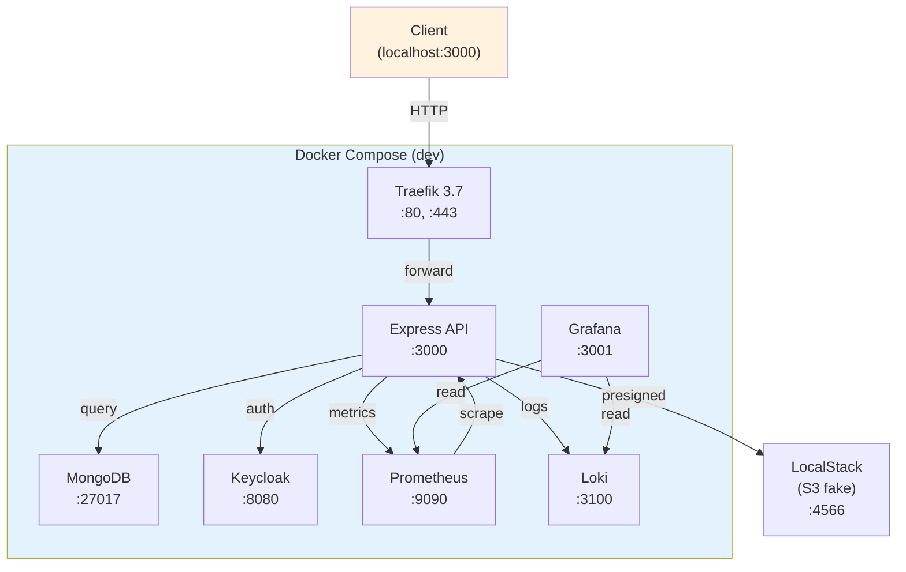
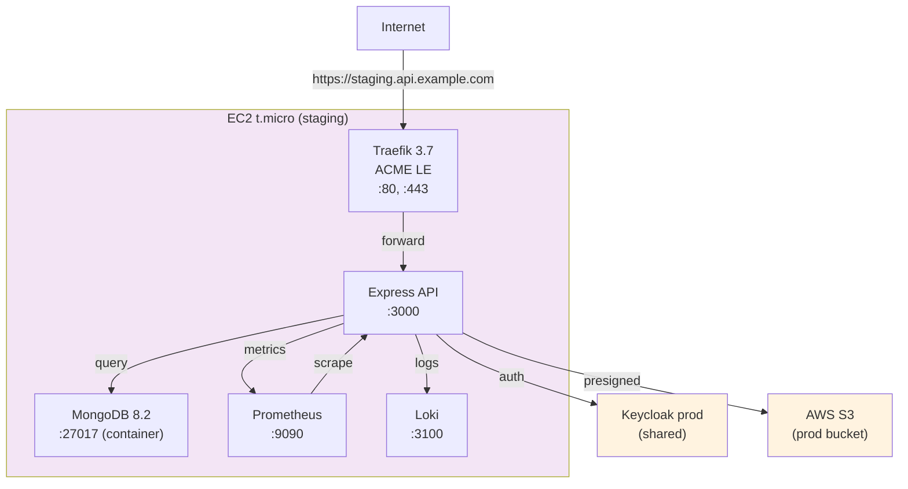
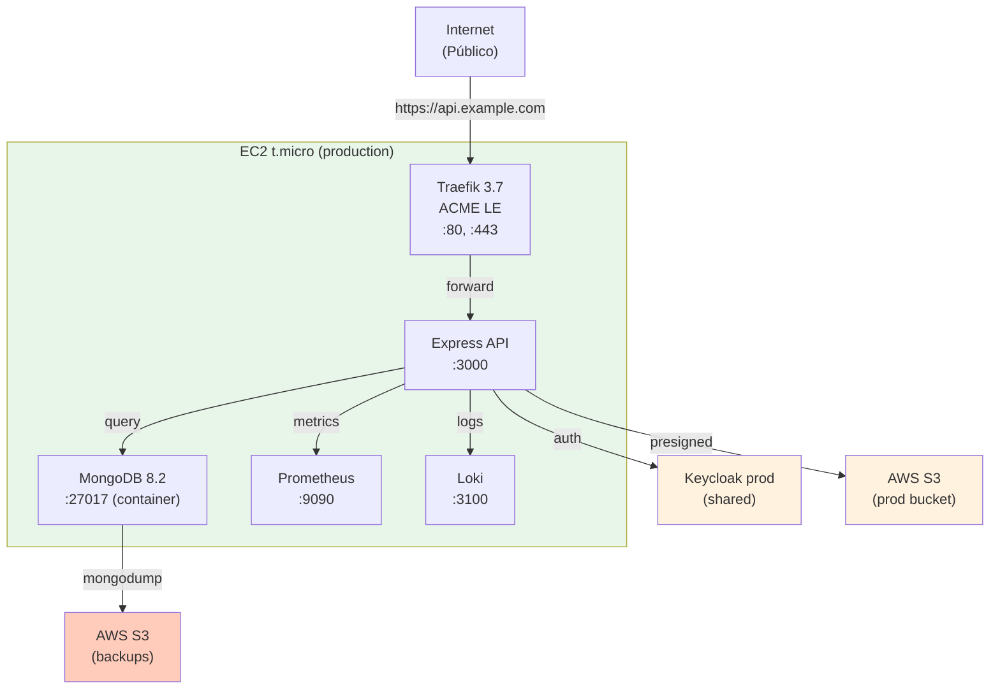
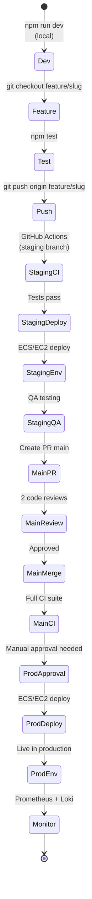

# Infraestructura

## What

Documentation for three deployment environments: local (localhost), development (EC2 staging), and production (EC2 production).

## Why

Each environment has different configuration (database, Keycloak URL, domain). Developers need to know where changes run and how they flow to production.

## Setup

Three separate environments let you:
- Reproduce production issues locally
- Test changes on staging before release
- Understand infrastructure layout
- Debug connectivity between services

## Included

- **Local:** Full stack in docker-compose, no AWS
- **Development:** Production-like setup on EC2 for testing
- **Production:** Real Let's Encrypt certificates and AWS integrations

Documentation covers:
- Components in each environment (API, database, proxy, monitoring)
- Environment variables
- Request flow (client → Traefik → API → database)
- Architecture diagrams

## Estructura

| Archivo | Tema |
|---|---|
| [`topology.md`](./topology.md) | **Mapa físico maestro** — qué corre dónde (EC2 mongo, ECS API, EC2 monitoring, S3 buckets, IAM, Firebase) |
| [`local.md`](./local.md) | Entorno local: API en host conectada a `mongo-staging` EC2 vía SSH tunnel |
| [`development.md`](./development.md) | Staging: ECS Fargate task `api-staging` + `mongo-staging` EC2 |
| [`production.md`](./production.md) | Production: ECS Fargate task `api-prod` + `mongo-prod` EC2 dedicada |

## Diagrama E2E: flujo de autenticación OIDC

## Componentes compartidos (todos los entornos)

| Componente | Tecnología | Puerto (local) | Propósito |
|---|---|---|---|
| **API** | Express 5 + TypeScript | 3000 | Backend HTTP |
| **MongoDB** | MongoDB 8.2 | 27017 | User data, audit logs |
| **Keycloak** | Keycloak 26.6.1 | 8080 | OIDC Provider, JWT |
| **Traefik** | Traefik 3.7 | 80, 443 | Reverse proxy + ACME |
| **Winston Logger** | Winston 3.19 | (stdout) | Logging |
| **Prometheus** | Prometheus 2.x | 9090 | Metrics scraping |
| **Grafana** | Grafana 11.x | 3001 | Dashboards |
| **Loki** | Loki 3.x | 3100 | Log aggregation |
| **AWS S3** | AWS SDK | (network) | Object storage |

## Envs por ambiente

| Variable | Local | Development | Production |
|---|---|---|---|
| `NODE_ENV` | `local` | `staging` | `production` |
| `DOMAIN` | N/A | `staging.api.example.com` | `api.example.com` |
| `KEYCLOAK_URL` | `http://localhost:8080` | `https://kc.staging.example.com` | `https://kc.example.com` |
| `MONGODB_URI` | `mongodb://localhost:27017/app` | EC2 private | EC2 private + auth |
| `AWS_S3_BUCKET` | `localstack` | `app-staging-bucket` | `app-prod-bucket` |
| `AWS_S3_REGION` | `us-east-1` | `us-east-1` | `us-east-1` |
| `LOKI_URL` | `http://localhost:3100` | `http://loki:3100` | `http://loki-prod:3100` |

## Diagramas por entorno

### Local (docker-compose dev profile)

### Development (EC2 staging)

### Production (EC2 prod)

## Flujo de deployment

## Links relacionados

- Docker Compose detail: [`docs/docker/`](../docker/)
- AWS infrastructure: [`docs/aws/`](../aws/)
- Keycloak setup: [`docs/gcp/firebase/`](../gcp/firebase/)
- API endpoints: [`docs/api/reference.md`](../api/reference.md)
- Full infra docs: [`docs/project/adapters.md`](../project/adapters.md)
- Traefik overview: Traefik 3.7 docs oficiales
