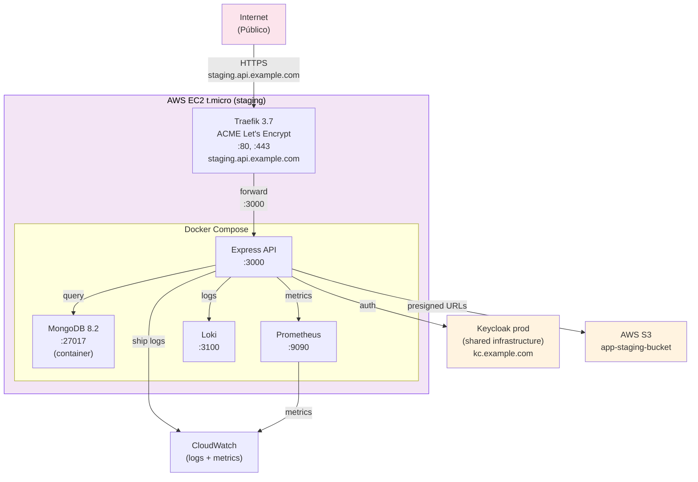

# Development — EC2 Staging

> Pre-production deployment on EC2 t.micro: containerized Traefik, MongoDB, API on domain staging.api.example.com.

## Arquitectura



## Requisitos de EC2

**Instance Type:** t.micro (free tier eligible)
**AMI:** Amazon Linux 2023
**EBS Volume:** 20 GB (gp3)
**Security Group:**
- Inbound: 22 (SSH) de IP confiable, 80, 443 (HTTP/HTTPS)
- Outbound: Todo

## Configuración EC2

### 1. Lanzar instancia

```bash
# AWS Console o CLI
aws ec2 run-instances \
  --image-id ami-0c55b159cbfafe1f0 \
  --instance-type t2.micro \
  --key-name my-key \
  --security-groups default \
  --tag-specifications 'ResourceType=instance,Tags=[{Key=Name,Value=api-staging}]'
```

### 2. Conectar via SSH

```bash
ssh -i my-key.pem ec2-user@<instance-public-ip>
```

### 3. Instalar Docker

```bash
sudo yum update -y
sudo yum install -y docker git
sudo systemctl start docker
sudo systemctl enable docker
sudo usermod -aG docker ec2-user
newgrp docker
```

### 4. Clonar repositorio + Build

```bash
git clone https://github.com/jmrg/express-clean-backend.git
cd express-clean-backend

# Copy .env.staging
cp .env.example .env.staging
# Editar con valores de staging (ver abajo)

# Build image Docker
docker build -t app-api:latest .

# docker-compose up será con profile staging (ver docker-compose.yml)
docker-compose --profile staging up -d
```

### 5. Configurar Traefik + ACME

Traefik será service externo que:
- Escucha :80, :443
- Redirige HTTP → HTTPS
- Adquiere certificado Let's Encrypt via ACME
- Reversa-proxea a API :3000

**Instalación Traefik:**
```bash
docker run -d \
  --name traefik \
  -p 80:80 \
  -p 443:443 \
  -v /var/run/docker.sock:/var/run/docker.sock \
  -v /home/ec2-user/traefik.yml:/traefik.yml \
  -v /home/ec2-user/acme.json:/acme.json \
  traefik:v3.7

# Permisos ACME
chmod 600 acme.json
```

## Variables de entorno (.env.staging)

```bash
NODE_ENV=staging

# Database
MONGODB_URI=mongodb://mongo:27017/app
MONGODB_USER=admin
MONGODB_PASSWORD=<generated-secret>

# Keycloak
KEYCLOAK_URL=https://kc.example.com
KEYCLOAK_REALM=app
KEYCLOAK_CLIENT_ID=app-api
KEYCLOAK_CLIENT_SECRET=<from-keycloak-admin>

# AWS
AWS_REGION=us-east-1
AWS_S3_BUCKET=app-staging-bucket
AWS_ACCESS_KEY_ID=<from-iam-user>
AWS_SECRET_ACCESS_KEY=<from-iam-user>

# Logging
LOKI_URL=http://loki:3100
LOG_LEVEL=info
ALLOWED_ORIGINS=https://staging.api.example.com

# Domain
DOMAIN=staging.api.example.com
```

## Flujo de deployment (GitHub Actions)

Trigger: `git push origin staging` o merge to staging branch

```yaml
name: Deploy to Staging

on:
  push:
    branches: [staging]

jobs:
  deploy:
    runs-on: ubuntu-latest
    steps:
      - uses: actions/checkout@v3
      
      - name: Run tests
        run: npm ci && npm run test
      
      - name: Build Docker image
        run: docker build -t app-api:${{ github.sha }} .
      
      - name: Deploy to EC2
        uses: appleboy/ssh-action@master
        with:
          host: ${{ secrets.STAGING_EC2_HOST }}
          username: ec2-user
          key: ${{ secrets.STAGING_EC2_KEY }}
          script: |
            cd express-clean-backend
            git pull origin staging
            docker-compose --profile staging down
            docker-compose --profile staging up -d
            
      - name: Smoke tests
        run: |
          curl -f https://staging.api.example.com/health || exit 1
```

## MongoDB en EC2

**Containerizado via docker-compose:**

```yaml
mongo:
  image: mongo:8.2
  container_name: mongo-staging
  ports:
    - "27017:27017"
  environment:
    MONGO_INITDB_ROOT_USERNAME: admin
    MONGO_INITDB_ROOT_PASSWORD: ${MONGODB_PASSWORD}
  volumes:
    - mongodata:/data/db
  networks:
    - backend

volumes:
  mongodata:
    driver: local
```

**Backup:** Via mongodump cron a S3
```bash
0 2 * * * /home/ec2-user/backup-mongo.sh
```

**Referencia:** guía MongoDB en EC2

## Monitoreo en Staging

### Prometheus + Grafana (local en EC2)

```bash
# Acceso via SSH tunnel
ssh -i my-key.pem -L 3001:localhost:3001 ec2-user@<ip>

# Luego en navegador local
open http://localhost:3001
```

### CloudWatch (AWS Console)

```bash
# API logs shipped via agent
# View in AWS Console → CloudWatch → Logs → /aws/ec2/api-staging
```

### Alertas (futuro)

SNS + email quando:
- Error rate > 5% (5 min window)
- Response time p95 > 1s
- DB connection pool exhausted

## Troubleshooting Staging

### API no responde
```bash
# SSH into EC2
ssh -i my-key.pem ec2-user@<ip>

# Check docker containers
docker ps

# Check logs
docker logs app-api | tail -50

# Restart
docker-compose --profile staging restart api
```

### Certificado ACME expirado
```bash
# Traefik auto-renueva 30 días antes
# Si falla:
docker logs traefik | grep acme
docker restart traefik
```

### MongoDB está lleno
```bash
# Backup y limpiar
docker exec mongo-staging mongodump --archive | gzip > backup.gz
aws s3 cp backup.gz s3://app-staging-bucket/backups/
docker exec mongo-staging mongosh --eval "db.loginAuditLogs.deleteMany({createdAt: {\$lt: new Date(Date.now() - 90*24*60*60*1000)}})"
```

## Comparación local vs staging

| Aspecto | Local | Staging |
|---|---|---|
| **Hosting** | Laptop/Desktop | AWS EC2 t.micro |
| **Dominio** | localhost:3000 | staging.api.example.com |
| **HTTPS** | No | Sí (Let's Encrypt) |
| **BD** | Local host | EC2 container |
| **Secretos** | .env.local | GitHub Secrets + env vars |
| **Logs** | Console + Loki local | CloudWatch + Loki EC2 |
| **Deployment** | Manual (npm run dev) | GitHub Actions auto |

## Referencias

- Docker compose staging profile: [`docker-compose.yml`](../../docker-compose.yml)
- Docker detail: [`docs/docker/development.md`](../docker/development.md)
- AWS setup: [`docs/aws/ec2.md`](../aws/ec2.md)
- Traefik overview: Traefik 3.7 docs oficiales
