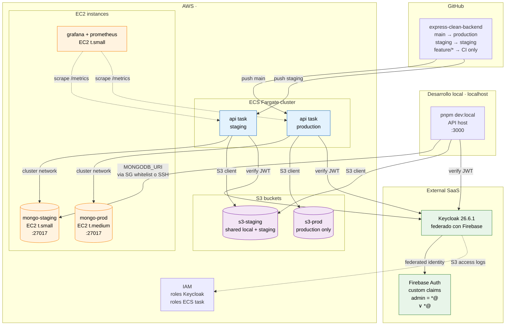
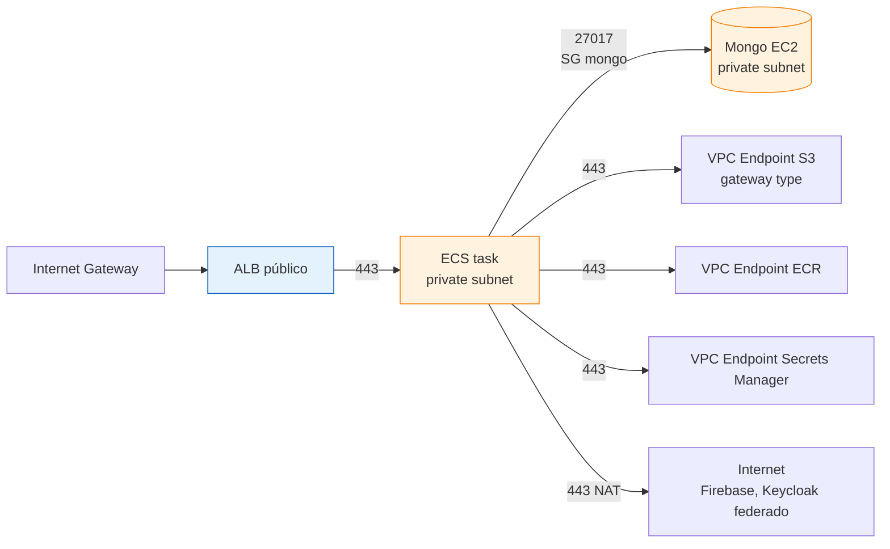

# Topología de despliegue

Mapa físico de la infraestructura: qué servicios corren dónde, cómo se
conectan y los roles de autenticación cross-environment.

La topología real de despliegue corre sobre AWS y Firebase Auth. MongoDB
vive en instancias EC2 dedicadas (staging y production separadas), la API
en containers ECS Fargate y el stack de observabilidad en EC2 propio.

Separar la base de datos del compute stateless permite escalar cada capa
de forma independiente. Las EC2 dedicadas para Mongo controlan costes y
habilitan snapshots EBS sin depender de Atlas.

Este documento sirve para saber, ante cualquier cambio o incidente, qué
máquina toca, qué security group aplica, en qué red estás y qué
credenciales usar.

---

## Componentes por rol

| Componente | Tipo | Entorno | Función |
|---|---|---|---|
| **mongodb-prod** | EC2 dedicada | production | Base de datos primaria de producción |
| **mongodb-staging** | EC2 dedicada | staging | Base de datos compartida por staging y desarrollo local |
| **api** | ECS Fargate task | staging + production | API Express containerizada (deploy desde `main` de GitHub) |
| **monitoring** | EC2 dedicada | shared | Stack Grafana + Prometheus para todos los entornos |
| **storage-staging** | S3 bucket | staging + local dev | Bucket usado por `localhost` y `staging` |
| **storage-prod** | S3 bucket | production | Bucket de producción |
| **iam-keycloak** | AWS IAM | shared | Roles para Keycloak (sesiones, JWKS, S3 access) |
| **firebase-auth** | Firebase Auth | shared | Identity provider con custom claims (admin = `*@<your-domain.tld>` ∨ `*@<admin-domain-secondary.tld>`) |

---

## Diagrama de topología



---

## Mapeo entorno → recursos

### Local (desarrollo)

```text
API:        pnpm dev:local en host
MongoDB:    apunta a mongo-staging EC2 (no levanta mongo local)
S3:         apunta a s3-staging
Auth:       Keycloak federado con Firebase
Roles:      *@<your-domain.tld> o *@<admin-domain-secondary.tld> → admin · resto → user
```

Conexión a `mongo-staging`:

- Opción A: SG con regla `from-my-ip:27017` (rotar IP cuando cambia).
- Opción B: SSH tunnel (`ssh -L 27017:localhost:27017 ec2-user@mongo-staging`)
  + `MONGODB_URI=mongodb://localhost:27017/...` en `.env.local`.

Recomendado: **opción B** (no expone Mongo a Internet, no toca SG).

### Staging

```text
API:        ECS Fargate cluster, task definition staging
MongoDB:    mongo-staging EC2 (mismo que dev local)
S3:         s3-staging
Auth:       Keycloak federado con Firebase
Trigger CI: push a rama `staging`
```

### Production

```text
API:        ECS Fargate cluster, task definition production
MongoDB:    mongo-prod EC2 (dedicada, NO compartida con otros entornos)
S3:         s3-prod
Auth:       Keycloak federado con Firebase
Trigger CI: push a rama `main` (con manual approval gate)
```

---

## Roles de autenticación

Identidad federada vía Firebase Auth → Keycloak. Los custom claims de
Firebase se mapean a roles de realm en Keycloak.

| Email pattern | Rol en Keycloak | Alcance |
|---|---|---|
| `*@<your-domain.tld>` | `admin` | Cualquier entorno (local, staging, production) |
| `*@<admin-domain-secondary.tld>` | `admin` | Cualquier entorno (local, staging, production) |
| Otro dominio | `user` | Cualquier entorno |

Implementación del check (Keycloak authentication flow + Firebase custom
claim sync):

```javascript
// Pseudo-flow al login
const email = firebaseUser.email;
const isAdmin = /@(jmrg\.dev|jmrg\.link)$/i.test(email);
firebaseAdmin.auth().setCustomUserClaims(firebaseUser.uid, {
  role: isAdmin ? 'admin' : 'user',
});
```

Keycloak lee `realm_access.roles` del JWT entrante y aplica
`check-role.middleware` en endpoints `admin`-only.

---

## Inventario de recursos por servicio

### EC2

| Instancia | Tipo | Función | Acceso |
|---|---|---|---|
| `mongo-staging` | t.small (2 vCPU, 2 GB) | Mongo staging + dev local | SG: ECS staging tasks + dev SSH |
| `mongo-prod` | t.medium (2 vCPU, 4 GB) | Mongo production | SG: solo ECS prod tasks |
| `monitoring` | t.small | Grafana + Prometheus | SG: panel admin via OIDC, scrape interno |

Detalle por instancia: ver [`aws/ec2.md`](../aws/ec2.md).

### ECS

| Cluster | Service | Task definition | Trigger |
|---|---|---|---|
| `app-cluster` | `api-staging` | `api:staging` | push a `staging` |
| `app-cluster` | `api-prod` | `api:production` | push a `main` (con approval) |

Detalle: [`aws/ecs.md`](../aws/ecs.md).

### S3

| Bucket | Uso | Lifecycle |
|---|---|---|
| `app-storage-staging-<account>` | Local dev + staging | Delete después de 30 días |
| `app-storage-prod-<account>` | Production | Versioning + delete tras 365 días |

Detalle: [`aws/s3.md`](../aws/s3.md).

### IAM

| Role | Asumido por | Permisos clave |
|---|---|---|
| `ecs-task-execution-role` | ECS agent | Pull ECR, leer Secrets Manager |
| `ecs-task-role-staging` | API container staging | `s3:*` en `app-storage-staging-*`, leer Secrets staging |
| `ecs-task-role-prod` | API container production | `s3:*` en `app-storage-prod-*`, leer Secrets prod |
| `keycloak-iam-role` | Keycloak server | Validar sesiones via STS, leer JWKS de Firebase |
| `github-actions-deploy-role` | GitHub Actions OIDC | Push ECR, update ECS service, leer Secrets |

Detalle: [`aws/iam.md`](../aws/iam.md) + [`ci-cd/oidc-aws.md`](../ci-cd/oidc-aws.md).

### Firebase Auth

| Componente | Detalle |
|---|---|
| Project | `jmrg-auth` (sugerido) |
| Providers | Email/password, Google, GitHub |
| Custom claims | `role: admin\|user` setado por Cloud Function al primer login |
| Integración con Keycloak | Identity Provider OIDC en realm `app` |

Detalle: [`gcp/firebase/auth.md`](../gcp/firebase/auth.md).

---

## Networking



**Subnets**:

- 2 AZ × `(public + private)`. Public para ALB e IGW. Private para ECS y EC2 mongo.
- NAT Gateway en public subnet AZ-a (si se necesita salida a Internet desde tasks).
- VPC Endpoints para S3 (gateway, gratis), ECR + Secrets Manager (interface, ~$7/mes cada uno) — evita coste NAT.

**Security Groups**:

| SG | Ingress | Egress |
|---|---|---|
| `alb-sg` | `0.0.0.0/0:443` | `api-tasks-sg:3000` |
| `api-tasks-sg` | `alb-sg:3000` | `mongo-sg:27017`, `0.0.0.0/0:443` (NAT/VPC EP) |
| `mongo-sg-staging` | `api-tasks-sg:27017`, `dev-bastion-sg:27017` | (ninguno) |
| `mongo-sg-prod` | `api-tasks-sg-prod:27017` (sin acceso dev) | (ninguno) |
| `monitoring-sg` | `alb-sg:3000`, `:9090`, `api-tasks-sg:9090` (scrape) | (ninguno) |

Detalle: [`aws/vpc-network.md`](../aws/vpc-network.md).

---

## Variables de entorno por entorno

### Local dev (`.env.local`)

```bash
NODE_ENV=local
PORT=3000
MONGODB_URI=mongodb://localhost:27017/app   # con SSH tunnel
KEYCLOAK_URL=https://auth.example.com          # publico
AWS_S3_BUCKET=app-storage-staging-<AWS_ACCOUNT_ID>
AWS_REGION=<AWS_REGION>
```

### Staging (Secrets Manager → ECS task)

```bash
NODE_ENV=staging
MONGODB_URI=mongodb://mongo-staging.internal:27017/app
KEYCLOAK_URL=https://auth-staging.example.com
AWS_S3_BUCKET=app-storage-staging-<AWS_ACCOUNT_ID>
```

### Production (Secrets Manager → ECS task)

```bash
NODE_ENV=production
MONGODB_URI=mongodb://mongo-prod.internal:27017/app
KEYCLOAK_URL=https://auth.example.com
AWS_S3_BUCKET=app-storage-prod-<AWS_ACCOUNT_ID>
```

Inyección en ECS via task definition `secrets:` field. Detalle:
[`aws/secrets-manager.md`](../aws/secrets-manager.md).

---

## Decisiones arquitectónicas

| Decisión | Razón |
|---|---|
| Mongo en EC2 dedicada vs Atlas | Coste predictible, control total backups EBS |
| Mongo staging compartido con dev local | Reducir coste, dev tiene datos realistas |
| Mongo prod aislado | Sin riesgo de leaks dev → prod |
| API en ECS Fargate (no EC2) | Sin gestión de capacity, scaling automático |
| Monitoring en EC2 propio (no managed Prometheus) | Coste + customización Grafana datasources |
| S3 staging compartido dev + staging | Datos realistas, mismas reglas IAM |
| Firebase Auth federado con Keycloak | Mobile/web sign-up rápido vía Firebase, sesiones server-side por Keycloak |
| Roles por dominio email | Sin gestión manual de usuarios admin |

---

## Coste mensual estimado

| Recurso | Tipo | Coste mensual aprox |
|---|---|---|
| EC2 mongo-staging | t3.small (2 GB) | $15 |
| EC2 mongo-prod | t3.medium (4 GB) | $30 |
| EC2 monitoring | t3.small | $15 |
| EBS storage (3 × 30 GB gp3) | — | $7 |
| ECS Fargate staging (0.5 vCPU, 1 GB, 24×7) | — | $15 |
| ECS Fargate production (1 vCPU, 2 GB, 24×7) | — | $30 |
| ALB | shared | $20 |
| S3 (10 GB + 100k requests) | shared | $5 |
| NAT Gateway (si VPC Endpoints no cubren) | — | $35 |
| Secrets Manager (10 secrets) | — | $4 |
| CloudWatch Logs (5 GB ingest) | — | $3 |
| **Total** | | **~$180/mes** |

Reducciones posibles:
- Quitar NAT Gateway → solo VPC Endpoints (-$35)
- ECS Fargate Spot para staging (-50% en staging)
- Reserved Instances para EC2 mongo (-30%)

---

## Referencias cruzadas

- [`aws/ec2.md`](../aws/ec2.md) — Detalle MongoDB en EC2.
- [`aws/ecs.md`](../aws/ecs.md) — Task definitions Fargate.
- [`aws/s3.md`](../aws/s3.md) — Buckets staging y prod.
- [`aws/iam.md`](../aws/iam.md) — Roles y trust policies.
- [`aws/secrets-manager.md`](../aws/secrets-manager.md) — Inyección de secrets.
- [`aws/vpc-network.md`](../aws/vpc-network.md) — VPC, subnets, SGs.
- [`aws/cloudwatch.md`](../aws/cloudwatch.md) — Logs y alarms del stack.
- [`gcp/firebase/auth.md`](../gcp/firebase/auth.md) — Firebase Auth setup.
- [`ci-cd/github-actions.md`](../ci-cd/github-actions.md) — Workflows que despliegan a esta topología.
- [`ci-cd/oidc-aws.md`](../ci-cd/oidc-aws.md) — OIDC federation entre GitHub y AWS.
